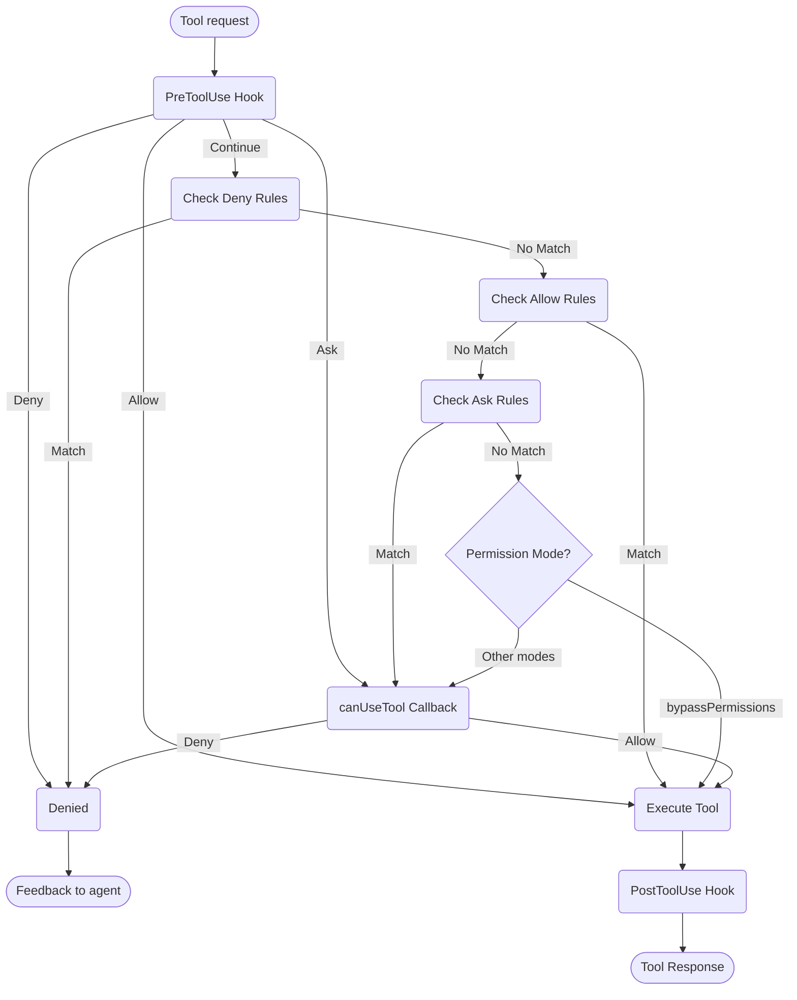

# Gestion des permissions

Contrôler l'utilisation des outils et les permissions dans le Claude Agent SDK

---

# Permissions du SDK

Le Claude Agent SDK fournit des contrôles de permission puissants qui vous permettent de gérer comment Claude utilise les outils dans votre application.

Ce guide couvre comment implémenter des systèmes de permission en utilisant le callback `canUseTool`, les hooks et les règles de permission settings.json. Pour la documentation complète de l'API, consultez la [référence du SDK TypeScript](/docs/fr/agent-sdk/typescript).

## Aperçu

Le Claude Agent SDK fournit quatre façons complémentaires de contrôler l'utilisation des outils :

1. **[Modes de permission](#permission-modes)** - Paramètres de comportement de permission globale qui affectent tous les outils
2. **[Callback canUseTool](/docs/fr/agent-sdk/typescript#canusetool)** - Gestionnaire de permission à l'exécution pour les cas non couverts par d'autres règles
3. **[Hooks](/docs/fr/agent-sdk/hooks)** - Contrôle fin-grained sur chaque exécution d'outil avec logique personnalisée
4. **[Règles de permission (settings.json)](https://code.claude.com/docs/en/settings#permission-settings)** - Règles déclaratives allow/deny avec analyse intégrée des commandes bash

Cas d'utilisation pour chaque approche :
- Modes de permission - Définir le comportement de permission global (planification, auto-acceptation des modifications, contournement des vérifications)
- `canUseTool` - Approbation dynamique pour les cas non couverts, demande à l'utilisateur la permission
- Hooks - Contrôle programmatique sur toutes les exécutions d'outils
- Règles de permission - Politiques statiques avec analyse intelligente des commandes bash

## Diagramme du flux de permission



**Ordre de traitement :** PreToolUse Hook → Deny Rules → Allow Rules → Ask Rules → Permission Mode Check → canUseTool Callback → PostToolUse Hook

## Modes de permission

Les modes de permission fournissent un contrôle global sur la façon dont Claude utilise les outils. Vous pouvez définir le mode de permission lors de l'appel de `query()` ou le modifier dynamiquement pendant les sessions de streaming.

### Modes disponibles

Le SDK supporte quatre modes de permission, chacun avec un comportement différent :

| Mode | Description | Comportement des outils |
| :--- | :---------- | :------------ |
| `default` | Comportement de permission standard | Les vérifications de permission normales s'appliquent |
| `plan` | Mode planification - pas d'exécution | Claude ne peut utiliser que les outils en lecture seule ; présente un plan avant l'exécution **(Non actuellement supporté dans le SDK)** |
| `acceptEdits` | Auto-acceptation des modifications de fichiers | Les modifications de fichiers et les opérations du système de fichiers sont automatiquement approuvées |
| `bypassPermissions` | Contourner toutes les vérifications de permission | Tous les outils s'exécutent sans invites de permission (à utiliser avec prudence) |

### Définition du mode de permission

Vous pouvez définir le mode de permission de deux façons :

#### 1. Configuration initiale

Définissez le mode lors de la création d'une requête :

<CodeGroup>

```typescript TypeScript
import { query } from "@anthropic-ai/claude-agent-sdk";

const result = await query({
  prompt: "Help me refactor this code",
  options: {
    permissionMode: 'default'  // Standard permission mode
  }
});
```

```python Python
from claude_agent_sdk import query

result = await query(
    prompt="Help me refactor this code",
    options={
        "permission_mode": "default"  # Standard permission mode
    }
)
```

</CodeGroup>

#### 2. Changements de mode dynamiques (Streaming uniquement)

Modifiez le mode pendant une session de streaming :

<CodeGroup>

```typescript TypeScript
import { query } from "@anthropic-ai/claude-agent-sdk";

// Create an async generator for streaming input
async function* streamInput() {
  yield { 
    type: 'user',
    message: { 
      role: 'user', 
      content: "Let's start with default permissions" 
    }
  };
  
  // Later in the conversation...
  yield {
    type: 'user',
    message: {
      role: 'user',
      content: "Now let's speed up development"
    }
  };
}

const q = query({
  prompt: streamInput(),
  options: {
    permissionMode: 'default'  // Start in default mode
  }
});

// Change mode dynamically
await q.setPermissionMode('acceptEdits');

// Process messages
for await (const message of q) {
  console.log(message);
}
```

```python Python
from claude_agent_sdk import query

async def stream_input():
    """Async generator for streaming input"""
    yield {
        "type": "user",
        "message": {
            "role": "user",
            "content": "Let's start with default permissions"
        }
    }
    
    # Later in the conversation...
    yield {
        "type": "user",
        "message": {
            "role": "user",
            "content": "Now let's speed up development"
        }
    }

q = query(
    prompt=stream_input(),
    options={
        "permission_mode": "default"  # Start in default mode
    }
)

# Change mode dynamically
await q.set_permission_mode("acceptEdits")

# Process messages
async for message in q:
    print(message)
```

</CodeGroup>

### Comportements spécifiques au mode

#### Mode Accept Edits (`acceptEdits`)

En mode accept edits :
- Toutes les modifications de fichiers sont automatiquement approuvées
- Les opérations du système de fichiers (mkdir, touch, rm, etc.) sont auto-approuvées
- Les autres outils nécessitent toujours des permissions normales
- Accélère le développement quand vous faites confiance aux modifications de Claude
- Utile pour le prototypage rapide et les itérations

Opérations auto-approuvées :
- Modifications de fichiers (outils Edit, Write)
- Commandes bash du système de fichiers (mkdir, touch, rm, mv, cp)
- Création et suppression de fichiers

#### Mode Bypass Permissions (`bypassPermissions`)

En mode bypass permissions :
- **TOUS les usages d'outils sont automatiquement approuvés**
- Aucune invite de permission n'apparaît
- Les hooks s'exécutent toujours (peuvent toujours bloquer les opérations)
- **À utiliser avec extrême prudence** - Claude a un accès système complet
- Recommandé uniquement pour les environnements contrôlés

### Priorité du mode dans le flux de permission

Les modes de permission sont évalués à un point spécifique dans le flux de permission :

1. **Les hooks s'exécutent en premier** - Peuvent autoriser, refuser, demander ou continuer
2. **Les règles de refus** sont vérifiées - Bloquent les outils indépendamment du mode
3. **Les règles d'autorisation** sont vérifiées - Permettent les outils s'ils correspondent
4. **Les règles de demande** sont vérifiées - Demandent la permission si elles correspondent
5. **Le mode de permission** est évalué :
   - **Mode `bypassPermissions`** - S'il est actif, autorise tous les outils restants
   - **Autres modes** - Déférer au callback `canUseTool`
6. **Callback `canUseTool`** - Gère les cas restants

Cela signifie :
- Les hooks peuvent toujours contrôler l'utilisation des outils, même en mode `bypassPermissions`
- Les règles de refus explicites remplacent tous les modes de permission
- Les règles de demande sont évaluées avant les modes de permission
- Le mode `bypassPermissions` remplace le callback `canUseTool` pour les outils non appariés

### Meilleures pratiques

1. **Utilisez le mode default** pour l'exécution contrôlée avec des vérifications de permission normales
2. **Utilisez le mode acceptEdits** quand vous travaillez sur des fichiers ou répertoires isolés
3. **Évitez bypassPermissions** en production ou sur des systèmes avec des données sensibles
4. **Combinez les modes avec les hooks** pour un contrôle fin-grained
5. **Changez les modes dynamiquement** en fonction de la progression des tâches et de la confiance

Exemple de progression du mode :
```typescript
// Start in default mode for controlled execution
permissionMode: 'default'

// Switch to acceptEdits for rapid iteration
await q.setPermissionMode('acceptEdits')
```

## canUseTool

Le callback `canUseTool` est passé en tant qu'option lors de l'appel de la fonction `query`. Il reçoit le nom de l'outil et les paramètres d'entrée, et doit retourner une décision - soit autoriser soit refuser.

canUseTool se déclenche chaque fois que Claude Code afficherait une invite de permission à un utilisateur, par exemple les hooks et les règles de permission ne la couvrent pas et elle n'est pas en mode acceptEdits.

Voici un exemple complet montrant comment implémenter l'approbation interactive des outils :

<CodeGroup>

```typescript TypeScript
import { query } from "@anthropic-ai/claude-agent-sdk";

async function promptForToolApproval(toolName: string, input: any) {
  console.log("\n🔧 Tool Request:");
  console.log(`   Tool: ${toolName}`);
  
  // Display tool parameters
  if (input && Object.keys(input).length > 0) {
    console.log("   Parameters:");
    for (const [key, value] of Object.entries(input)) {
      let displayValue = value;
      if (typeof value === 'string' && value.length > 100) {
        displayValue = value.substring(0, 100) + "...";
      } else if (typeof value === 'object') {
        displayValue = JSON.stringify(value, null, 2);
      }
      console.log(`     ${key}: ${displayValue}`);
    }
  }
  
  // Get user approval (replace with your UI logic)
  const approved = await getUserApproval();
  
  if (approved) {
    console.log("   ✅ Approved\n");
    return {
      behavior: "allow",
      updatedInput: input
    };
  } else {
    console.log("   ❌ Denied\n");
    return {
      behavior: "deny",
      message: "User denied permission for this tool"
    };
  }
}

// Use the permission callback
const result = await query({
  prompt: "Help me analyze this codebase",
  options: {
    canUseTool: async (toolName, input) => {
      return promptForToolApproval(toolName, input);
    }
  }
});
```

```python Python
from claude_agent_sdk import query

async def prompt_for_tool_approval(tool_name: str, input_params: dict):
    print(f"\n🔧 Tool Request:")
    print(f"   Tool: {tool_name}")

    # Display parameters
    if input_params:
        print("   Parameters:")
        for key, value in input_params.items():
            display_value = value
            if isinstance(value, str) and len(value) > 100:
                display_value = value[:100] + "..."
            elif isinstance(value, (dict, list)):
                display_value = json.dumps(value, indent=2)
            print(f"     {key}: {display_value}")

    # Get user approval
    answer = input("\n   Approve this tool use? (y/n): ")

    if answer.lower() in ['y', 'yes']:
        print("   ✅ Approved\n")
        return {
            "behavior": "allow",
            "updatedInput": input_params
        }
    else:
        print("   ❌ Denied\n")
        return {
            "behavior": "deny",
            "message": "User denied permission for this tool"
        }

# Use the permission callback
result = await query(
    prompt="Help me analyze this codebase",
    options={
        "can_use_tool": prompt_for_tool_approval
    }
)
```

</CodeGroup>

## Gestion de l'outil AskUserQuestion

L'outil `AskUserQuestion` permet à Claude de poser des questions de clarification à l'utilisateur pendant une conversation. Quand cet outil est appelé, votre callback `canUseTool` reçoit les questions et doit retourner les réponses de l'utilisateur.

### Structure d'entrée

Quand `canUseTool` est appelé avec `toolName: "AskUserQuestion"`, l'entrée contient :

```typescript
{
  questions: [
    {
      question: "Which database should we use?",
      header: "Database",
      options: [
        { label: "PostgreSQL", description: "Relational, ACID compliant" },
        { label: "MongoDB", description: "Document-based, flexible schema" }
      ],
      multiSelect: false
    },
    {
      question: "Which features should we enable?",
      header: "Features",
      options: [
        { label: "Authentication", description: "User login and sessions" },
        { label: "Logging", description: "Request and error logging" },
        { label: "Caching", description: "Redis-based response caching" }
      ],
      multiSelect: true
    }
  ]
}
```

### Retour des réponses

Retournez les réponses dans `updatedInput.answers` en tant qu'enregistrement mappant le texte de la question aux étiquettes d'option sélectionnées :

```typescript
return {
  behavior: "allow",
  updatedInput: {
    questions: input.questions,  // Pass through original questions
    answers: {
      "Which database should we use?": "PostgreSQL",
      "Which features should we enable?": "Authentication, Caching"
    }
  }
}
```

<Note>
Les réponses multi-sélection sont des chaînes séparées par des virgules (par exemple, `"Authentication, Caching"`).
</Note>

## Ressources connexes

- [Guide des Hooks](/docs/fr/agent-sdk/hooks) - Apprenez comment implémenter les hooks pour un contrôle fin-grained sur l'exécution des outils
- [Paramètres : Règles de permission](https://code.claude.com/docs/en/settings#permission-settings) - Configurez les règles déclaratives allow/deny avec analyse des commandes bash