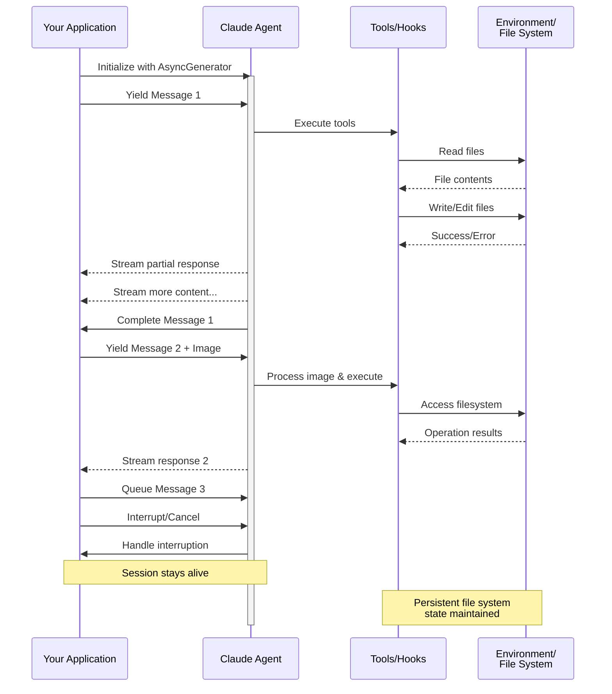

# Input in Streaming

Comprensione delle due modalità di input per Claude Agent SDK e quando utilizzare ciascuna

---

## Panoramica

Claude Agent SDK supporta due modalità di input distinte per interagire con gli agenti:

- **Modalità Input in Streaming** (Predefinita e Consigliata) - Una sessione persistente e interattiva
- **Input Singolo Messaggio** - Query una tantum che utilizzano lo stato della sessione e la ripresa

Questa guida spiega le differenze, i vantaggi e i casi d'uso per ogni modalità per aiutarti a scegliere l'approccio giusto per la tua applicazione.

## Modalità Input in Streaming (Consigliata)

La modalità input in streaming è il modo **preferito** per utilizzare Claude Agent SDK. Fornisce accesso completo alle capacità dell'agente e consente esperienze ricche e interattive.

Consente all'agente di operare come un processo di lunga durata che accetta input dell'utente, gestisce interruzioni, visualizza richieste di autorizzazione e gestisce la gestione della sessione.

### Come Funziona



### Vantaggi

<CardGroup cols={2}>
  <Card title="Caricamenti di Immagini" icon="image">
    Allega immagini direttamente ai messaggi per l'analisi visiva e la comprensione
  </Card>
  <Card title="Messaggi in Coda" icon="stack">
    Invia più messaggi che vengono elaborati sequenzialmente, con la possibilità di interrompere
  </Card>
  <Card title="Integrazione Strumenti" icon="wrench">
    Accesso completo a tutti gli strumenti e ai server MCP personalizzati durante la sessione
  </Card>
  <Card title="Supporto Hook" icon="link">
    Utilizza hook del ciclo di vita per personalizzare il comportamento in vari punti
  </Card>
  <Card title="Feedback in Tempo Reale" icon="lightning">
    Visualizza le risposte mentre vengono generate, non solo i risultati finali
  </Card>
  <Card title="Persistenza del Contesto" icon="database">
    Mantieni il contesto della conversazione su più turni naturalmente
  </Card>
</CardGroup>

### Esempio di Implementazione

<CodeGroup>

```typescript TypeScript
import { query } from "@anthropic-ai/claude-agent-sdk";
import { readFileSync } from "fs";

async function* generateMessages() {
  // First message
  yield {
    type: "user" as const,
    message: {
      role: "user" as const,
      content: "Analyze this codebase for security issues"
    }
  };
  
  // Wait for conditions or user input
  await new Promise(resolve => setTimeout(resolve, 2000));
  
  // Follow-up with image
  yield {
    type: "user" as const,
    message: {
      role: "user" as const,
      content: [
        {
          type: "text",
          text: "Review this architecture diagram"
        },
        {
          type: "image",
          source: {
            type: "base64",
            media_type: "image/png",
            data: readFileSync("diagram.png", "base64")
          }
        }
      ]
    }
  };
}

// Process streaming responses
for await (const message of query({
  prompt: generateMessages(),
  options: {
    maxTurns: 10,
    allowedTools: ["Read", "Grep"]
  }
})) {
  if (message.type === "result") {
    console.log(message.result);
  }
}
```

```python Python
from claude_agent_sdk import ClaudeSDKClient, ClaudeAgentOptions, AssistantMessage, TextBlock
import asyncio
import base64

async def streaming_analysis():
    async def message_generator():
        # First message
        yield {
            "type": "user",
            "message": {
                "role": "user",
                "content": "Analyze this codebase for security issues"
            }
        }

        # Wait for conditions
        await asyncio.sleep(2)

        # Follow-up with image
        with open("diagram.png", "rb") as f:
            image_data = base64.b64encode(f.read()).decode()

        yield {
            "type": "user",
            "message": {
                "role": "user",
                "content": [
                    {
                        "type": "text",
                        "text": "Review this architecture diagram"
                    },
                    {
                        "type": "image",
                        "source": {
                            "type": "base64",
                            "media_type": "image/png",
                            "data": image_data
                        }
                    }
                ]
            }
        }

    # Use ClaudeSDKClient for streaming input
    options = ClaudeAgentOptions(
        max_turns=10,
        allowed_tools=["Read", "Grep"]
    )

    async with ClaudeSDKClient(options) as client:
        # Send streaming input
        await client.query(message_generator())

        # Process responses
        async for message in client.receive_response():
            if isinstance(message, AssistantMessage):
                for block in message.content:
                    if isinstance(block, TextBlock):
                        print(block.text)

asyncio.run(streaming_analysis())
```

</CodeGroup>

## Input Singolo Messaggio

L'input singolo messaggio è più semplice ma più limitato.

### Quando Utilizzare Input Singolo Messaggio

Utilizza input singolo messaggio quando:

- Hai bisogno di una risposta una tantum
- Non hai bisogno di allegati di immagini, hook, ecc.
- Hai bisogno di operare in un ambiente senza stato, come una funzione lambda

### Limitazioni

<Warning>
La modalità input singolo messaggio **non** supporta:
- Allegati di immagini diretti nei messaggi
- Accodamento dinamico dei messaggi
- Interruzione in tempo reale
- Integrazione hook
- Conversazioni multi-turno naturali
</Warning>

### Esempio di Implementazione

<CodeGroup>

```typescript TypeScript
import { query } from "@anthropic-ai/claude-agent-sdk";

// Simple one-shot query
for await (const message of query({
  prompt: "Explain the authentication flow",
  options: {
    maxTurns: 1,
    allowedTools: ["Read", "Grep"]
  }
})) {
  if (message.type === "result") {
    console.log(message.result);
  }
}

// Continue conversation with session management
for await (const message of query({
  prompt: "Now explain the authorization process",
  options: {
    continue: true,
    maxTurns: 1
  }
})) {
  if (message.type === "result") {
    console.log(message.result);
  }
}
```

```python Python
from claude_agent_sdk import query, ClaudeAgentOptions, ResultMessage
import asyncio

async def single_message_example():
    # Simple one-shot query using query() function
    async for message in query(
        prompt="Explain the authentication flow",
        options=ClaudeAgentOptions(
            max_turns=1,
            allowed_tools=["Read", "Grep"]
        )
    ):
        if isinstance(message, ResultMessage):
            print(message.result)

    # Continue conversation with session management
    async for message in query(
        prompt="Now explain the authorization process",
        options=ClaudeAgentOptions(
            continue_conversation=True,
            max_turns=1
        )
    ):
        if isinstance(message, ResultMessage):
            print(message.result)

asyncio.run(single_message_example())
```

</CodeGroup>