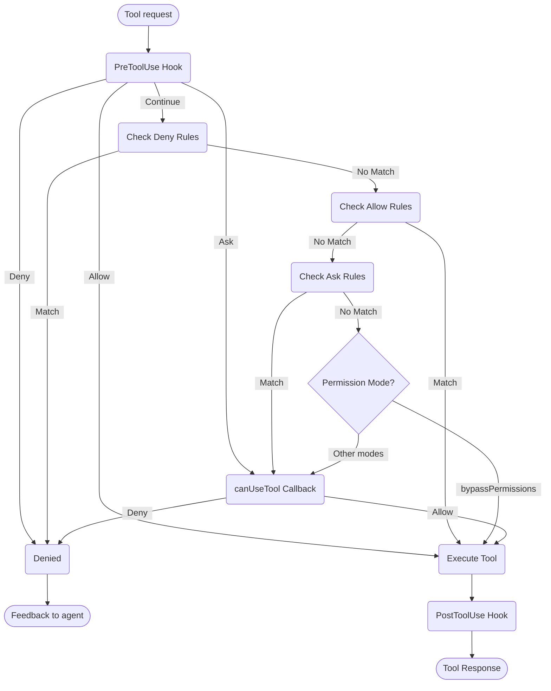

# パーミッションの処理

Claude Agent SDKでツール使用とパーミッションを制御する

---

# SDK パーミッション

Claude Agent SDKは、アプリケーション内でClaudeがツールを使用する方法を管理できる強力なパーミッション制御を提供します。

このガイドでは、`canUseTool`コールバック、フック、settings.jsonパーミッションルールを使用してパーミッションシステムを実装する方法について説明します。完全なAPI ドキュメントについては、[TypeScript SDK リファレンス](/docs/ja/agent-sdk/typescript)を参照してください。

## 概要

Claude Agent SDKは、ツール使用を制御するための4つの相互補完的な方法を提供します：

1. **[パーミッションモード](#permission-modes)** - すべてのツールに影響するグローバルパーミッション動作設定
2. **[canUseTool コールバック](/docs/ja/agent-sdk/typescript#canusetool)** - 他のルールでカバーされていないケースのランタイムパーミッションハンドラー
3. **[フック](/docs/ja/agent-sdk/hooks)** - ツール実行のすべてのステップに対するカスタムロジックを使用した細粒度制御
4. **[パーミッションルール (settings.json)](https://code.claude.com/docs/en/settings#permission-settings)** - 統合されたbashコマンド解析を備えた宣言的な許可/拒否ルール

各アプローチのユースケース：
- パーミッションモード - 全体的なパーミッション動作を設定（計画、編集の自動受け入れ、チェックのバイパス）
- `canUseTool` - カバーされていないケースの動的承認、ユーザーにパーミッションを求める
- フック - すべてのツール実行に対するプログラマティック制御
- パーミッションルール - インテリジェントなbashコマンド解析を備えた静的ポリシー

## パーミッションフロー図



**処理順序：** PreToolUse Hook → 拒否ルール → 許可ルール → 質問ルール → パーミッションモードチェック → canUseTool コールバック → PostToolUse Hook

## パーミッションモード

パーミッションモードは、Claudeがツールを使用する方法に対するグローバル制御を提供します。`query()`を呼び出すときにパーミッションモードを設定するか、ストリーミングセッション中に動的に変更できます。

### 利用可能なモード

SDKは4つのパーミッションモードをサポートしており、それぞれ異なる動作があります：

| モード | 説明 | ツール動作 |
| :--- | :---------- | :------------ |
| `default` | 標準的なパーミッション動作 | 通常のパーミッションチェックが適用されます |
| `plan` | 計画モード - 実行なし | Claudeは読み取り専用ツールのみを使用できます。実行前に計画を提示します **(現在SDKではサポートされていません)** |
| `acceptEdits` | ファイル編集の自動受け入れ | ファイル編集とファイルシステム操作は自動的に承認されます |
| `bypassPermissions` | すべてのパーミッションチェックをバイパス | すべてのツールはパーミッションプロンプトなしで実行されます（注意して使用してください） |

### パーミッションモードの設定

パーミッションモードは2つの方法で設定できます：

#### 1. 初期設定

クエリを作成するときにモードを設定します：

<CodeGroup>

```typescript TypeScript
import { query } from "@anthropic-ai/claude-agent-sdk";

const result = await query({
  prompt: "Help me refactor this code",
  options: {
    permissionMode: 'default'  // Standard permission mode
  }
});
```

```python Python
from claude_agent_sdk import query

result = await query(
    prompt="Help me refactor this code",
    options={
        "permission_mode": "default"  # Standard permission mode
    }
)
```

</CodeGroup>

#### 2. 動的モード変更（ストリーミングのみ）

ストリーミングセッション中にモードを変更します：

<CodeGroup>

```typescript TypeScript
import { query } from "@anthropic-ai/claude-agent-sdk";

// Create an async generator for streaming input
async function* streamInput() {
  yield { 
    type: 'user',
    message: { 
      role: 'user', 
      content: "Let's start with default permissions" 
    }
  };
  
  // Later in the conversation...
  yield {
    type: 'user',
    message: {
      role: 'user',
      content: "Now let's speed up development"
    }
  };
}

const q = query({
  prompt: streamInput(),
  options: {
    permissionMode: 'default'  // Start in default mode
  }
});

// Change mode dynamically
await q.setPermissionMode('acceptEdits');

// Process messages
for await (const message of q) {
  console.log(message);
}
```

```python Python
from claude_agent_sdk import query

async def stream_input():
    """Async generator for streaming input"""
    yield {
        "type": "user",
        "message": {
            "role": "user",
            "content": "Let's start with default permissions"
        }
    }
    
    # Later in the conversation...
    yield {
        "type": "user",
        "message": {
            "role": "user",
            "content": "Now let's speed up development"
        }
    }

q = query(
    prompt=stream_input(),
    options={
        "permission_mode": "default"  # Start in default mode
    }
)

# Change mode dynamically
await q.set_permission_mode("acceptEdits")

# Process messages
async for message in q:
    print(message)
```

</CodeGroup>

### モード固有の動作

#### 編集受け入れモード (`acceptEdits`)

編集受け入れモードでは：
- すべてのファイル編集は自動的に承認されます
- ファイルシステム操作（mkdir、touch、rm など）は自動承認されます
- 他のツールは通常のパーミッションが必要です
- Claudeの編集を信頼する場合、開発を高速化します
- 迅速なプロトタイピングと反復に役立ちます

自動承認される操作：
- ファイル編集（Edit、Write ツール）
- Bash ファイルシステムコマンド（mkdir、touch、rm、mv、cp）
- ファイルの作成と削除

#### パーミッションバイパスモード (`bypassPermissions`)

パーミッションバイパスモードでは：
- **すべてのツール使用が自動的に承認されます**
- パーミッションプロンプトは表示されません
- フックは引き続き実行されます（操作をブロックできます）
- **極度の注意を払って使用してください** - Claudeはシステムへの完全なアクセス権を持ちます
- 制御された環境でのみ推奨されます

### パーミッションフロー内のモード優先度

パーミッションモードはパーミッションフロー内の特定のポイントで評価されます：

1. **フックが最初に実行されます** - 許可、拒否、質問、または続行できます
2. **拒否ルール**がチェックされます - モードに関係なくツールをブロックします
3. **許可ルール**がチェックされます - マッチした場合、ツールを許可します
4. **質問ルール**がチェックされます - マッチした場合、パーミッションを求めます
5. **パーミッションモード**が評価されます：
   - **`bypassPermissions` モード** - アクティブな場合、残りのすべてのツールを許可します
   - **その他のモード** - `canUseTool` コールバックに委譲します
6. **`canUseTool` コールバック** - 残りのケースを処理します

これは以下を意味します：
- フックは`bypassPermissions`モードでもツール使用を制御できます
- 明示的な拒否ルールはすべてのパーミッションモードをオーバーライドします
- 質問ルールはパーミッションモードの前に評価されます
- `bypassPermissions`モードはマッチしないツールの`canUseTool`コールバックをオーバーライドします

### ベストプラクティス

1. **デフォルトモードを使用**して、通常のパーミッションチェックで制御された実行を行います
2. **acceptEdits モードを使用**して、分離されたファイルまたはディレクトリで作業する場合
3. **bypassPermissions を避ける**本番環境またはセンシティブデータを含むシステムでは
4. **モードをフックと組み合わせる**細粒度制御のため
5. **タスクの進行状況と信頼度に基づいてモードを動的に切り替える**

モード進行の例：
```typescript
// Start in default mode for controlled execution
permissionMode: 'default'

// Switch to acceptEdits for rapid iteration
await q.setPermissionMode('acceptEdits')
```

## canUseTool

`canUseTool`コールバックは、`query`関数を呼び出すときにオプションとして渡されます。ツール名と入力パラメータを受け取り、決定（許可または拒否）を返す必要があります。

canUseTool は、Claude Code がユーザーにパーミッションプロンプトを表示する場合に発火します。例えば、フックとパーミッションルールでカバーされておらず、acceptEdits モードではない場合です。

以下は、インタラクティブなツール承認を実装する方法を示す完全な例です：

<CodeGroup>

```typescript TypeScript
import { query } from "@anthropic-ai/claude-agent-sdk";

async function promptForToolApproval(toolName: string, input: any) {
  console.log("\n🔧 Tool Request:");
  console.log(`   Tool: ${toolName}`);
  
  // Display tool parameters
  if (input && Object.keys(input).length > 0) {
    console.log("   Parameters:");
    for (const [key, value] of Object.entries(input)) {
      let displayValue = value;
      if (typeof value === 'string' && value.length > 100) {
        displayValue = value.substring(0, 100) + "...";
      } else if (typeof value === 'object') {
        displayValue = JSON.stringify(value, null, 2);
      }
      console.log(`     ${key}: ${displayValue}`);
    }
  }
  
  // Get user approval (replace with your UI logic)
  const approved = await getUserApproval();
  
  if (approved) {
    console.log("   ✅ Approved\n");
    return {
      behavior: "allow",
      updatedInput: input
    };
  } else {
    console.log("   ❌ Denied\n");
    return {
      behavior: "deny",
      message: "User denied permission for this tool"
    };
  }
}

// Use the permission callback
const result = await query({
  prompt: "Help me analyze this codebase",
  options: {
    canUseTool: async (toolName, input) => {
      return promptForToolApproval(toolName, input);
    }
  }
});
```

```python Python
from claude_agent_sdk import query

async def prompt_for_tool_approval(tool_name: str, input_params: dict):
    print(f"\n🔧 Tool Request:")
    print(f"   Tool: {tool_name}")

    # Display parameters
    if input_params:
        print("   Parameters:")
        for key, value in input_params.items():
            display_value = value
            if isinstance(value, str) and len(value) > 100:
                display_value = value[:100] + "..."
            elif isinstance(value, (dict, list)):
                display_value = json.dumps(value, indent=2)
            print(f"     {key}: {display_value}")

    # Get user approval
    answer = input("\n   Approve this tool use? (y/n): ")

    if answer.lower() in ['y', 'yes']:
        print("   ✅ Approved\n")
        return {
            "behavior": "allow",
            "updatedInput": input_params
        }
    else:
        print("   ❌ Denied\n")
        return {
            "behavior": "deny",
            "message": "User denied permission for this tool"
        }

# Use the permission callback
result = await query(
    prompt="Help me analyze this codebase",
    options={
        "can_use_tool": prompt_for_tool_approval
    }
)
```

</CodeGroup>

## AskUserQuestion ツールの処理

`AskUserQuestion`ツールを使用すると、Claude は会話中にユーザーに明確化の質問をすることができます。このツールが呼び出されると、`canUseTool`コールバックは質問を受け取り、ユーザーの回答を返す必要があります。

### 入力構造

`canUseTool`が`toolName: "AskUserQuestion"`で呼び出されると、入力には以下が含まれます：

```typescript
{
  questions: [
    {
      question: "Which database should we use?",
      header: "Database",
      options: [
        { label: "PostgreSQL", description: "Relational, ACID compliant" },
        { label: "MongoDB", description: "Document-based, flexible schema" }
      ],
      multiSelect: false
    },
    {
      question: "Which features should we enable?",
      header: "Features",
      options: [
        { label: "Authentication", description: "User login and sessions" },
        { label: "Logging", description: "Request and error logging" },
        { label: "Caching", description: "Redis-based response caching" }
      ],
      multiSelect: true
    }
  ]
}
```

### 回答の返却

`updatedInput.answers`に回答を返します。これは質問テキストを選択されたオプションラベルにマッピングするレコードです：

```typescript
return {
  behavior: "allow",
  updatedInput: {
    questions: input.questions,  // Pass through original questions
    answers: {
      "Which database should we use?": "PostgreSQL",
      "Which features should we enable?": "Authentication, Caching"
    }
  }
}
```

<Note>
複数選択の回答はカンマ区切り文字列です（例：`"Authentication, Caching"`）。
</Note>

## 関連リソース

- [フックガイド](/docs/ja/agent-sdk/hooks) - ツール実行に対する細粒度制御を実装するためのフックについて学習します
- [設定：パーミッションルール](https://code.claude.com/docs/en/settings#permission-settings) - bash コマンド解析を備えた宣言的な許可/拒否ルールを設定します