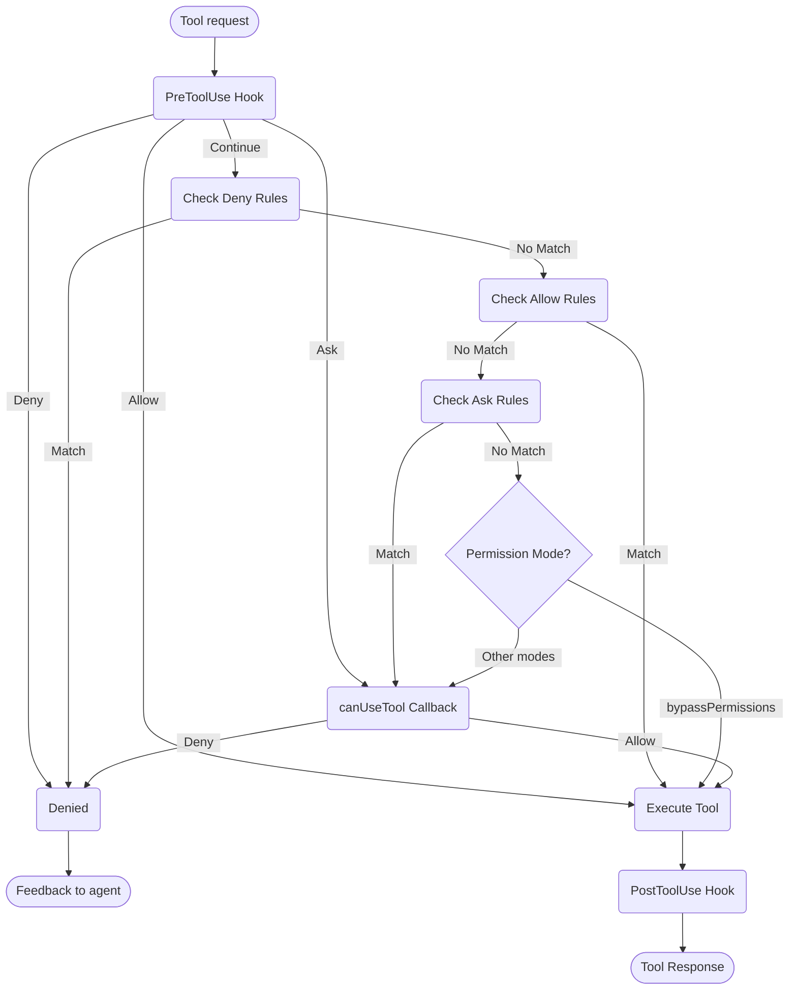

# 권한 처리

Claude Agent SDK에서 도구 사용 및 권한 제어

---

# SDK 권한

Claude Agent SDK는 애플리케이션에서 Claude가 도구를 사용하는 방식을 관리할 수 있는 강력한 권한 제어 기능을 제공합니다.

이 가이드에서는 `canUseTool` 콜백, 훅 및 settings.json 권한 규칙을 사용하여 권한 시스템을 구현하는 방법을 다룹니다. 전체 API 문서는 [TypeScript SDK 참조](/docs/ko/agent-sdk/typescript)를 참조하세요.

## 개요

Claude Agent SDK는 도구 사용을 제어하는 네 가지 상호 보완적인 방법을 제공합니다:

1. **[권한 모드](#permission-modes)** - 모든 도구에 영향을 미치는 전역 권한 동작 설정
2. **[canUseTool 콜백](/docs/ko/agent-sdk/typescript#canusetool)** - 다른 규칙으로 다루지 않는 경우를 위한 런타임 권한 핸들러
3. **[훅](/docs/ko/agent-sdk/hooks)** - 모든 도구 실행에 대한 세밀한 제어 및 사용자 정의 로직
4. **[권한 규칙 (settings.json)](https://code.claude.com/docs/en/settings#permission-settings)** - 통합 bash 명령어 파싱을 포함한 선언적 허용/거부 규칙

각 접근 방식의 사용 사례:
- 권한 모드 - 전체 권한 동작 설정 (계획, 자동 편집 수락, 검사 우회)
- `canUseTool` - 다루지 않은 경우에 대한 동적 승인, 사용자에게 권한 요청
- 훅 - 모든 도구 실행에 대한 프로그래밍 방식의 제어
- 권한 규칙 - 지능형 bash 명령어 파싱을 포함한 정적 정책

## 권한 흐름 다이어그램



**처리 순서:** PreToolUse Hook → Deny Rules → Allow Rules → Ask Rules → Permission Mode Check → canUseTool Callback → PostToolUse Hook

## 권한 모드

권한 모드는 Claude가 도구를 사용하는 방식에 대한 전역 제어를 제공합니다. `query()`를 호출할 때 권한 모드를 설정하거나 스트리밍 세션 중에 동적으로 변경할 수 있습니다.

### 사용 가능한 모드

SDK는 각각 다른 동작을 가진 네 가지 권한 모드를 지원합니다:

| 모드 | 설명 | 도구 동작 |
| :--- | :---------- | :------------ |
| `default` | 표준 권한 동작 | 일반 권한 검사 적용 |
| `plan` | 계획 모드 - 실행 없음 | Claude는 읽기 전용 도구만 사용 가능; 실행 전에 계획 제시 **(현재 SDK에서 지원되지 않음)** |
| `acceptEdits` | 자동 파일 편집 수락 | 파일 편집 및 파일 시스템 작업이 자동으로 승인됨 |
| `bypassPermissions` | 모든 권한 검사 우회 | 모든 도구가 권한 프롬프트 없이 실행됨 (주의해서 사용) |

### 권한 모드 설정

권한 모드를 두 가지 방법으로 설정할 수 있습니다:

#### 1. 초기 구성

쿼리를 생성할 때 모드를 설정합니다:

<CodeGroup>

```typescript TypeScript
import { query } from "@anthropic-ai/claude-agent-sdk";

const result = await query({
  prompt: "Help me refactor this code",
  options: {
    permissionMode: 'default'  // Standard permission mode
  }
});
```

```python Python
from claude_agent_sdk import query

result = await query(
    prompt="Help me refactor this code",
    options={
        "permission_mode": "default"  # Standard permission mode
    }
)
```

</CodeGroup>

#### 2. 동적 모드 변경 (스트리밍만 해당)

스트리밍 세션 중에 모드를 변경합니다:

<CodeGroup>

```typescript TypeScript
import { query } from "@anthropic-ai/claude-agent-sdk";

// Create an async generator for streaming input
async function* streamInput() {
  yield { 
    type: 'user',
    message: { 
      role: 'user', 
      content: "Let's start with default permissions" 
    }
  };
  
  // Later in the conversation...
  yield {
    type: 'user',
    message: {
      role: 'user',
      content: "Now let's speed up development"
    }
  };
}

const q = query({
  prompt: streamInput(),
  options: {
    permissionMode: 'default'  // Start in default mode
  }
});

// Change mode dynamically
await q.setPermissionMode('acceptEdits');

// Process messages
for await (const message of q) {
  console.log(message);
}
```

```python Python
from claude_agent_sdk import query

async def stream_input():
    """Async generator for streaming input"""
    yield {
        "type": "user",
        "message": {
            "role": "user",
            "content": "Let's start with default permissions"
        }
    }
    
    # Later in the conversation...
    yield {
        "type": "user",
        "message": {
            "role": "user",
            "content": "Now let's speed up development"
        }
    }

q = query(
    prompt=stream_input(),
    options={
        "permission_mode": "default"  # Start in default mode
    }
)

# Change mode dynamically
await q.set_permission_mode("acceptEdits")

# Process messages
async for message in q:
    print(message)
```

</CodeGroup>

### 모드별 동작

#### 편집 수락 모드 (`acceptEdits`)

편집 수락 모드에서:
- 모든 파일 편집이 자동으로 승인됨
- 파일 시스템 작업 (mkdir, touch, rm 등)이 자동 승인됨
- 다른 도구는 여전히 일반 권한 필요
- Claude의 편집을 신뢰할 때 개발 속도 향상
- 빠른 프로토타이핑 및 반복에 유용

자동 승인 작업:
- 파일 편집 (Edit, Write 도구)
- Bash 파일 시스템 명령어 (mkdir, touch, rm, mv, cp)
- 파일 생성 및 삭제

#### 권한 우회 모드 (`bypassPermissions`)

권한 우회 모드에서:
- **모든 도구 사용이 자동으로 승인됨**
- 권한 프롬프트가 나타나지 않음
- 훅은 여전히 실행됨 (여전히 작업을 차단할 수 있음)
- **매우 주의해서 사용** - Claude가 전체 시스템 액세스 권한 보유
- 제어된 환경에서만 권장

### 권한 흐름에서의 모드 우선순위

권한 모드는 권한 흐름의 특정 지점에서 평가됩니다:

1. **훅이 먼저 실행됨** - 허용, 거부, 요청 또는 계속 가능
2. **거부 규칙이 확인됨** - 모드와 관계없이 도구 차단
3. **허용 규칙이 확인됨** - 일치하면 도구 허용
4. **요청 규칙이 확인됨** - 일치하면 권한 요청
5. **권한 모드가 평가됨:**
   - **`bypassPermissions` 모드** - 활성화되면 남은 모든 도구 허용
   - **다른 모드** - `canUseTool` 콜백으로 연기
6. **`canUseTool` 콜백** - 남은 경우 처리

이는 다음을 의미합니다:
- 훅은 `bypassPermissions` 모드에서도 항상 도구 사용을 제어할 수 있음
- 명시적 거부 규칙은 모든 권한 모드를 무시
- 요청 규칙은 권한 모드 전에 평가됨
- `bypassPermissions` 모드는 일치하지 않은 도구에 대해 `canUseTool` 콜백을 무시

### 모범 사례

1. **기본 모드 사용** - 일반 권한 검사를 통한 제어된 실행
2. **acceptEdits 모드 사용** - 격리된 파일 또는 디렉토리에서 작업할 때
3. **bypassPermissions 피하기** - 프로덕션 또는 민감한 데이터가 있는 시스템에서
4. **훅과 모드 결합** - 세밀한 제어를 위해
5. **동적으로 모드 전환** - 작업 진행 상황 및 신뢰도에 따라

모드 진행의 예:
```typescript
// Start in default mode for controlled execution
permissionMode: 'default'

// Switch to acceptEdits for rapid iteration
await q.setPermissionMode('acceptEdits')
```

## canUseTool

`canUseTool` 콜백은 `query` 함수를 호출할 때 옵션으로 전달됩니다. 도구 이름과 입력 매개변수를 받으며, 허용 또는 거부 중 하나의 결정을 반환해야 합니다.

canUseTool은 Claude Code가 사용자에게 권한 프롬프트를 표시할 때마다 실행됩니다. 예를 들어 훅 및 권한 규칙으로 다루지 않고 acceptEdits 모드가 아닐 때입니다.

다음은 대화형 도구 승인을 구현하는 방법을 보여주는 완전한 예입니다:

<CodeGroup>

```typescript TypeScript
import { query } from "@anthropic-ai/claude-agent-sdk";

async function promptForToolApproval(toolName: string, input: any) {
  console.log("\n🔧 Tool Request:");
  console.log(`   Tool: ${toolName}`);
  
  // Display tool parameters
  if (input && Object.keys(input).length > 0) {
    console.log("   Parameters:");
    for (const [key, value] of Object.entries(input)) {
      let displayValue = value;
      if (typeof value === 'string' && value.length > 100) {
        displayValue = value.substring(0, 100) + "...";
      } else if (typeof value === 'object') {
        displayValue = JSON.stringify(value, null, 2);
      }
      console.log(`     ${key}: ${displayValue}`);
    }
  }
  
  // Get user approval (replace with your UI logic)
  const approved = await getUserApproval();
  
  if (approved) {
    console.log("   ✅ Approved\n");
    return {
      behavior: "allow",
      updatedInput: input
    };
  } else {
    console.log("   ❌ Denied\n");
    return {
      behavior: "deny",
      message: "User denied permission for this tool"
    };
  }
}

// Use the permission callback
const result = await query({
  prompt: "Help me analyze this codebase",
  options: {
    canUseTool: async (toolName, input) => {
      return promptForToolApproval(toolName, input);
    }
  }
});
```

```python Python
from claude_agent_sdk import query

async def prompt_for_tool_approval(tool_name: str, input_params: dict):
    print(f"\n🔧 Tool Request:")
    print(f"   Tool: {tool_name}")

    # Display parameters
    if input_params:
        print("   Parameters:")
        for key, value in input_params.items():
            display_value = value
            if isinstance(value, str) and len(value) > 100:
                display_value = value[:100] + "..."
            elif isinstance(value, (dict, list)):
                display_value = json.dumps(value, indent=2)
            print(f"     {key}: {display_value}")

    # Get user approval
    answer = input("\n   Approve this tool use? (y/n): ")

    if answer.lower() in ['y', 'yes']:
        print("   ✅ Approved\n")
        return {
            "behavior": "allow",
            "updatedInput": input_params
        }
    else:
        print("   ❌ Denied\n")
        return {
            "behavior": "deny",
            "message": "User denied permission for this tool"
        }

# Use the permission callback
result = await query(
    prompt="Help me analyze this codebase",
    options={
        "can_use_tool": prompt_for_tool_approval
    }
)
```

</CodeGroup>

## AskUserQuestion 도구 처리

`AskUserQuestion` 도구를 사용하면 Claude가 대화 중에 사용자에게 명확히 하는 질문을 할 수 있습니다. 이 도구가 호출되면 `canUseTool` 콜백이 질문을 받고 사용자의 답변을 반환해야 합니다.

### 입력 구조

`canUseTool`이 `toolName: "AskUserQuestion"`으로 호출될 때 입력에는 다음이 포함됩니다:

```typescript
{
  questions: [
    {
      question: "Which database should we use?",
      header: "Database",
      options: [
        { label: "PostgreSQL", description: "Relational, ACID compliant" },
        { label: "MongoDB", description: "Document-based, flexible schema" }
      ],
      multiSelect: false
    },
    {
      question: "Which features should we enable?",
      header: "Features",
      options: [
        { label: "Authentication", description: "User login and sessions" },
        { label: "Logging", description: "Request and error logging" },
        { label: "Caching", description: "Redis-based response caching" }
      ],
      multiSelect: true
    }
  ]
}
```

### 답변 반환

`updatedInput.answers`에서 질문 텍스트를 선택한 옵션 레이블에 매핑하는 레코드로 답변을 반환합니다:

```typescript
return {
  behavior: "allow",
  updatedInput: {
    questions: input.questions,  // Pass through original questions
    answers: {
      "Which database should we use?": "PostgreSQL",
      "Which features should we enable?": "Authentication, Caching"
    }
  }
}
```

<Note>
다중 선택 답변은 쉼표로 구분된 문자열입니다 (예: `"Authentication, Caching"`).
</Note>

## 관련 리소스

- [훅 가이드](/docs/ko/agent-sdk/hooks) - 도구 실행에 대한 세밀한 제어를 위해 훅을 구현하는 방법 알아보기
- [설정: 권한 규칙](https://code.claude.com/docs/en/settings#permission-settings) - bash 명령어 파싱을 포함한 선언적 허용/거부 규칙 구성