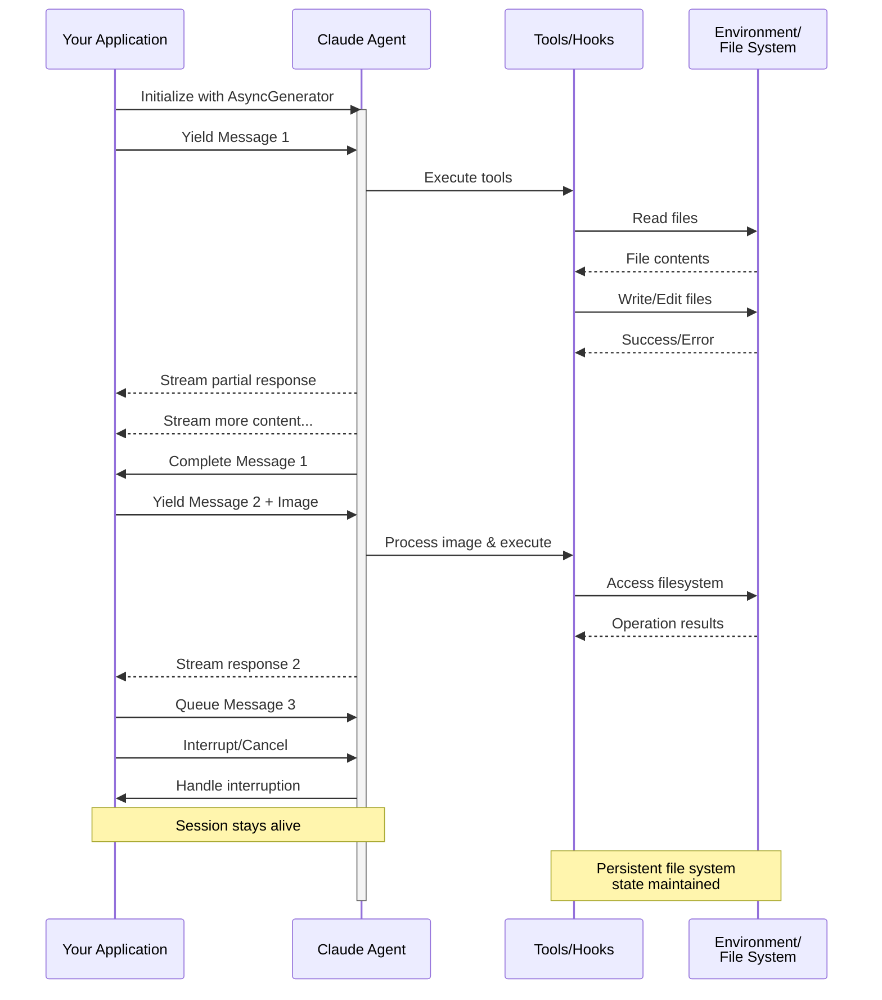

# 스트리밍 입력

Claude Agent SDK의 두 가지 입력 모드 이해 및 각각을 사용할 시기

---

## 개요

Claude Agent SDK는 에이전트와 상호작용하기 위한 두 가지 서로 다른 입력 모드를 지원합니다:

- **스트리밍 입력 모드** (기본값 및 권장) - 지속적이고 대화형 세션
- **단일 메시지 입력** - 세션 상태를 사용하고 재개하는 일회성 쿼리

이 가이드는 각 모드의 차이점, 이점 및 사용 사례를 설명하여 애플리케이션에 적합한 접근 방식을 선택하는 데 도움을 줍니다.

## 스트리밍 입력 모드 (권장)

스트리밍 입력 모드는 Claude Agent SDK를 사용하는 **선호되는** 방식입니다. 에이전트의 기능에 완전히 접근할 수 있으며 풍부하고 대화형의 경험을 가능하게 합니다.

에이전트가 장기간 실행되는 프로세스로 작동하여 사용자 입력을 받고, 중단을 처리하며, 권한 요청을 표시하고, 세션 관리를 처리할 수 있게 합니다.

### 작동 방식



### 이점

<CardGroup cols={2}>
  <Card title="이미지 업로드" icon="image">
    시각적 분석 및 이해를 위해 메시지에 직접 이미지 첨부
  </Card>
  <Card title="대기 중인 메시지" icon="stack">
    순차적으로 처리되며 중단할 수 있는 여러 메시지 전송
  </Card>
  <Card title="도구 통합" icon="wrench">
    세션 중 모든 도구 및 사용자 정의 MCP 서버에 완전히 접근
  </Card>
  <Card title="훅 지원" icon="link">
    라이프사이클 훅을 사용하여 다양한 지점에서 동작 사용자 정의
  </Card>
  <Card title="실시간 피드백" icon="lightning">
    최종 결과뿐만 아니라 생성되는 응답을 실시간으로 확인
  </Card>
  <Card title="컨텍스트 지속성" icon="database">
    여러 턴에 걸쳐 자연스럽게 대화 컨텍스트 유지
  </Card>
</CardGroup>

### 구현 예제

<CodeGroup>

```typescript TypeScript
import { query } from "@anthropic-ai/claude-agent-sdk";
import { readFileSync } from "fs";

async function* generateMessages() {
  // First message
  yield {
    type: "user" as const,
    message: {
      role: "user" as const,
      content: "Analyze this codebase for security issues"
    }
  };
  
  // Wait for conditions or user input
  await new Promise(resolve => setTimeout(resolve, 2000));
  
  // Follow-up with image
  yield {
    type: "user" as const,
    message: {
      role: "user" as const,
      content: [
        {
          type: "text",
          text: "Review this architecture diagram"
        },
        {
          type: "image",
          source: {
            type: "base64",
            media_type: "image/png",
            data: readFileSync("diagram.png", "base64")
          }
        }
      ]
    }
  };
}

// Process streaming responses
for await (const message of query({
  prompt: generateMessages(),
  options: {
    maxTurns: 10,
    allowedTools: ["Read", "Grep"]
  }
})) {
  if (message.type === "result") {
    console.log(message.result);
  }
}
```

```python Python
from claude_agent_sdk import ClaudeSDKClient, ClaudeAgentOptions, AssistantMessage, TextBlock
import asyncio
import base64

async def streaming_analysis():
    async def message_generator():
        # First message
        yield {
            "type": "user",
            "message": {
                "role": "user",
                "content": "Analyze this codebase for security issues"
            }
        }

        # Wait for conditions
        await asyncio.sleep(2)

        # Follow-up with image
        with open("diagram.png", "rb") as f:
            image_data = base64.b64encode(f.read()).decode()

        yield {
            "type": "user",
            "message": {
                "role": "user",
                "content": [
                    {
                        "type": "text",
                        "text": "Review this architecture diagram"
                    },
                    {
                        "type": "image",
                        "source": {
                            "type": "base64",
                            "media_type": "image/png",
                            "data": image_data
                        }
                    }
                ]
            }
        }

    # Use ClaudeSDKClient for streaming input
    options = ClaudeAgentOptions(
        max_turns=10,
        allowed_tools=["Read", "Grep"]
    )

    async with ClaudeSDKClient(options) as client:
        # Send streaming input
        await client.query(message_generator())

        # Process responses
        async for message in client.receive_response():
            if isinstance(message, AssistantMessage):
                for block in message.content:
                    if isinstance(block, TextBlock):
                        print(block.text)

asyncio.run(streaming_analysis())
```

</CodeGroup>

## 단일 메시지 입력

단일 메시지 입력은 더 간단하지만 더 제한적입니다.

### 단일 메시지 입력을 사용할 시기

다음의 경우 단일 메시지 입력을 사용하세요:

- 일회성 응답이 필요한 경우
- 이미지 첨부, 훅 등이 필요하지 않은 경우
- 람다 함수와 같은 상태 비저장 환경에서 작동해야 하는 경우

### 제한 사항

<Warning>
단일 메시지 입력 모드는 다음을 **지원하지 않습니다**:
- 메시지의 직접 이미지 첨부
- 동적 메시지 대기열
- 실시간 중단
- 훅 통합
- 자연스러운 다중 턴 대화
</Warning>

### 구현 예제

<CodeGroup>

```typescript TypeScript
import { query } from "@anthropic-ai/claude-agent-sdk";

// Simple one-shot query
for await (const message of query({
  prompt: "Explain the authentication flow",
  options: {
    maxTurns: 1,
    allowedTools: ["Read", "Grep"]
  }
})) {
  if (message.type === "result") {
    console.log(message.result);
  }
}

// Continue conversation with session management
for await (const message of query({
  prompt: "Now explain the authorization process",
  options: {
    continue: true,
    maxTurns: 1
  }
})) {
  if (message.type === "result") {
    console.log(message.result);
  }
}
```

```python Python
from claude_agent_sdk import query, ClaudeAgentOptions, ResultMessage
import asyncio

async def single_message_example():
    # Simple one-shot query using query() function
    async for message in query(
        prompt="Explain the authentication flow",
        options=ClaudeAgentOptions(
            max_turns=1,
            allowed_tools=["Read", "Grep"]
        )
    ):
        if isinstance(message, ResultMessage):
            print(message.result)

    # Continue conversation with session management
    async for message in query(
        prompt="Now explain the authorization process",
        options=ClaudeAgentOptions(
            continue_conversation=True,
            max_turns=1
        )
    ):
        if isinstance(message, ResultMessage):
            print(message.result)

asyncio.run(single_message_example())
```

</CodeGroup>