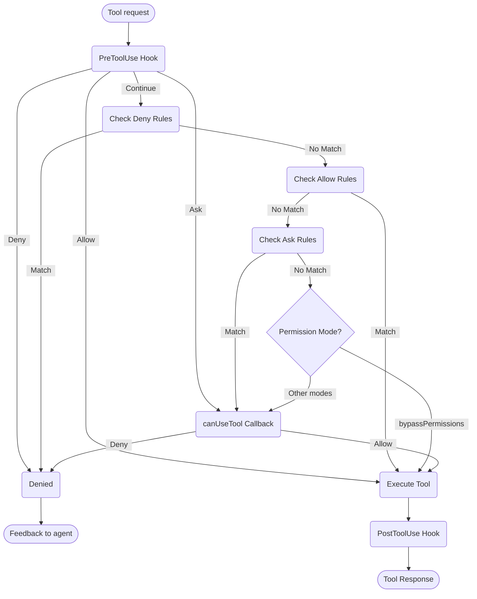

# Tratamento de Permissões

Controle o uso de ferramentas e permissões no Claude Agent SDK

---

# Permissões do SDK

O Claude Agent SDK fornece controles de permissão poderosos que permitem gerenciar como Claude usa ferramentas em sua aplicação.

Este guia aborda como implementar sistemas de permissão usando o callback `canUseTool`, hooks e regras de permissão settings.json. Para documentação completa da API, consulte a [referência do SDK TypeScript](/docs/pt-BR/agent-sdk/typescript).

## Visão Geral

O Claude Agent SDK fornece quatro maneiras complementares de controlar o uso de ferramentas:

1. **[Modos de Permissão](#permission-modes)** - Configurações de comportamento de permissão global que afetam todas as ferramentas
2. **[Callback canUseTool](/docs/pt-BR/agent-sdk/typescript#canusetool)** - Manipulador de permissão em tempo de execução para casos não cobertos por outras regras
3. **[Hooks](/docs/pt-BR/agent-sdk/hooks)** - Controle refinado sobre cada execução de ferramenta com lógica personalizada
4. **[Regras de permissão (settings.json)](https://code.claude.com/docs/en/settings#permission-settings)** - Regras declarativas de permissão/negação com análise integrada de comandos bash

Casos de uso para cada abordagem:
- Modos de permissão - Definir comportamento geral de permissão (planejamento, aceitação automática de edições, bypass de verificações)
- `canUseTool` - Aprovação dinâmica para casos não cobertos, solicita permissão ao usuário
- Hooks - Controle programático sobre todas as execuções de ferramentas
- Regras de permissão - Políticas estáticas com análise inteligente de comandos bash

## Diagrama de Fluxo de Permissão



**Ordem de Processamento:** PreToolUse Hook → Regras de Negação → Regras de Permissão → Regras de Solicitação → Verificação de Modo de Permissão → Callback canUseTool → PostToolUse Hook

## Modos de Permissão

Os modos de permissão fornecem controle global sobre como Claude usa ferramentas. Você pode definir o modo de permissão ao chamar `query()` ou alterá-lo dinamicamente durante sessões de streaming.

### Modos Disponíveis

O SDK suporta quatro modos de permissão, cada um com comportamento diferente:

| Modo | Descrição | Comportamento da Ferramenta |
| :--- | :---------- | :------------ |
| `default` | Comportamento de permissão padrão | Verificações de permissão normais se aplicam |
| `plan` | Modo de planejamento - sem execução | Claude pode usar apenas ferramentas somente leitura; apresenta um plano antes da execução **(Não suportado atualmente no SDK)** |
| `acceptEdits` | Aceitar automaticamente edições de arquivo | Edições de arquivo e operações do sistema de arquivos são aprovadas automaticamente |
| `bypassPermissions` | Bypass de todas as verificações de permissão | Todas as ferramentas são executadas sem prompts de permissão (use com cuidado) |

### Definindo o Modo de Permissão

Você pode definir o modo de permissão de duas maneiras:

#### 1. Configuração Inicial

Defina o modo ao criar uma consulta:

<CodeGroup>

```typescript TypeScript
import { query } from "@anthropic-ai/claude-agent-sdk";

const result = await query({
  prompt: "Help me refactor this code",
  options: {
    permissionMode: 'default'  // Standard permission mode
  }
});
```

```python Python
from claude_agent_sdk import query

result = await query(
    prompt="Help me refactor this code",
    options={
        "permission_mode": "default"  # Standard permission mode
    }
)
```

</CodeGroup>

#### 2. Alterações Dinâmicas de Modo (Apenas Streaming)

Altere o modo durante uma sessão de streaming:

<CodeGroup>

```typescript TypeScript
import { query } from "@anthropic-ai/claude-agent-sdk";

// Create an async generator for streaming input
async function* streamInput() {
  yield { 
    type: 'user',
    message: { 
      role: 'user', 
      content: "Let's start with default permissions" 
    }
  };
  
  // Later in the conversation...
  yield {
    type: 'user',
    message: {
      role: 'user',
      content: "Now let's speed up development"
    }
  };
}

const q = query({
  prompt: streamInput(),
  options: {
    permissionMode: 'default'  // Start in default mode
  }
});

// Change mode dynamically
await q.setPermissionMode('acceptEdits');

// Process messages
for await (const message of q) {
  console.log(message);
}
```

```python Python
from claude_agent_sdk import query

async def stream_input():
    """Async generator for streaming input"""
    yield {
        "type": "user",
        "message": {
            "role": "user",
            "content": "Let's start with default permissions"
        }
    }
    
    # Later in the conversation...
    yield {
        "type": "user",
        "message": {
            "role": "user",
            "content": "Now let's speed up development"
        }
    }

q = query(
    prompt=stream_input(),
    options={
        "permission_mode": "default"  # Start in default mode
    }
)

# Change mode dynamically
await q.set_permission_mode("acceptEdits")

# Process messages
async for message in q:
    print(message)
```

</CodeGroup>

### Comportamentos Específicos do Modo

#### Modo Aceitar Edições (`acceptEdits`)

No modo aceitar edições:
- Todas as edições de arquivo são aprovadas automaticamente
- Operações do sistema de arquivos (mkdir, touch, rm, etc.) são auto-aprovadas
- Outras ferramentas ainda requerem permissões normais
- Acelera o desenvolvimento quando você confia nas edições do Claude
- Útil para prototipagem rápida e iterações

Operações auto-aprovadas:
- Edições de arquivo (ferramentas Edit, Write)
- Comandos bash do sistema de arquivos (mkdir, touch, rm, mv, cp)
- Criação e exclusão de arquivo

#### Modo Bypass de Permissões (`bypassPermissions`)

No modo bypass de permissões:
- **TODOS os usos de ferramentas são aprovados automaticamente**
- Nenhum prompt de permissão aparece
- Hooks ainda são executados (ainda podem bloquear operações)
- **Use com extremo cuidado** - Claude tem acesso total ao sistema
- Recomendado apenas para ambientes controlados

### Prioridade do Modo no Fluxo de Permissão

Os modos de permissão são avaliados em um ponto específico no fluxo de permissão:

1. **Hooks são executados primeiro** - Podem permitir, negar, solicitar ou continuar
2. **Regras de negação** são verificadas - Bloqueiam ferramentas independentemente do modo
3. **Regras de permissão** são verificadas - Permitem ferramentas se correspondidas
4. **Regras de solicitação** são verificadas - Solicitam permissão se correspondidas
5. **Modo de permissão** é avaliado:
   - **Modo `bypassPermissions`** - Se ativo, permite todas as ferramentas restantes
   - **Outros modos** - Adiam para o callback `canUseTool`
6. **Callback `canUseTool`** - Manipula casos restantes

Isso significa:
- Hooks podem sempre controlar o uso de ferramentas, mesmo no modo `bypassPermissions`
- Regras de negação explícitas substituem todos os modos de permissão
- Regras de solicitação são avaliadas antes dos modos de permissão
- O modo `bypassPermissions` substitui o callback `canUseTool` para ferramentas não correspondidas

### Melhores Práticas

1. **Use o modo padrão** para execução controlada com verificações de permissão normais
2. **Use o modo acceptEdits** ao trabalhar em arquivos ou diretórios isolados
3. **Evite bypassPermissions** em produção ou em sistemas com dados sensíveis
4. **Combine modos com hooks** para controle refinado
5. **Alterne modos dinamicamente** com base no progresso da tarefa e confiança

Exemplo de progressão de modo:
```typescript
// Start in default mode for controlled execution
permissionMode: 'default'

// Switch to acceptEdits for rapid iteration
await q.setPermissionMode('acceptEdits')
```

## canUseTool

O callback `canUseTool` é passado como uma opção ao chamar a função `query`. Ele recebe o nome da ferramenta e os parâmetros de entrada, e deve retornar uma decisão - permitir ou negar.

canUseTool dispara sempre que Claude Code mostraria um prompt de permissão a um usuário, por exemplo, hooks e regras de permissão não cobrem e não está no modo acceptEdits.

Aqui está um exemplo completo mostrando como implementar aprovação interativa de ferramentas:

<CodeGroup>

```typescript TypeScript
import { query } from "@anthropic-ai/claude-agent-sdk";

async function promptForToolApproval(toolName: string, input: any) {
  console.log("\n🔧 Tool Request:");
  console.log(`   Tool: ${toolName}`);
  
  // Display tool parameters
  if (input && Object.keys(input).length > 0) {
    console.log("   Parameters:");
    for (const [key, value] of Object.entries(input)) {
      let displayValue = value;
      if (typeof value === 'string' && value.length > 100) {
        displayValue = value.substring(0, 100) + "...";
      } else if (typeof value === 'object') {
        displayValue = JSON.stringify(value, null, 2);
      }
      console.log(`     ${key}: ${displayValue}`);
    }
  }
  
  // Get user approval (replace with your UI logic)
  const approved = await getUserApproval();
  
  if (approved) {
    console.log("   ✅ Approved\n");
    return {
      behavior: "allow",
      updatedInput: input
    };
  } else {
    console.log("   ❌ Denied\n");
    return {
      behavior: "deny",
      message: "User denied permission for this tool"
    };
  }
}

// Use the permission callback
const result = await query({
  prompt: "Help me analyze this codebase",
  options: {
    canUseTool: async (toolName, input) => {
      return promptForToolApproval(toolName, input);
    }
  }
});
```

```python Python
from claude_agent_sdk import query

async def prompt_for_tool_approval(tool_name: str, input_params: dict):
    print(f"\n🔧 Tool Request:")
    print(f"   Tool: {tool_name}")

    # Display parameters
    if input_params:
        print("   Parameters:")
        for key, value in input_params.items():
            display_value = value
            if isinstance(value, str) and len(value) > 100:
                display_value = value[:100] + "..."
            elif isinstance(value, (dict, list)):
                display_value = json.dumps(value, indent=2)
            print(f"     {key}: {display_value}")

    # Get user approval
    answer = input("\n   Approve this tool use? (y/n): ")

    if answer.lower() in ['y', 'yes']:
        print("   ✅ Approved\n")
        return {
            "behavior": "allow",
            "updatedInput": input_params
        }
    else:
        print("   ❌ Denied\n")
        return {
            "behavior": "deny",
            "message": "User denied permission for this tool"
        }

# Use the permission callback
result = await query(
    prompt="Help me analyze this codebase",
    options={
        "can_use_tool": prompt_for_tool_approval
    }
)
```

</CodeGroup>

## Tratamento da Ferramenta AskUserQuestion

A ferramenta `AskUserQuestion` permite que Claude faça perguntas de esclarecimento ao usuário durante uma conversa. Quando esta ferramenta é chamada, seu callback `canUseTool` recebe as perguntas e deve retornar as respostas do usuário.

### Estrutura de Entrada

Quando `canUseTool` é chamado com `toolName: "AskUserQuestion"`, a entrada contém:

```typescript
{
  questions: [
    {
      question: "Which database should we use?",
      header: "Database",
      options: [
        { label: "PostgreSQL", description: "Relational, ACID compliant" },
        { label: "MongoDB", description: "Document-based, flexible schema" }
      ],
      multiSelect: false
    },
    {
      question: "Which features should we enable?",
      header: "Features",
      options: [
        { label: "Authentication", description: "User login and sessions" },
        { label: "Logging", description: "Request and error logging" },
        { label: "Caching", description: "Redis-based response caching" }
      ],
      multiSelect: true
    }
  ]
}
```

### Retornando Respostas

Retorne as respostas em `updatedInput.answers` como um registro mapeando texto de pergunta para o(s) rótulo(s) de opção selecionada(s):

```typescript
return {
  behavior: "allow",
  updatedInput: {
    questions: input.questions,  // Pass through original questions
    answers: {
      "Which database should we use?": "PostgreSQL",
      "Which features should we enable?": "Authentication, Caching"
    }
  }
}
```

<Note>
Respostas de seleção múltipla são strings separadas por vírgula (por exemplo, `"Authentication, Caching"`).
</Note>

## Recursos Relacionados

- [Guia de Hooks](/docs/pt-BR/agent-sdk/hooks) - Aprenda como implementar hooks para controle refinado sobre a execução de ferramentas
- [Configurações: Regras de Permissão](https://code.claude.com/docs/en/settings#permission-settings) - Configure regras declarativas de permissão/negação com análise de comandos bash