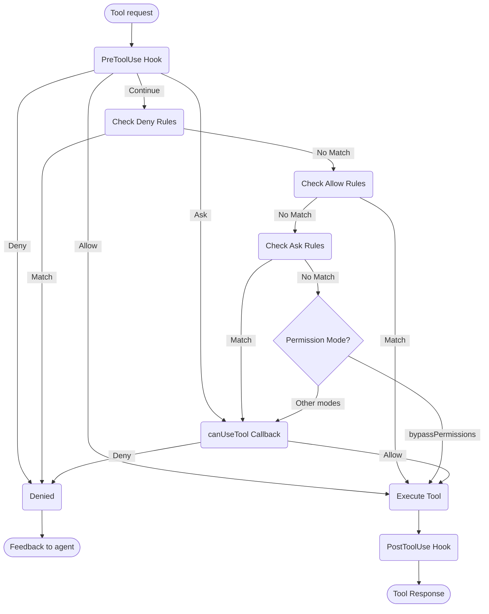

# Управление разрешениями

Контролируйте использование инструментов и разрешения в Claude Agent SDK

---

# Разрешения SDK

Claude Agent SDK предоставляет мощные элементы управления разрешениями, которые позволяют вам управлять тем, как Claude использует инструменты в вашем приложении.

Это руководство охватывает способы реализации систем разрешений с использованием обратного вызова `canUseTool`, хуков и правил разрешений settings.json. Полную документацию API см. в [справочнике TypeScript SDK](/docs/ru/agent-sdk/typescript).

## Обзор

Claude Agent SDK предоставляет четыре дополняющих друг друга способа управления использованием инструментов:

1. **[Режимы разрешений](#permission-modes)** - Глобальные параметры поведения разрешений, влияющие на все инструменты
2. **[Обратный вызов canUseTool](/docs/ru/agent-sdk/typescript#canusetool)** - Обработчик разрешений во время выполнения для случаев, не охватываемых другими правилами
3. **[Хуки](/docs/ru/agent-sdk/hooks)** - Точное управление каждым выполнением инструмента с пользовательской логикой
4. **[Правила разрешений (settings.json)](https://code.claude.com/docs/en/settings#permission-settings)** - Декларативные правила разрешения/запрета с интегрированным анализом команд bash

Варианты использования для каждого подхода:
- Режимы разрешений - Установка общего поведения разрешений (планирование, автоприятие редактирования, обход проверок)
- `canUseTool` - Динамическое одобрение для необработанных случаев, запрос разрешения у пользователя
- Хуки - Программное управление всеми выполнениями инструментов
- Правила разрешений - Статические политики с интеллектуальным анализом команд bash

## Диаграмма потока разрешений



**Порядок обработки:** PreToolUse Hook → Deny Rules → Allow Rules → Ask Rules → Permission Mode Check → canUseTool Callback → PostToolUse Hook

## Режимы разрешений

Режимы разрешений обеспечивают глобальное управление тем, как Claude использует инструменты. Вы можете установить режим разрешений при вызове `query()` или изменить его динамически во время сеансов потоковой передачи.

### Доступные режимы

SDK поддерживает четыре режима разрешений, каждый с различным поведением:

| Режим | Описание | Поведение инструмента |
| :--- | :---------- | :------------ |
| `default` | Стандартное поведение разрешений | Применяются обычные проверки разрешений |
| `plan` | Режим планирования - без выполнения | Claude может использовать только инструменты только для чтения; представляет план перед выполнением **(В настоящее время не поддерживается в SDK)** |
| `acceptEdits` | Автоприятие редактирования файлов | Редактирование файлов и операции файловой системы автоматически одобряются |
| `bypassPermissions` | Обход всех проверок разрешений | Все инструменты работают без запросов разрешений (используйте с осторожностью) |

### Установка режима разрешений

Вы можете установить режим разрешений двумя способами:

#### 1. Начальная конфигурация

Установите режим при создании запроса:

<CodeGroup>

```typescript TypeScript
import { query } from "@anthropic-ai/claude-agent-sdk";

const result = await query({
  prompt: "Help me refactor this code",
  options: {
    permissionMode: 'default'  // Standard permission mode
  }
});
```

```python Python
from claude_agent_sdk import query

result = await query(
    prompt="Help me refactor this code",
    options={
        "permission_mode": "default"  # Standard permission mode
    }
)
```

</CodeGroup>

#### 2. Динамические изменения режима (только потоковая передача)

Измените режим во время сеанса потоковой передачи:

<CodeGroup>

```typescript TypeScript
import { query } from "@anthropic-ai/claude-agent-sdk";

// Create an async generator for streaming input
async function* streamInput() {
  yield { 
    type: 'user',
    message: { 
      role: 'user', 
      content: "Let's start with default permissions" 
    }
  };
  
  // Later in the conversation...
  yield {
    type: 'user',
    message: {
      role: 'user',
      content: "Now let's speed up development"
    }
  };
}

const q = query({
  prompt: streamInput(),
  options: {
    permissionMode: 'default'  // Start in default mode
  }
});

// Change mode dynamically
await q.setPermissionMode('acceptEdits');

// Process messages
for await (const message of q) {
  console.log(message);
}
```

```python Python
from claude_agent_sdk import query

async def stream_input():
    """Async generator for streaming input"""
    yield {
        "type": "user",
        "message": {
            "role": "user",
            "content": "Let's start with default permissions"
        }
    }
    
    # Later in the conversation...
    yield {
        "type": "user",
        "message": {
            "role": "user",
            "content": "Now let's speed up development"
        }
    }

q = query(
    prompt=stream_input(),
    options={
        "permission_mode": "default"  # Start in default mode
    }
)

# Change mode dynamically
await q.set_permission_mode("acceptEdits")

# Process messages
async for message in q:
    print(message)
```

</CodeGroup>

### Поведение, специфичное для режима

#### Режим приема редактирования (`acceptEdits`)

В режиме приема редактирования:
- Все редактирования файлов автоматически одобряются
- Операции файловой системы (mkdir, touch, rm и т. д.) автоматически одобряются
- Другие инструменты по-прежнему требуют обычных разрешений
- Ускоряет разработку, когда вы доверяете редактированию Claude
- Полезно для быстрого прототипирования и итераций

Автоматически одобренные операции:
- Редактирование файлов (инструменты Edit, Write)
- Команды bash файловой системы (mkdir, touch, rm, mv, cp)
- Создание и удаление файлов

#### Режим обхода разрешений (`bypassPermissions`)

В режиме обхода разрешений:
- **ВСЕ использования инструментов автоматически одобряются**
- Запросы разрешений не появляются
- Хуки по-прежнему выполняются (могут по-прежнему блокировать операции)
- **Используйте с крайней осторожностью** - Claude имеет полный доступ к системе
- Рекомендуется только для контролируемых сред

### Приоритет режима в потоке разрешений

Режимы разрешений оцениваются в определенной точке потока разрешений:

1. **Хуки выполняются первыми** - Могут разрешить, запретить, спросить или продолжить
2. **Проверяются правила запрета** - Блокируют инструменты независимо от режима
3. **Проверяются правила разрешения** - Разрешают инструменты при совпадении
4. **Проверяются правила запроса** - Запрашивают разрешение при совпадении
5. **Оценивается режим разрешений:**
   - **Режим `bypassPermissions`** - Если активен, разрешает все оставшиеся инструменты
   - **Другие режимы** - Отложить на обратный вызов `canUseTool`
6. **Обратный вызов `canUseTool`** - Обрабатывает оставшиеся случаи

Это означает:
- Хуки всегда могут управлять использованием инструментов, даже в режиме `bypassPermissions`
- Явные правила запрета переопределяют все режимы разрешений
- Правила запроса оцениваются перед режимами разрешений
- Режим `bypassPermissions` переопределяет обратный вызов `canUseTool` для несовпадающих инструментов

### Лучшие практики

1. **Используйте режим по умолчанию** для контролируемого выполнения с обычными проверками разрешений
2. **Используйте режим acceptEdits** при работе с изолированными файлами или каталогами
3. **Избегайте bypassPermissions** в производстве или на системах с конфиденциальными данными
4. **Комбинируйте режимы с хуками** для точного управления
5. **Динамически переключайте режимы** в зависимости от прогресса задачи и уверенности

Пример прогрессии режима:
```typescript
// Start in default mode for controlled execution
permissionMode: 'default'

// Switch to acceptEdits for rapid iteration
await q.setPermissionMode('acceptEdits')
```

## canUseTool

Обратный вызов `canUseTool` передается как опция при вызове функции `query`. Он получает имя инструмента и входные параметры и должен вернуть решение - разрешить или запретить.

canUseTool срабатывает всякий раз, когда Claude Code показал бы запрос разрешения пользователю, например, когда хуки и правила разрешений не охватывают это и это не находится в режиме acceptEdits.

Вот полный пример, показывающий, как реализовать интерактивное одобрение инструмента:

<CodeGroup>

```typescript TypeScript
import { query } from "@anthropic-ai/claude-agent-sdk";

async function promptForToolApproval(toolName: string, input: any) {
  console.log("\n🔧 Tool Request:");
  console.log(`   Tool: ${toolName}`);
  
  // Display tool parameters
  if (input && Object.keys(input).length > 0) {
    console.log("   Parameters:");
    for (const [key, value] of Object.entries(input)) {
      let displayValue = value;
      if (typeof value === 'string' && value.length > 100) {
        displayValue = value.substring(0, 100) + "...";
      } else if (typeof value === 'object') {
        displayValue = JSON.stringify(value, null, 2);
      }
      console.log(`     ${key}: ${displayValue}`);
    }
  }
  
  // Get user approval (replace with your UI logic)
  const approved = await getUserApproval();
  
  if (approved) {
    console.log("   ✅ Approved\n");
    return {
      behavior: "allow",
      updatedInput: input
    };
  } else {
    console.log("   ❌ Denied\n");
    return {
      behavior: "deny",
      message: "User denied permission for this tool"
    };
  }
}

// Use the permission callback
const result = await query({
  prompt: "Help me analyze this codebase",
  options: {
    canUseTool: async (toolName, input) => {
      return promptForToolApproval(toolName, input);
    }
  }
});
```

```python Python
from claude_agent_sdk import query

async def prompt_for_tool_approval(tool_name: str, input_params: dict):
    print(f"\n🔧 Tool Request:")
    print(f"   Tool: {tool_name}")

    # Display parameters
    if input_params:
        print("   Parameters:")
        for key, value in input_params.items():
            display_value = value
            if isinstance(value, str) and len(value) > 100:
                display_value = value[:100] + "..."
            elif isinstance(value, (dict, list)):
                display_value = json.dumps(value, indent=2)
            print(f"     {key}: {display_value}")

    # Get user approval
    answer = input("\n   Approve this tool use? (y/n): ")

    if answer.lower() in ['y', 'yes']:
        print("   ✅ Approved\n")
        return {
            "behavior": "allow",
            "updatedInput": input_params
        }
    else:
        print("   ❌ Denied\n")
        return {
            "behavior": "deny",
            "message": "User denied permission for this tool"
        }

# Use the permission callback
result = await query(
    prompt="Help me analyze this codebase",
    options={
        "can_use_tool": prompt_for_tool_approval
    }
)
```

</CodeGroup>

## Обработка инструмента AskUserQuestion

Инструмент `AskUserQuestion` позволяет Claude задавать пользователю уточняющие вопросы во время разговора. Когда этот инструмент вызывается, ваш обратный вызов `canUseTool` получает вопросы и должен вернуть ответы пользователя.

### Структура входных данных

Когда `canUseTool` вызывается с `toolName: "AskUserQuestion"`, входные данные содержат:

```typescript
{
  questions: [
    {
      question: "Which database should we use?",
      header: "Database",
      options: [
        { label: "PostgreSQL", description: "Relational, ACID compliant" },
        { label: "MongoDB", description: "Document-based, flexible schema" }
      ],
      multiSelect: false
    },
    {
      question: "Which features should we enable?",
      header: "Features",
      options: [
        { label: "Authentication", description: "User login and sessions" },
        { label: "Logging", description: "Request and error logging" },
        { label: "Caching", description: "Redis-based response caching" }
      ],
      multiSelect: true
    }
  ]
}
```

### Возврат ответов

Верните ответы в `updatedInput.answers` как запись, сопоставляющую текст вопроса с выбранной меткой опции:

```typescript
return {
  behavior: "allow",
  updatedInput: {
    questions: input.questions,  // Pass through original questions
    answers: {
      "Which database should we use?": "PostgreSQL",
      "Which features should we enable?": "Authentication, Caching"
    }
  }
}
```

<Note>
Ответы с множественным выбором - это строки, разделенные запятыми (например, `"Authentication, Caching"`).
</Note>

## Связанные ресурсы

- [Руководство по хукам](/docs/ru/agent-sdk/hooks) - Узнайте, как реализовать хуки для точного управления выполнением инструментов
- [Параметры: правила разрешений](https://code.claude.com/docs/en/settings#permission-settings) - Настройте декларативные правила разрешения/запрета с анализом команд bash