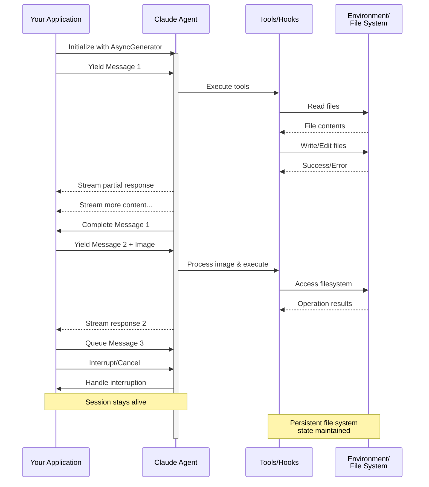

# Потоковый ввод

Понимание двух режимов ввода для Claude Agent SDK и когда использовать каждый

---

## Обзор

Claude Agent SDK поддерживает два различных режима ввода для взаимодействия с агентами:

- **Режим потокового ввода** (По умолчанию и рекомендуется) - постоянный интерактивный сеанс
- **Ввод одного сообщения** - одноразовые запросы, которые используют состояние сеанса и возобновление

Это руководство объясняет различия, преимущества и варианты использования каждого режима, чтобы помочь вам выбрать правильный подход для вашего приложения.

## Режим потокового ввода (рекомендуется)

Режим потокового ввода - это **предпочтительный** способ использования Claude Agent SDK. Он обеспечивает полный доступ к возможностям агента и позволяет создавать богатые интерактивные впечатления.

Он позволяет агенту работать как долгоживущий процесс, который принимает пользовательский ввод, обрабатывает прерывания, выводит запросы разрешений и управляет сеансом.

### Как это работает



### Преимущества

<CardGroup cols={2}>
  <Card title="Загрузка изображений" icon="image">
    Прикрепляйте изображения непосредственно к сообщениям для визуального анализа и понимания
  </Card>
  <Card title="Сообщения в очереди" icon="stack">
    Отправляйте несколько сообщений, которые обрабатываются последовательно, с возможностью прерывания
  </Card>
  <Card title="Интеграция инструментов" icon="wrench">
    Полный доступ ко всем инструментам и пользовательским серверам MCP во время сеанса
  </Card>
  <Card title="Поддержка хуков" icon="link">
    Используйте хуки жизненного цикла для настройки поведения в различных точках
  </Card>
  <Card title="Обратная связь в реальном времени" icon="lightning">
    Смотрите ответы по мере их создания, а не только окончательные результаты
  </Card>
  <Card title="Сохранение контекста" icon="database">
    Сохраняйте контекст разговора в нескольких ходах естественным образом
  </Card>
</CardGroup>

### Пример реализации

<CodeGroup>

```typescript TypeScript
import { query } from "@anthropic-ai/claude-agent-sdk";
import { readFileSync } from "fs";

async function* generateMessages() {
  // First message
  yield {
    type: "user" as const,
    message: {
      role: "user" as const,
      content: "Analyze this codebase for security issues"
    }
  };
  
  // Wait for conditions or user input
  await new Promise(resolve => setTimeout(resolve, 2000));
  
  // Follow-up with image
  yield {
    type: "user" as const,
    message: {
      role: "user" as const,
      content: [
        {
          type: "text",
          text: "Review this architecture diagram"
        },
        {
          type: "image",
          source: {
            type: "base64",
            media_type: "image/png",
            data: readFileSync("diagram.png", "base64")
          }
        }
      ]
    }
  };
}

// Process streaming responses
for await (const message of query({
  prompt: generateMessages(),
  options: {
    maxTurns: 10,
    allowedTools: ["Read", "Grep"]
  }
})) {
  if (message.type === "result") {
    console.log(message.result);
  }
}
```

```python Python
from claude_agent_sdk import ClaudeSDKClient, ClaudeAgentOptions, AssistantMessage, TextBlock
import asyncio
import base64

async def streaming_analysis():
    async def message_generator():
        # First message
        yield {
            "type": "user",
            "message": {
                "role": "user",
                "content": "Analyze this codebase for security issues"
            }
        }

        # Wait for conditions
        await asyncio.sleep(2)

        # Follow-up with image
        with open("diagram.png", "rb") as f:
            image_data = base64.b64encode(f.read()).decode()

        yield {
            "type": "user",
            "message": {
                "role": "user",
                "content": [
                    {
                        "type": "text",
                        "text": "Review this architecture diagram"
                    },
                    {
                        "type": "image",
                        "source": {
                            "type": "base64",
                            "media_type": "image/png",
                            "data": image_data
                        }
                    }
                ]
            }
        }

    # Use ClaudeSDKClient for streaming input
    options = ClaudeAgentOptions(
        max_turns=10,
        allowed_tools=["Read", "Grep"]
    )

    async with ClaudeSDKClient(options) as client:
        # Send streaming input
        await client.query(message_generator())

        # Process responses
        async for message in client.receive_response():
            if isinstance(message, AssistantMessage):
                for block in message.content:
                    if isinstance(block, TextBlock):
                        print(block.text)

asyncio.run(streaming_analysis())
```

</CodeGroup>

## Ввод одного сообщения

Ввод одного сообщения проще, но более ограничен.

### Когда использовать ввод одного сообщения

Используйте ввод одного сообщения, когда:

- Вам нужен одноразовый ответ
- Вам не нужны вложения изображений, хуки и т. д.
- Вам нужно работать в среде без состояния, такой как функция lambda

### Ограничения

<Warning>
Режим ввода одного сообщения **не** поддерживает:
- Прямые вложения изображений в сообщениях
- Динамическое формирование очереди сообщений
- Прерывание в реальном времени
- Интеграцию хуков
- Естественные многоходовые разговоры
</Warning>

### Пример реализации

<CodeGroup>

```typescript TypeScript
import { query } from "@anthropic-ai/claude-agent-sdk";

// Simple one-shot query
for await (const message of query({
  prompt: "Explain the authentication flow",
  options: {
    maxTurns: 1,
    allowedTools: ["Read", "Grep"]
  }
})) {
  if (message.type === "result") {
    console.log(message.result);
  }
}

// Continue conversation with session management
for await (const message of query({
  prompt: "Now explain the authorization process",
  options: {
    continue: true,
    maxTurns: 1
  }
})) {
  if (message.type === "result") {
    console.log(message.result);
  }
}
```

```python Python
from claude_agent_sdk import query, ClaudeAgentOptions, ResultMessage
import asyncio

async def single_message_example():
    # Simple one-shot query using query() function
    async for message in query(
        prompt="Explain the authentication flow",
        options=ClaudeAgentOptions(
            max_turns=1,
            allowed_tools=["Read", "Grep"]
        )
    ):
        if isinstance(message, ResultMessage):
            print(message.result)

    # Continue conversation with session management
    async for message in query(
        prompt="Now explain the authorization process",
        options=ClaudeAgentOptions(
            continue_conversation=True,
            max_turns=1
        )
    ):
        if isinstance(message, ResultMessage):
            print(message.result)

asyncio.run(single_message_example())
```

</CodeGroup>