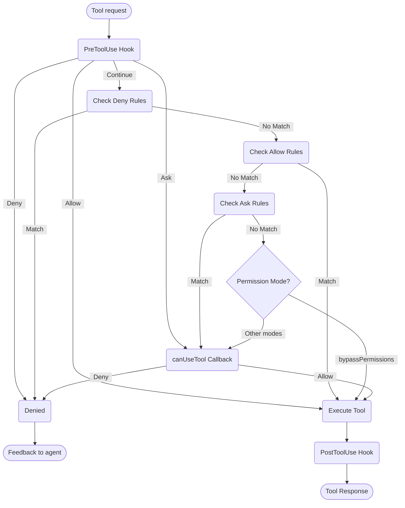

# 處理權限

在 Claude Agent SDK 中控制工具使用和權限

---

# SDK 權限

Claude Agent SDK 提供強大的權限控制，讓您能夠管理 Claude 在應用程式中如何使用工具。

本指南涵蓋如何使用 `canUseTool` 回呼、hooks 和 settings.json 權限規則來實現權限系統。如需完整的 API 文件，請參閱 [TypeScript SDK 參考](/docs/zh-TW/agent-sdk/typescript)。

## 概述

Claude Agent SDK 提供四種互補的方式來控制工具使用：

1. **[權限模式](#permission-modes)** - 影響所有工具的全域權限行為設定
2. **[canUseTool 回呼](/docs/zh-TW/agent-sdk/typescript#canusetool)** - 用於其他規則未涵蓋情況的執行時權限處理器
3. **[Hooks](/docs/zh-TW/agent-sdk/hooks)** - 對每個工具執行進行細粒度控制，具有自訂邏輯
4. **[權限規則 (settings.json)](https://code.claude.com/docs/en/settings#permission-settings)** - 具有整合 bash 命令解析的宣告式允許/拒絕規則

每種方法的使用案例：
- 權限模式 - 設定整體權限行為（規劃、自動接受編輯、繞過檢查）
- `canUseTool` - 未涵蓋情況的動態核准，提示使用者要求權限
- Hooks - 對所有工具執行的程式化控制
- 權限規則 - 具有智慧 bash 命令解析的靜態原則

## 權限流程圖



**處理順序：** PreToolUse Hook → 拒絕規則 → 允許規則 → 詢問規則 → 權限模式檢查 → canUseTool 回呼 → PostToolUse Hook

## 權限模式

權限模式提供對 Claude 如何使用工具的全域控制。您可以在呼叫 `query()` 時設定權限模式，或在串流工作階段期間動態變更它。

### 可用模式

SDK 支援四種權限模式，每種都有不同的行為：

| 模式 | 說明 | 工具行為 |
| :--- | :---------- | :------------ |
| `default` | 標準權限行為 | 套用正常權限檢查 |
| `plan` | 規劃模式 - 無執行 | Claude 只能使用唯讀工具；在執行前呈現計畫 **(SDK 目前不支援)** |
| `acceptEdits` | 自動接受檔案編輯 | 檔案編輯和檔案系統操作會自動核准 |
| `bypassPermissions` | 繞過所有權限檢查 | 所有工具執行時無需權限提示（謹慎使用） |

### 設定權限模式

您可以透過兩種方式設定權限模式：

#### 1. 初始配置

在建立查詢時設定模式：

<CodeGroup>

```typescript TypeScript
import { query } from "@anthropic-ai/claude-agent-sdk";

const result = await query({
  prompt: "Help me refactor this code",
  options: {
    permissionMode: 'default'  // Standard permission mode
  }
});
```

```python Python
from claude_agent_sdk import query

result = await query(
    prompt="Help me refactor this code",
    options={
        "permission_mode": "default"  # Standard permission mode
    }
)
```

</CodeGroup>

#### 2. 動態模式變更（僅限串流）

在串流工作階段期間變更模式：

<CodeGroup>

```typescript TypeScript
import { query } from "@anthropic-ai/claude-agent-sdk";

// Create an async generator for streaming input
async function* streamInput() {
  yield { 
    type: 'user',
    message: { 
      role: 'user', 
      content: "Let's start with default permissions" 
    }
  };
  
  // Later in the conversation...
  yield {
    type: 'user',
    message: {
      role: 'user',
      content: "Now let's speed up development"
    }
  };
}

const q = query({
  prompt: streamInput(),
  options: {
    permissionMode: 'default'  // Start in default mode
  }
});

// Change mode dynamically
await q.setPermissionMode('acceptEdits');

// Process messages
for await (const message of q) {
  console.log(message);
}
```

```python Python
from claude_agent_sdk import query

async def stream_input():
    """Async generator for streaming input"""
    yield {
        "type": "user",
        "message": {
            "role": "user",
            "content": "Let's start with default permissions"
        }
    }
    
    # Later in the conversation...
    yield {
        "type": "user",
        "message": {
            "role": "user",
            "content": "Now let's speed up development"
        }
    }

q = query(
    prompt=stream_input(),
    options={
        "permission_mode": "default"  # Start in default mode
    }
)

# Change mode dynamically
await q.set_permission_mode("acceptEdits")

# Process messages
async for message in q:
    print(message)
```

</CodeGroup>

### 模式特定行為

#### 接受編輯模式 (`acceptEdits`)

在接受編輯模式中：
- 所有檔案編輯都會自動核准
- 檔案系統操作（mkdir、touch、rm 等）會自動核准
- 其他工具仍需要正常權限
- 當您信任 Claude 的編輯時，加快開發速度
- 適用於快速原型設計和迭代

自動核准的操作：
- 檔案編輯（Edit、Write 工具）
- Bash 檔案系統命令（mkdir、touch、rm、mv、cp）
- 檔案建立和刪除

#### 繞過權限模式 (`bypassPermissions`)

在繞過權限模式中：
- **所有工具使用都會自動核准**
- 不會出現權限提示
- Hooks 仍會執行（仍可以阻止操作）
- **謹慎使用** - Claude 具有完整的系統存取權限
- 僅建議用於受控環境

### 權限流程中的模式優先順序

權限模式在權限流程中的特定點進行評估：

1. **Hooks 首先執行** - 可以允許、拒絕、詢問或繼續
2. **檢查拒絕規則** - 無論模式如何都會阻止工具
3. **檢查允許規則** - 如果符合則允許工具
4. **檢查詢問規則** - 如果符合則提示要求權限
5. **評估權限模式**：
   - **`bypassPermissions` 模式** - 如果啟用，允許所有剩餘工具
   - **其他模式** - 延遲到 `canUseTool` 回呼
6. **`canUseTool` 回呼** - 處理剩餘情況

這意味著：
- Hooks 可以始終控制工具使用，即使在 `bypassPermissions` 模式中
- 明確的拒絕規則會覆蓋所有權限模式
- 詢問規則在權限模式之前進行評估
- `bypassPermissions` 模式會覆蓋不符合工具的 `canUseTool` 回呼

### 最佳實踐

1. **使用預設模式**進行具有正常權限檢查的受控執行
2. **使用 acceptEdits 模式**在處理隔離檔案或目錄時
3. **避免 bypassPermissions** 在生產環境或包含敏感資料的系統上
4. **將模式與 hooks 結合**以進行細粒度控制
5. **根據任務進度和信心動態切換模式**

模式進度的範例：
```typescript
// Start in default mode for controlled execution
permissionMode: 'default'

// Switch to acceptEdits for rapid iteration
await q.setPermissionMode('acceptEdits')
```

## canUseTool

`canUseTool` 回呼在呼叫 `query` 函式時作為選項傳遞。它接收工具名稱和輸入參數，並必須返回決定 - 允許或拒絕。

canUseTool 在 Claude Code 會向使用者顯示權限提示時觸發，例如 hooks 和權限規則未涵蓋它且不在 acceptEdits 模式中。

以下是一個完整的範例，顯示如何實現互動式工具核准：

<CodeGroup>

```typescript TypeScript
import { query } from "@anthropic-ai/claude-agent-sdk";

async function promptForToolApproval(toolName: string, input: any) {
  console.log("\n🔧 Tool Request:");
  console.log(`   Tool: ${toolName}`);
  
  // Display tool parameters
  if (input && Object.keys(input).length > 0) {
    console.log("   Parameters:");
    for (const [key, value] of Object.entries(input)) {
      let displayValue = value;
      if (typeof value === 'string' && value.length > 100) {
        displayValue = value.substring(0, 100) + "...";
      } else if (typeof value === 'object') {
        displayValue = JSON.stringify(value, null, 2);
      }
      console.log(`     ${key}: ${displayValue}`);
    }
  }
  
  // Get user approval (replace with your UI logic)
  const approved = await getUserApproval();
  
  if (approved) {
    console.log("   ✅ Approved\n");
    return {
      behavior: "allow",
      updatedInput: input
    };
  } else {
    console.log("   ❌ Denied\n");
    return {
      behavior: "deny",
      message: "User denied permission for this tool"
    };
  }
}

// Use the permission callback
const result = await query({
  prompt: "Help me analyze this codebase",
  options: {
    canUseTool: async (toolName, input) => {
      return promptForToolApproval(toolName, input);
    }
  }
});
```

```python Python
from claude_agent_sdk import query

async def prompt_for_tool_approval(tool_name: str, input_params: dict):
    print(f"\n🔧 Tool Request:")
    print(f"   Tool: {tool_name}")

    # Display parameters
    if input_params:
        print("   Parameters:")
        for key, value in input_params.items():
            display_value = value
            if isinstance(value, str) and len(value) > 100:
                display_value = value[:100] + "..."
            elif isinstance(value, (dict, list)):
                display_value = json.dumps(value, indent=2)
            print(f"     {key}: {display_value}")

    # Get user approval
    answer = input("\n   Approve this tool use? (y/n): ")

    if answer.lower() in ['y', 'yes']:
        print("   ✅ Approved\n")
        return {
            "behavior": "allow",
            "updatedInput": input_params
        }
    else:
        print("   ❌ Denied\n")
        return {
            "behavior": "deny",
            "message": "User denied permission for this tool"
        }

# Use the permission callback
result = await query(
    prompt="Help me analyze this codebase",
    options={
        "can_use_tool": prompt_for_tool_approval
    }
)
```

</CodeGroup>

## 處理 AskUserQuestion 工具

`AskUserQuestion` 工具允許 Claude 在對話期間向使用者提出澄清問題。當呼叫此工具時，您的 `canUseTool` 回呼會接收問題並必須返回使用者的答案。

### 輸入結構

當使用 `toolName: "AskUserQuestion"` 呼叫 `canUseTool` 時，輸入包含：

```typescript
{
  questions: [
    {
      question: "Which database should we use?",
      header: "Database",
      options: [
        { label: "PostgreSQL", description: "Relational, ACID compliant" },
        { label: "MongoDB", description: "Document-based, flexible schema" }
      ],
      multiSelect: false
    },
    {
      question: "Which features should we enable?",
      header: "Features",
      options: [
        { label: "Authentication", description: "User login and sessions" },
        { label: "Logging", description: "Request and error logging" },
        { label: "Caching", description: "Redis-based response caching" }
      ],
      multiSelect: true
    }
  ]
}
```

### 返回答案

在 `updatedInput.answers` 中返回答案，作為將問題文字對應到所選選項標籤的記錄：

```typescript
return {
  behavior: "allow",
  updatedInput: {
    questions: input.questions,  // Pass through original questions
    answers: {
      "Which database should we use?": "PostgreSQL",
      "Which features should we enable?": "Authentication, Caching"
    }
  }
}
```

<Note>
多選答案是逗號分隔的字串（例如 `"Authentication, Caching"`）。
</Note>

## 相關資源

- [Hooks 指南](/docs/zh-TW/agent-sdk/hooks) - 了解如何實現 hooks 以對工具執行進行細粒度控制
- [設定：權限規則](https://code.claude.com/docs/en/settings#permission-settings) - 使用 bash 命令解析配置宣告式允許/拒絕規則