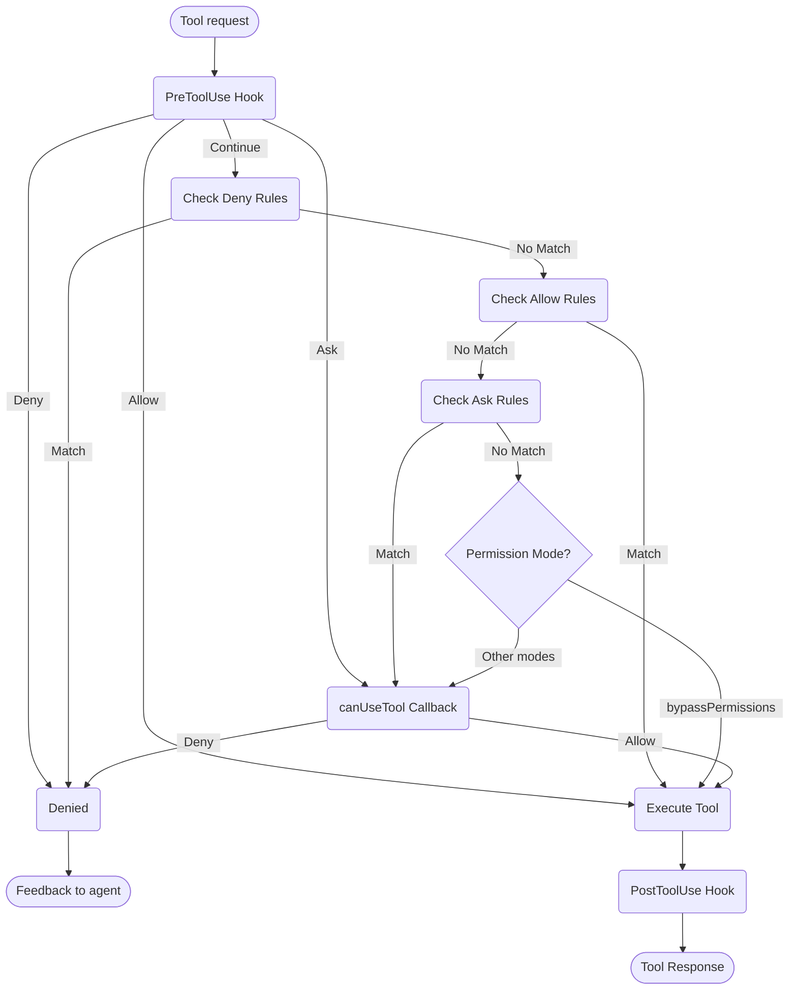

# Berechtigungen verwalten

Steuern Sie die Werkzeugnutzung und Berechtigungen im Claude Agent SDK

---

# SDK-Berechtigungen

Das Claude Agent SDK bietet leistungsstarke Berechtigungskontrollen, mit denen Sie verwalten können, wie Claude Werkzeuge in Ihrer Anwendung nutzt.

Dieser Leitfaden behandelt die Implementierung von Berechtigungssystemen mithilfe des `canUseTool`-Callbacks, Hooks und settings.json-Berechtigungsregeln. Für die vollständige API-Dokumentation siehe die [TypeScript SDK-Referenz](/docs/de/agent-sdk/typescript).

## Übersicht

Das Claude Agent SDK bietet vier komplementäre Möglichkeiten zur Steuerung der Werkzeugnutzung:

1. **[Berechtigungsmodi](#permission-modes)** - Globale Berechtigungsverhaltenseinstellungen, die alle Werkzeuge beeinflussen
2. **[canUseTool-Callback](/docs/de/agent-sdk/typescript#canusetool)** - Laufzeit-Berechtigungshandler für Fälle, die nicht durch andere Regeln abgedeckt sind
3. **[Hooks](/docs/de/agent-sdk/hooks)** - Feinkörnige Kontrolle über jede Werkzeugausführung mit benutzerdefinierter Logik
4. **[Berechtigungsregeln (settings.json)](https://code.claude.com/docs/en/settings#permission-settings)** - Deklarative Allow/Deny-Regeln mit integrierter Bash-Befehlsanalyse

Anwendungsfälle für jeden Ansatz:
- Berechtigungsmodi - Legen Sie das allgemeine Berechtigungsverhalten fest (Planung, automatisches Akzeptieren von Bearbeitungen, Umgehen von Überprüfungen)
- `canUseTool` - Dynamische Genehmigung für nicht abgedeckte Fälle, fordert Benutzer zur Genehmigung auf
- Hooks - Programmgesteuerte Kontrolle über alle Werkzeugausführungen
- Berechtigungsregeln - Statische Richtlinien mit intelligenter Bash-Befehlsanalyse

## Berechtigungsfluss-Diagramm



**Verarbeitungsreihenfolge:** PreToolUse Hook → Deny Rules → Allow Rules → Ask Rules → Permission Mode Check → canUseTool Callback → PostToolUse Hook

## Berechtigungsmodi

Berechtigungsmodi bieten globale Kontrolle darüber, wie Claude Werkzeuge nutzt. Sie können den Berechtigungsmodus beim Aufrufen von `query()` festlegen oder ihn während Streaming-Sitzungen dynamisch ändern.

### Verfügbare Modi

Das SDK unterstützt vier Berechtigungsmodi, jeder mit unterschiedlichem Verhalten:

| Modus | Beschreibung | Werkzeugverhalten |
| :--- | :---------- | :------------ |
| `default` | Standardberechtigungsverhalten | Normale Berechtigungsprüfungen gelten |
| `plan` | Planungsmodus - keine Ausführung | Claude kann nur schreibgeschützte Werkzeuge verwenden; präsentiert einen Plan vor der Ausführung **(Wird derzeit im SDK nicht unterstützt)** |
| `acceptEdits` | Automatisches Akzeptieren von Dateibearbeitungen | Dateibearbeitungen und Dateisystemoperationen werden automatisch genehmigt |
| `bypassPermissions` | Alle Berechtigungsprüfungen umgehen | Alle Werkzeuge werden ohne Berechtigungsaufforderungen ausgeführt (mit Vorsicht verwenden) |

### Berechtigungsmodus festlegen

Sie können den Berechtigungsmodus auf zwei Arten festlegen:

#### 1. Anfängliche Konfiguration

Legen Sie den Modus beim Erstellen einer Abfrage fest:

<CodeGroup>

```typescript TypeScript
import { query } from "@anthropic-ai/claude-agent-sdk";

const result = await query({
  prompt: "Help me refactor this code",
  options: {
    permissionMode: 'default'  // Standard permission mode
  }
});
```

```python Python
from claude_agent_sdk import query

result = await query(
    prompt="Help me refactor this code",
    options={
        "permission_mode": "default"  # Standard permission mode
    }
)
```

</CodeGroup>

#### 2. Dynamische Modusänderungen (nur Streaming)

Ändern Sie den Modus während einer Streaming-Sitzung:

<CodeGroup>

```typescript TypeScript
import { query } from "@anthropic-ai/claude-agent-sdk";

// Create an async generator for streaming input
async function* streamInput() {
  yield { 
    type: 'user',
    message: { 
      role: 'user', 
      content: "Let's start with default permissions" 
    }
  };
  
  // Later in the conversation...
  yield {
    type: 'user',
    message: {
      role: 'user',
      content: "Now let's speed up development"
    }
  };
}

const q = query({
  prompt: streamInput(),
  options: {
    permissionMode: 'default'  // Start in default mode
  }
});

// Change mode dynamically
await q.setPermissionMode('acceptEdits');

// Process messages
for await (const message of q) {
  console.log(message);
}
```

```python Python
from claude_agent_sdk import query

async def stream_input():
    """Async generator for streaming input"""
    yield {
        "type": "user",
        "message": {
            "role": "user",
            "content": "Let's start with default permissions"
        }
    }
    
    # Later in the conversation...
    yield {
        "type": "user",
        "message": {
            "role": "user",
            "content": "Now let's speed up development"
        }
    }

q = query(
    prompt=stream_input(),
    options={
        "permission_mode": "default"  # Start in default mode
    }
)

# Change mode dynamically
await q.set_permission_mode("acceptEdits")

# Process messages
async for message in q:
    print(message)
```

</CodeGroup>

### Moduspezifische Verhaltensweisen

#### Bearbeitungen akzeptieren Modus (`acceptEdits`)

Im Modus "Bearbeitungen akzeptieren":
- Alle Dateibearbeitungen werden automatisch genehmigt
- Dateisystemoperationen (mkdir, touch, rm, usw.) werden automatisch genehmigt
- Andere Werkzeuge erfordern weiterhin normale Berechtigungen
- Beschleunigt die Entwicklung, wenn Sie Claudes Bearbeitungen vertrauen
- Nützlich für schnelle Prototypisierung und Iterationen

Automatisch genehmigte Operationen:
- Dateibearbeitungen (Edit-, Write-Werkzeuge)
- Bash-Dateisystembefehle (mkdir, touch, rm, mv, cp)
- Dateierstellung und -löschung

#### Berechtigungen umgehen Modus (`bypassPermissions`)

Im Modus "Berechtigungen umgehen":
- **ALLE Werkzeugnutzungen werden automatisch genehmigt**
- Es werden keine Berechtigungsaufforderungen angezeigt
- Hooks werden weiterhin ausgeführt (können Operationen immer noch blockieren)
- **Mit äußerster Vorsicht verwenden** - Claude hat vollständigen Systemzugriff
- Wird nur für kontrollierte Umgebungen empfohlen

### Modusspriorität im Berechtigungsfluss

Berechtigungsmodi werden an einem bestimmten Punkt im Berechtigungsfluss ausgewertet:

1. **Hooks werden zuerst ausgeführt** - Können zulassen, verweigern, fragen oder fortfahren
2. **Deny-Regeln** werden überprüft - Blockieren Sie Werkzeuge unabhängig vom Modus
3. **Allow-Regeln** werden überprüft - Erlauben Sie Werkzeuge, wenn sie übereinstimmen
4. **Ask-Regeln** werden überprüft - Fordern Sie Genehmigung an, wenn sie übereinstimmen
5. **Berechtigungsmodus** wird ausgewertet:
   - **`bypassPermissions`-Modus** - Falls aktiv, erlaubt alle verbleibenden Werkzeuge
   - **Andere Modi** - Verschieben Sie auf `canUseTool`-Callback
6. **`canUseTool`-Callback** - Behandelt verbleibende Fälle

Dies bedeutet:
- Hooks können die Werkzeugnutzung immer steuern, auch im `bypassPermissions`-Modus
- Explizite Deny-Regeln überschreiben alle Berechtigungsmodi
- Ask-Regeln werden vor Berechtigungsmodi ausgewertet
- Der `bypassPermissions`-Modus überschreibt den `canUseTool`-Callback für nicht übereinstimmende Werkzeuge

### Best Practices

1. **Verwenden Sie den Standard-Modus** für kontrollierte Ausführung mit normalen Berechtigungsprüfungen
2. **Verwenden Sie den acceptEdits-Modus** bei der Arbeit mit isolierten Dateien oder Verzeichnissen
3. **Vermeiden Sie bypassPermissions** in der Produktion oder auf Systemen mit sensiblen Daten
4. **Kombinieren Sie Modi mit Hooks** für feinkörnige Kontrolle
5. **Wechseln Sie Modi dynamisch** basierend auf Aufgabenfortschritt und Vertrauen

Beispiel für Modusfortschritt:
```typescript
// Start in default mode for controlled execution
permissionMode: 'default'

// Switch to acceptEdits for rapid iteration
await q.setPermissionMode('acceptEdits')
```

## canUseTool

Der `canUseTool`-Callback wird als Option beim Aufrufen der `query`-Funktion übergeben. Er empfängt den Werkzeugnamen und Eingabeparameter und muss eine Entscheidung zurückgeben - entweder zulassen oder verweigern.

canUseTool wird immer dann ausgelöst, wenn Claude Code einem Benutzer eine Berechtigungsaufforderung anzeigen würde, z. B. wenn Hooks und Berechtigungsregeln es nicht abdecken und es nicht im acceptEdits-Modus ist.

Hier ist ein vollständiges Beispiel, das zeigt, wie Sie interaktive Werkzeugzustimmung implementieren:

<CodeGroup>

```typescript TypeScript
import { query } from "@anthropic-ai/claude-agent-sdk";

async function promptForToolApproval(toolName: string, input: any) {
  console.log("\n🔧 Tool Request:");
  console.log(`   Tool: ${toolName}`);
  
  // Display tool parameters
  if (input && Object.keys(input).length > 0) {
    console.log("   Parameters:");
    for (const [key, value] of Object.entries(input)) {
      let displayValue = value;
      if (typeof value === 'string' && value.length > 100) {
        displayValue = value.substring(0, 100) + "...";
      } else if (typeof value === 'object') {
        displayValue = JSON.stringify(value, null, 2);
      }
      console.log(`     ${key}: ${displayValue}`);
    }
  }
  
  // Get user approval (replace with your UI logic)
  const approved = await getUserApproval();
  
  if (approved) {
    console.log("   ✅ Approved\n");
    return {
      behavior: "allow",
      updatedInput: input
    };
  } else {
    console.log("   ❌ Denied\n");
    return {
      behavior: "deny",
      message: "User denied permission for this tool"
    };
  }
}

// Use the permission callback
const result = await query({
  prompt: "Help me analyze this codebase",
  options: {
    canUseTool: async (toolName, input) => {
      return promptForToolApproval(toolName, input);
    }
  }
});
```

```python Python
from claude_agent_sdk import query

async def prompt_for_tool_approval(tool_name: str, input_params: dict):
    print(f"\n🔧 Tool Request:")
    print(f"   Tool: {tool_name}")

    # Display parameters
    if input_params:
        print("   Parameters:")
        for key, value in input_params.items():
            display_value = value
            if isinstance(value, str) and len(value) > 100:
                display_value = value[:100] + "..."
            elif isinstance(value, (dict, list)):
                display_value = json.dumps(value, indent=2)
            print(f"     {key}: {display_value}")

    # Get user approval
    answer = input("\n   Approve this tool use? (y/n): ")

    if answer.lower() in ['y', 'yes']:
        print("   ✅ Approved\n")
        return {
            "behavior": "allow",
            "updatedInput": input_params
        }
    else:
        print("   ❌ Denied\n")
        return {
            "behavior": "deny",
            "message": "User denied permission for this tool"
        }

# Use the permission callback
result = await query(
    prompt="Help me analyze this codebase",
    options={
        "can_use_tool": prompt_for_tool_approval
    }
)
```

</CodeGroup>

## Umgang mit dem AskUserQuestion-Werkzeug

Das `AskUserQuestion`-Werkzeug ermöglicht es Claude, dem Benutzer während eines Gesprächs Klärungsfragen zu stellen. Wenn dieses Werkzeug aufgerufen wird, empfängt Ihr `canUseTool`-Callback die Fragen und muss die Antworten des Benutzers zurückgeben.

### Eingabestruktur

Wenn `canUseTool` mit `toolName: "AskUserQuestion"` aufgerufen wird, enthält die Eingabe:

```typescript
{
  questions: [
    {
      question: "Which database should we use?",
      header: "Database",
      options: [
        { label: "PostgreSQL", description: "Relational, ACID compliant" },
        { label: "MongoDB", description: "Document-based, flexible schema" }
      ],
      multiSelect: false
    },
    {
      question: "Which features should we enable?",
      header: "Features",
      options: [
        { label: "Authentication", description: "User login and sessions" },
        { label: "Logging", description: "Request and error logging" },
        { label: "Caching", description: "Redis-based response caching" }
      ],
      multiSelect: true
    }
  ]
}
```

### Antworten zurückgeben

Geben Sie die Antworten in `updatedInput.answers` als Datensatz zurück, der Fragentext den ausgewählten Optionslabeln zuordnet:

```typescript
return {
  behavior: "allow",
  updatedInput: {
    questions: input.questions,  // Pass through original questions
    answers: {
      "Which database should we use?": "PostgreSQL",
      "Which features should we enable?": "Authentication, Caching"
    }
  }
}
```

<Note>
Multi-Select-Antworten sind durch Kommas getrennte Zeichenketten (z. B. `"Authentication, Caching"`).
</Note>

## Verwandte Ressourcen

- [Hooks-Leitfaden](/docs/de/agent-sdk/hooks) - Erfahren Sie, wie Sie Hooks für feinkörnige Kontrolle über die Werkzeugausführung implementieren
- [Einstellungen: Berechtigungsregeln](https://code.claude.com/docs/en/settings#permission-settings) - Konfigurieren Sie deklarative Allow/Deny-Regeln mit Bash-Befehlsanalyse