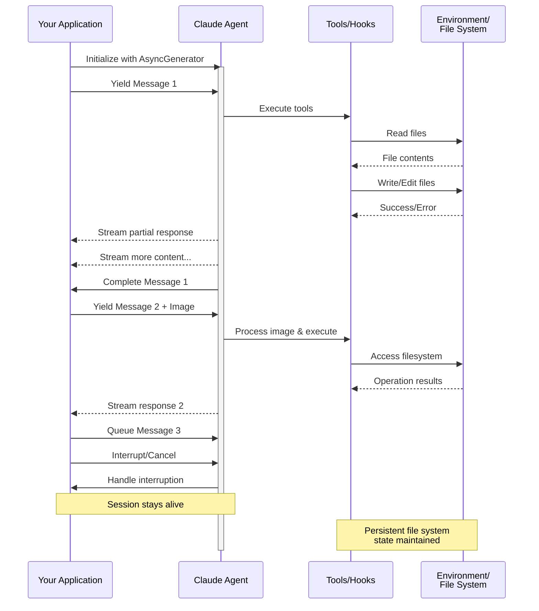

# Streaming-Eingabe

Verständnis der zwei Eingabemodi für Claude Agent SDK und wann man jeden verwendet

---

## Übersicht

Das Claude Agent SDK unterstützt zwei unterschiedliche Eingabemodi für die Interaktion mit Agenten:

- **Streaming-Eingabemodus** (Standard & Empfohlen) - Eine persistente, interaktive Sitzung
- **Einzelne Nachricht-Eingabe** - One-Shot-Abfragen, die Sitzungszustand verwenden und fortgesetzt werden

Dieser Leitfaden erklärt die Unterschiede, Vorteile und Anwendungsfälle für jeden Modus, um Ihnen bei der Wahl des richtigen Ansatzes für Ihre Anwendung zu helfen.

## Streaming-Eingabemodus (Empfohlen)

Der Streaming-Eingabemodus ist die **bevorzugte** Methode zur Verwendung des Claude Agent SDK. Er bietet vollständigen Zugriff auf die Fähigkeiten des Agenten und ermöglicht umfangreiche, interaktive Erfahrungen.

Er ermöglicht es dem Agenten, als langlebiger Prozess zu fungieren, der Benutzereingaben entgegennimmt, Unterbrechungen handhabt, Berechtigungsanfragen anzeigt und die Sitzungsverwaltung handhabt.

### Funktionsweise



### Vorteile

<CardGroup cols={2}>
  <Card title="Bild-Uploads" icon="image">
    Bilder direkt an Nachrichten anhängen für visuelle Analyse und Verständnis
  </Card>
  <Card title="Warteschlangen-Nachrichten" icon="stack">
    Mehrere Nachrichten senden, die sequenziell verarbeitet werden, mit der Möglichkeit zu unterbrechen
  </Card>
  <Card title="Tool-Integration" icon="wrench">
    Vollständiger Zugriff auf alle Tools und benutzerdefinierten MCP-Server während der Sitzung
  </Card>
  <Card title="Hooks-Unterstützung" icon="link">
    Verwenden Sie Lifecycle-Hooks, um das Verhalten an verschiedenen Punkten anzupassen
  </Card>
  <Card title="Echtzeit-Feedback" icon="lightning">
    Sehen Sie Antworten, während sie generiert werden, nicht nur die endgültigen Ergebnisse
  </Card>
  <Card title="Kontext-Persistenz" icon="database">
    Behalten Sie den Gesprächskontext über mehrere Umdrehungen natürlich bei
  </Card>
</CardGroup>

### Implementierungsbeispiel

<CodeGroup>

```typescript TypeScript
import { query } from "@anthropic-ai/claude-agent-sdk";
import { readFileSync } from "fs";

async function* generateMessages() {
  // First message
  yield {
    type: "user" as const,
    message: {
      role: "user" as const,
      content: "Analyze this codebase for security issues"
    }
  };
  
  // Wait for conditions or user input
  await new Promise(resolve => setTimeout(resolve, 2000));
  
  // Follow-up with image
  yield {
    type: "user" as const,
    message: {
      role: "user" as const,
      content: [
        {
          type: "text",
          text: "Review this architecture diagram"
        },
        {
          type: "image",
          source: {
            type: "base64",
            media_type: "image/png",
            data: readFileSync("diagram.png", "base64")
          }
        }
      ]
    }
  };
}

// Process streaming responses
for await (const message of query({
  prompt: generateMessages(),
  options: {
    maxTurns: 10,
    allowedTools: ["Read", "Grep"]
  }
})) {
  if (message.type === "result") {
    console.log(message.result);
  }
}
```

```python Python
from claude_agent_sdk import ClaudeSDKClient, ClaudeAgentOptions, AssistantMessage, TextBlock
import asyncio
import base64

async def streaming_analysis():
    async def message_generator():
        # First message
        yield {
            "type": "user",
            "message": {
                "role": "user",
                "content": "Analyze this codebase for security issues"
            }
        }

        # Wait for conditions
        await asyncio.sleep(2)

        # Follow-up with image
        with open("diagram.png", "rb") as f:
            image_data = base64.b64encode(f.read()).decode()

        yield {
            "type": "user",
            "message": {
                "role": "user",
                "content": [
                    {
                        "type": "text",
                        "text": "Review this architecture diagram"
                    },
                    {
                        "type": "image",
                        "source": {
                            "type": "base64",
                            "media_type": "image/png",
                            "data": image_data
                        }
                    }
                ]
            }
        }

    # Use ClaudeSDKClient for streaming input
    options = ClaudeAgentOptions(
        max_turns=10,
        allowed_tools=["Read", "Grep"]
    )

    async with ClaudeSDKClient(options) as client:
        # Send streaming input
        await client.query(message_generator())

        # Process responses
        async for message in client.receive_response():
            if isinstance(message, AssistantMessage):
                for block in message.content:
                    if isinstance(block, TextBlock):
                        print(block.text)

asyncio.run(streaming_analysis())
```

</CodeGroup>

## Einzelne Nachricht-Eingabe

Die Eingabe einer einzelnen Nachricht ist einfacher, aber begrenzter.

### Wann man Einzelne Nachricht-Eingabe verwendet

Verwenden Sie die Eingabe einer einzelnen Nachricht, wenn:

- Sie eine One-Shot-Antwort benötigen
- Sie keine Bild-Anhänge, Hooks usw. benötigen
- Sie in einer zustandslosen Umgebung arbeiten müssen, z. B. in einer Lambda-Funktion

### Einschränkungen

<Warning>
Der Modus für Einzelne Nachricht-Eingabe unterstützt **nicht**:
- Direkte Bild-Anhänge in Nachrichten
- Dynamische Nachrichtenwarteschlangen
- Echtzeit-Unterbrechung
- Hook-Integration
- Natürliche Multi-Turn-Gespräche
</Warning>

### Implementierungsbeispiel

<CodeGroup>

```typescript TypeScript
import { query } from "@anthropic-ai/claude-agent-sdk";

// Simple one-shot query
for await (const message of query({
  prompt: "Explain the authentication flow",
  options: {
    maxTurns: 1,
    allowedTools: ["Read", "Grep"]
  }
})) {
  if (message.type === "result") {
    console.log(message.result);
  }
}

// Continue conversation with session management
for await (const message of query({
  prompt: "Now explain the authorization process",
  options: {
    continue: true,
    maxTurns: 1
  }
})) {
  if (message.type === "result") {
    console.log(message.result);
  }
}
```

```python Python
from claude_agent_sdk import query, ClaudeAgentOptions, ResultMessage
import asyncio

async def single_message_example():
    # Simple one-shot query using query() function
    async for message in query(
        prompt="Explain the authentication flow",
        options=ClaudeAgentOptions(
            max_turns=1,
            allowed_tools=["Read", "Grep"]
        )
    ):
        if isinstance(message, ResultMessage):
            print(message.result)

    # Continue conversation with session management
    async for message in query(
        prompt="Now explain the authorization process",
        options=ClaudeAgentOptions(
            continue_conversation=True,
            max_turns=1
        )
    ):
        if isinstance(message, ResultMessage):
            print(message.result)

asyncio.run(single_message_example())
```

</CodeGroup>