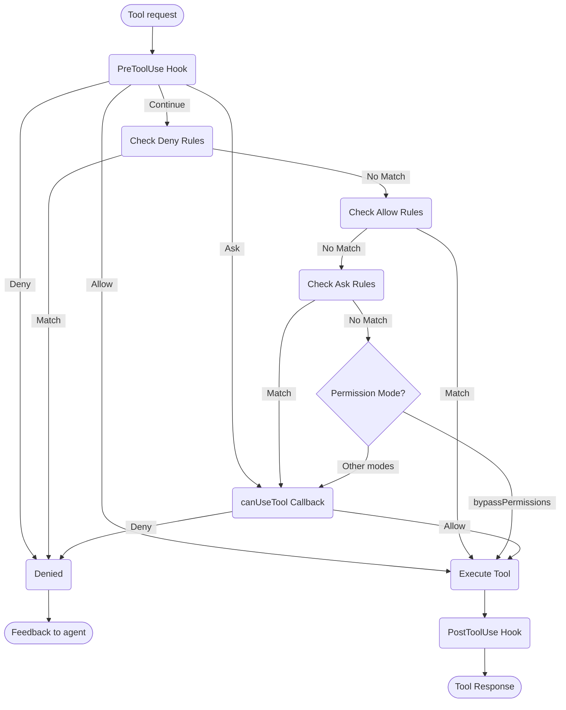

# Manejo de Permisos

Controla el uso de herramientas y permisos en el SDK del Agente Claude

---

# Permisos del SDK

El SDK del Agente Claude proporciona controles de permisos potentes que te permiten gestionar cómo Claude utiliza herramientas en tu aplicación.

Esta guía cubre cómo implementar sistemas de permisos utilizando la devolución de llamada `canUseTool`, hooks y reglas de permisos en settings.json. Para la documentación completa de la API, consulta la [referencia del SDK de TypeScript](/docs/es/agent-sdk/typescript).

## Descripción General

El SDK del Agente Claude proporciona cuatro formas complementarias de controlar el uso de herramientas:

1. **[Modos de Permiso](#permission-modes)** - Configuraciones de comportamiento de permisos globales que afectan a todas las herramientas
2. **[Devolución de llamada canUseTool](/docs/es/agent-sdk/typescript#canusetool)** - Controlador de permisos en tiempo de ejecución para casos no cubiertos por otras reglas
3. **[Hooks](/docs/es/agent-sdk/hooks)** - Control granular sobre cada ejecución de herramienta con lógica personalizada
4. **[Reglas de permisos (settings.json)](https://code.claude.com/docs/en/settings#permission-settings)** - Reglas declarativas de permitir/denegar con análisis integrado de comandos bash

Casos de uso para cada enfoque:
- Modos de permiso - Establecer el comportamiento general de permisos (planificación, aceptación automática de ediciones, omisión de verificaciones)
- `canUseTool` - Aprobación dinámica para casos no cubiertos, solicita permiso al usuario
- Hooks - Control programático sobre todas las ejecuciones de herramientas
- Reglas de permisos - Políticas estáticas con análisis inteligente de comandos bash

## Diagrama de Flujo de Permisos



**Orden de Procesamiento:** PreToolUse Hook → Deny Rules → Allow Rules → Ask Rules → Permission Mode Check → canUseTool Callback → PostToolUse Hook

## Modos de Permiso

Los modos de permiso proporcionan control global sobre cómo Claude utiliza herramientas. Puedes establecer el modo de permiso al llamar a `query()` o cambiarlo dinámicamente durante sesiones de transmisión.

### Modos Disponibles

El SDK admite cuatro modos de permiso, cada uno con comportamiento diferente:

| Modo | Descripción | Comportamiento de Herramientas |
| :--- | :---------- | :------------ |
| `default` | Comportamiento de permiso estándar | Se aplican verificaciones de permiso normales |
| `plan` | Modo de planificación - sin ejecución | Claude solo puede usar herramientas de solo lectura; presenta un plan antes de la ejecución **(No actualmente soportado en SDK)** |
| `acceptEdits` | Aceptar automáticamente ediciones de archivos | Las ediciones de archivos y operaciones del sistema de archivos se aprueban automáticamente |
| `bypassPermissions` | Omitir todas las verificaciones de permisos | Todas las herramientas se ejecutan sin solicitudes de permiso (usar con cuidado) |

### Establecer Modo de Permiso

Puedes establecer el modo de permiso de dos formas:

#### 1. Configuración Inicial

Establece el modo al crear una consulta:

<CodeGroup>

```typescript TypeScript
import { query } from "@anthropic-ai/claude-agent-sdk";

const result = await query({
  prompt: "Help me refactor this code",
  options: {
    permissionMode: 'default'  // Standard permission mode
  }
});
```

```python Python
from claude_agent_sdk import query

result = await query(
    prompt="Help me refactor this code",
    options={
        "permission_mode": "default"  # Standard permission mode
    }
)
```

</CodeGroup>

#### 2. Cambios de Modo Dinámico (Solo Transmisión)

Cambia el modo durante una sesión de transmisión:

<CodeGroup>

```typescript TypeScript
import { query } from "@anthropic-ai/claude-agent-sdk";

// Create an async generator for streaming input
async function* streamInput() {
  yield { 
    type: 'user',
    message: { 
      role: 'user', 
      content: "Let's start with default permissions" 
    }
  };
  
  // Later in the conversation...
  yield {
    type: 'user',
    message: {
      role: 'user',
      content: "Now let's speed up development"
    }
  };
}

const q = query({
  prompt: streamInput(),
  options: {
    permissionMode: 'default'  // Start in default mode
  }
});

// Change mode dynamically
await q.setPermissionMode('acceptEdits');

// Process messages
for await (const message of q) {
  console.log(message);
}
```

```python Python
from claude_agent_sdk import query

async def stream_input():
    """Async generator for streaming input"""
    yield {
        "type": "user",
        "message": {
            "role": "user",
            "content": "Let's start with default permissions"
        }
    }
    
    # Later in the conversation...
    yield {
        "type": "user",
        "message": {
            "role": "user",
            "content": "Now let's speed up development"
        }
    }

q = query(
    prompt=stream_input(),
    options={
        "permission_mode": "default"  # Start in default mode
    }
)

# Change mode dynamically
await q.set_permission_mode("acceptEdits")

# Process messages
async for message in q:
    print(message)
```

</CodeGroup>

### Comportamientos Específicos del Modo

#### Modo Aceptar Ediciones (`acceptEdits`)

En modo aceptar ediciones:
- Todas las ediciones de archivos se aprueban automáticamente
- Las operaciones del sistema de archivos (mkdir, touch, rm, etc.) se aprueban automáticamente
- Otras herramientas aún requieren permisos normales
- Acelera el desarrollo cuando confías en las ediciones de Claude
- Útil para prototipado rápido e iteraciones

Operaciones aprobadas automáticamente:
- Ediciones de archivos (herramientas Edit, Write)
- Comandos bash del sistema de archivos (mkdir, touch, rm, mv, cp)
- Creación y eliminación de archivos

#### Modo Omitir Permisos (`bypassPermissions`)

En modo omitir permisos:
- **TODAS las usos de herramientas se aprueban automáticamente**
- No aparecen solicitudes de permiso
- Los hooks aún se ejecutan (aún pueden bloquear operaciones)
- **Usar con extrema precaución** - Claude tiene acceso completo al sistema
- Recomendado solo para entornos controlados

### Prioridad del Modo en el Flujo de Permisos

Los modos de permiso se evalúan en un punto específico del flujo de permisos:

1. **Los hooks se ejecutan primero** - Pueden permitir, denegar, preguntar o continuar
2. **Se verifican las reglas de denegación** - Bloquean herramientas independientemente del modo
3. **Se verifican las reglas de permiso** - Permiten herramientas si coinciden
4. **Se verifican las reglas de pregunta** - Solicitan permiso si coinciden
5. **Se evalúa el modo de permiso**:
   - **Modo `bypassPermissions`** - Si está activo, permite todas las herramientas restantes
   - **Otros modos** - Diferir a la devolución de llamada `canUseTool`
6. **Devolución de llamada `canUseTool`** - Maneja casos restantes

Esto significa:
- Los hooks siempre pueden controlar el uso de herramientas, incluso en modo `bypassPermissions`
- Las reglas de denegación explícitas anulan todos los modos de permiso
- Las reglas de pregunta se evalúan antes de los modos de permiso
- El modo `bypassPermissions` anula la devolución de llamada `canUseTool` para herramientas no coincidentes

### Mejores Prácticas

1. **Usa el modo predeterminado** para ejecución controlada con verificaciones de permiso normales
2. **Usa el modo acceptEdits** cuando trabajes en archivos o directorios aislados
3. **Evita bypassPermissions** en producción o en sistemas con datos sensibles
4. **Combina modos con hooks** para control granular
5. **Cambia modos dinámicamente** según el progreso de la tarea y la confianza

Ejemplo de progresión de modo:
```typescript
// Start in default mode for controlled execution
permissionMode: 'default'

// Switch to acceptEdits for rapid iteration
await q.setPermissionMode('acceptEdits')
```

## canUseTool

La devolución de llamada `canUseTool` se pasa como una opción al llamar a la función `query`. Recibe el nombre de la herramienta y los parámetros de entrada, y debe devolver una decisión: permitir o denegar.

canUseTool se activa siempre que Claude Code mostraría una solicitud de permiso a un usuario, por ejemplo, los hooks y las reglas de permisos no lo cubren y no está en modo acceptEdits.

Aquí hay un ejemplo completo que muestra cómo implementar la aprobación interactiva de herramientas:

<CodeGroup>

```typescript TypeScript
import { query } from "@anthropic-ai/claude-agent-sdk";

async function promptForToolApproval(toolName: string, input: any) {
  console.log("\n🔧 Tool Request:");
  console.log(`   Tool: ${toolName}`);
  
  // Display tool parameters
  if (input && Object.keys(input).length > 0) {
    console.log("   Parameters:");
    for (const [key, value] of Object.entries(input)) {
      let displayValue = value;
      if (typeof value === 'string' && value.length > 100) {
        displayValue = value.substring(0, 100) + "...";
      } else if (typeof value === 'object') {
        displayValue = JSON.stringify(value, null, 2);
      }
      console.log(`     ${key}: ${displayValue}`);
    }
  }
  
  // Get user approval (replace with your UI logic)
  const approved = await getUserApproval();
  
  if (approved) {
    console.log("   ✅ Approved\n");
    return {
      behavior: "allow",
      updatedInput: input
    };
  } else {
    console.log("   ❌ Denied\n");
    return {
      behavior: "deny",
      message: "User denied permission for this tool"
    };
  }
}

// Use the permission callback
const result = await query({
  prompt: "Help me analyze this codebase",
  options: {
    canUseTool: async (toolName, input) => {
      return promptForToolApproval(toolName, input);
    }
  }
});
```

```python Python
from claude_agent_sdk import query

async def prompt_for_tool_approval(tool_name: str, input_params: dict):
    print(f"\n🔧 Tool Request:")
    print(f"   Tool: {tool_name}")

    # Display parameters
    if input_params:
        print("   Parameters:")
        for key, value in input_params.items():
            display_value = value
            if isinstance(value, str) and len(value) > 100:
                display_value = value[:100] + "..."
            elif isinstance(value, (dict, list)):
                display_value = json.dumps(value, indent=2)
            print(f"     {key}: {display_value}")

    # Get user approval
    answer = input("\n   Approve this tool use? (y/n): ")

    if answer.lower() in ['y', 'yes']:
        print("   ✅ Approved\n")
        return {
            "behavior": "allow",
            "updatedInput": input_params
        }
    else:
        print("   ❌ Denied\n")
        return {
            "behavior": "deny",
            "message": "User denied permission for this tool"
        }

# Use the permission callback
result = await query(
    prompt="Help me analyze this codebase",
    options={
        "can_use_tool": prompt_for_tool_approval
    }
)
```

</CodeGroup>

## Manejo de la Herramienta AskUserQuestion

La herramienta `AskUserQuestion` permite a Claude hacer preguntas aclaratorias al usuario durante una conversación. Cuando se llama a esta herramienta, tu devolución de llamada `canUseTool` recibe las preguntas y debe devolver las respuestas del usuario.

### Estructura de Entrada

Cuando se llama a `canUseTool` con `toolName: "AskUserQuestion"`, la entrada contiene:

```typescript
{
  questions: [
    {
      question: "Which database should we use?",
      header: "Database",
      options: [
        { label: "PostgreSQL", description: "Relational, ACID compliant" },
        { label: "MongoDB", description: "Document-based, flexible schema" }
      ],
      multiSelect: false
    },
    {
      question: "Which features should we enable?",
      header: "Features",
      options: [
        { label: "Authentication", description: "User login and sessions" },
        { label: "Logging", description: "Request and error logging" },
        { label: "Caching", description: "Redis-based response caching" }
      ],
      multiSelect: true
    }
  ]
}
```

### Devolviendo Respuestas

Devuelve las respuestas en `updatedInput.answers` como un registro que asigna el texto de la pregunta a la(s) etiqueta(s) de opción seleccionada(s):

```typescript
return {
  behavior: "allow",
  updatedInput: {
    questions: input.questions,  // Pass through original questions
    answers: {
      "Which database should we use?": "PostgreSQL",
      "Which features should we enable?": "Authentication, Caching"
    }
  }
}
```

<Note>
Las respuestas de selección múltiple son cadenas separadas por comas (por ejemplo, `"Authentication, Caching"`).
</Note>

## Recursos Relacionados

- [Guía de Hooks](/docs/es/agent-sdk/hooks) - Aprende cómo implementar hooks para control granular sobre la ejecución de herramientas
- [Configuración: Reglas de Permisos](https://code.claude.com/docs/en/settings#permission-settings) - Configura reglas declarativas de permitir/denegar con análisis de comandos bash