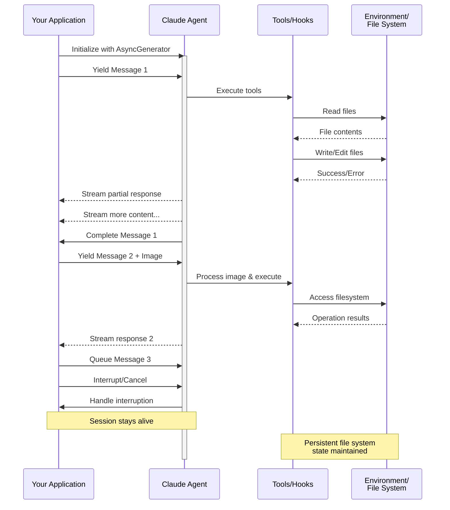

# Entrada de Streaming

Comprensión de los dos modos de entrada para Claude Agent SDK y cuándo usar cada uno

---

## Descripción General

El Claude Agent SDK admite dos modos de entrada distintos para interactuar con agentes:

- **Modo de Entrada de Streaming** (Predeterminado y Recomendado) - Una sesión persistente e interactiva
- **Entrada de Mensaje Único** - Consultas de una sola vez que utilizan el estado de la sesión y la reanudación

Esta guía explica las diferencias, beneficios y casos de uso para cada modo para ayudarte a elegir el enfoque correcto para tu aplicación.

## Modo de Entrada de Streaming (Recomendado)

El modo de entrada de streaming es la forma **preferida** de usar el Claude Agent SDK. Proporciona acceso completo a las capacidades del agente y permite experiencias ricas e interactivas.

Permite que el agente funcione como un proceso de larga duración que recibe entrada del usuario, maneja interrupciones, expone solicitudes de permisos y gestiona la sesión.

### Cómo Funciona



### Beneficios

<CardGroup cols={2}>
  <Card title="Cargas de Imágenes" icon="image">
    Adjunta imágenes directamente a los mensajes para análisis y comprensión visual
  </Card>
  <Card title="Mensajes en Cola" icon="stack">
    Envía múltiples mensajes que se procesan secuencialmente, con la capacidad de interrumpir
  </Card>
  <Card title="Integración de Herramientas" icon="wrench">
    Acceso completo a todas las herramientas y servidores MCP personalizados durante la sesión
  </Card>
  <Card title="Soporte de Hooks" icon="link">
    Utiliza hooks de ciclo de vida para personalizar el comportamiento en varios puntos
  </Card>
  <Card title="Retroalimentación en Tiempo Real" icon="lightning">
    Ve las respuestas mientras se generan, no solo los resultados finales
  </Card>
  <Card title="Persistencia de Contexto" icon="database">
    Mantén el contexto de la conversación en múltiples turnos de forma natural
  </Card>
</CardGroup>

### Ejemplo de Implementación

<CodeGroup>

```typescript TypeScript
import { query } from "@anthropic-ai/claude-agent-sdk";
import { readFileSync } from "fs";

async function* generateMessages() {
  // First message
  yield {
    type: "user" as const,
    message: {
      role: "user" as const,
      content: "Analyze this codebase for security issues"
    }
  };
  
  // Wait for conditions or user input
  await new Promise(resolve => setTimeout(resolve, 2000));
  
  // Follow-up with image
  yield {
    type: "user" as const,
    message: {
      role: "user" as const,
      content: [
        {
          type: "text",
          text: "Review this architecture diagram"
        },
        {
          type: "image",
          source: {
            type: "base64",
            media_type: "image/png",
            data: readFileSync("diagram.png", "base64")
          }
        }
      ]
    }
  };
}

// Process streaming responses
for await (const message of query({
  prompt: generateMessages(),
  options: {
    maxTurns: 10,
    allowedTools: ["Read", "Grep"]
  }
})) {
  if (message.type === "result") {
    console.log(message.result);
  }
}
```

```python Python
from claude_agent_sdk import ClaudeSDKClient, ClaudeAgentOptions, AssistantMessage, TextBlock
import asyncio
import base64

async def streaming_analysis():
    async def message_generator():
        # First message
        yield {
            "type": "user",
            "message": {
                "role": "user",
                "content": "Analyze this codebase for security issues"
            }
        }

        # Wait for conditions
        await asyncio.sleep(2)

        # Follow-up with image
        with open("diagram.png", "rb") as f:
            image_data = base64.b64encode(f.read()).decode()

        yield {
            "type": "user",
            "message": {
                "role": "user",
                "content": [
                    {
                        "type": "text",
                        "text": "Review this architecture diagram"
                    },
                    {
                        "type": "image",
                        "source": {
                            "type": "base64",
                            "media_type": "image/png",
                            "data": image_data
                        }
                    }
                ]
            }
        }

    # Use ClaudeSDKClient for streaming input
    options = ClaudeAgentOptions(
        max_turns=10,
        allowed_tools=["Read", "Grep"]
    )

    async with ClaudeSDKClient(options) as client:
        # Send streaming input
        await client.query(message_generator())

        # Process responses
        async for message in client.receive_response():
            if isinstance(message, AssistantMessage):
                for block in message.content:
                    if isinstance(block, TextBlock):
                        print(block.text)

asyncio.run(streaming_analysis())
```

</CodeGroup>

## Entrada de Mensaje Único

La entrada de mensaje único es más simple pero más limitada.

### Cuándo Usar Entrada de Mensaje Único

Usa entrada de mensaje único cuando:

- Necesites una respuesta de una sola vez
- No necesites adjuntos de imágenes, hooks, etc.
- Necesites operar en un entorno sin estado, como una función lambda

### Limitaciones

<Warning>
El modo de entrada de mensaje único **no** admite:
- Adjuntos de imágenes directas en mensajes
- Encolamiento dinámico de mensajes
- Interrupción en tiempo real
- Integración de hooks
- Conversaciones naturales de múltiples turnos
</Warning>

### Ejemplo de Implementación

<CodeGroup>

```typescript TypeScript
import { query } from "@anthropic-ai/claude-agent-sdk";

// Simple one-shot query
for await (const message of query({
  prompt: "Explain the authentication flow",
  options: {
    maxTurns: 1,
    allowedTools: ["Read", "Grep"]
  }
})) {
  if (message.type === "result") {
    console.log(message.result);
  }
}

// Continue conversation with session management
for await (const message of query({
  prompt: "Now explain the authorization process",
  options: {
    continue: true,
    maxTurns: 1
  }
})) {
  if (message.type === "result") {
    console.log(message.result);
  }
}
```

```python Python
from claude_agent_sdk import query, ClaudeAgentOptions, ResultMessage
import asyncio

async def single_message_example():
    # Simple one-shot query using query() function
    async for message in query(
        prompt="Explain the authentication flow",
        options=ClaudeAgentOptions(
            max_turns=1,
            allowed_tools=["Read", "Grep"]
        )
    ):
        if isinstance(message, ResultMessage):
            print(message.result)

    # Continue conversation with session management
    async for message in query(
        prompt="Now explain the authorization process",
        options=ClaudeAgentOptions(
            continue_conversation=True,
            max_turns=1
        )
    ):
        if isinstance(message, ResultMessage):
            print(message.result)

asyncio.run(single_message_example())
```

</CodeGroup>