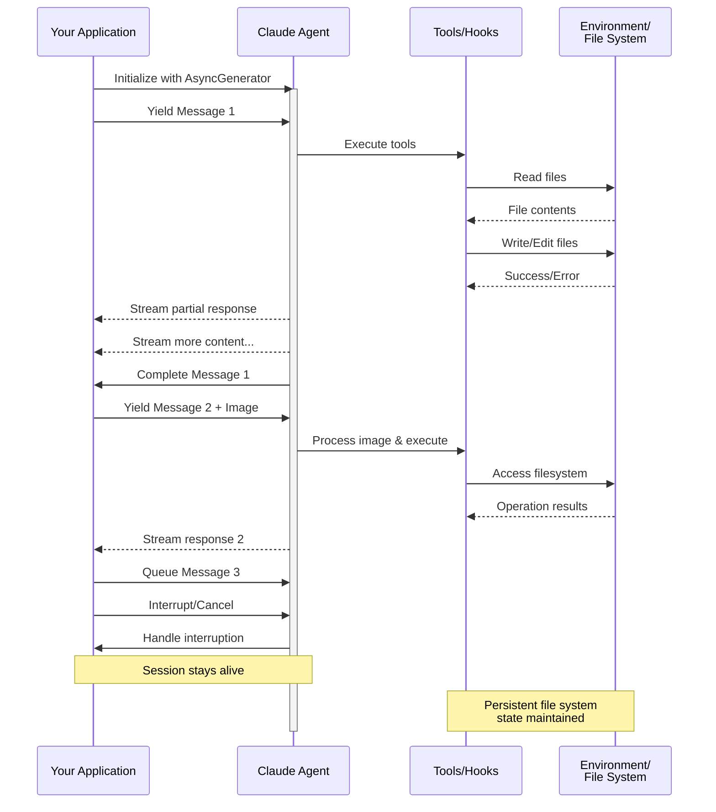

# Entrée en continu

Comprendre les deux modes d'entrée du SDK Claude Agent et quand utiliser chacun

---

## Aperçu

Le SDK Claude Agent prend en charge deux modes d'entrée distincts pour interagir avec les agents :

- **Mode d'entrée en continu** (Par défaut et recommandé) - Une session persistante et interactive
- **Entrée de message unique** - Des requêtes ponctuelles qui utilisent l'état de la session et la reprise

Ce guide explique les différences, les avantages et les cas d'utilisation de chaque mode pour vous aider à choisir la bonne approche pour votre application.

## Mode d'entrée en continu (Recommandé)

Le mode d'entrée en continu est la façon **préférée** d'utiliser le SDK Claude Agent. Il fournit un accès complet aux capacités de l'agent et permet des expériences riches et interactives.

Il permet à l'agent de fonctionner comme un processus de longue durée qui accepte l'entrée de l'utilisateur, gère les interruptions, affiche les demandes de permission et gère la gestion de session.

### Comment cela fonctionne



### Avantages

<CardGroup cols={2}>
  <Card title="Téléchargements d'images" icon="image">
    Joignez des images directement aux messages pour l'analyse et la compréhension visuelles
  </Card>
  <Card title="Messages en file d'attente" icon="stack">
    Envoyez plusieurs messages qui se traitent séquentiellement, avec la possibilité d'interrompre
  </Card>
  <Card title="Intégration d'outils" icon="wrench">
    Accès complet à tous les outils et serveurs MCP personnalisés pendant la session
  </Card>
  <Card title="Support des hooks" icon="link">
    Utilisez les hooks de cycle de vie pour personnaliser le comportement à différents points
  </Card>
  <Card title="Retours en temps réel" icon="lightning">
    Voyez les réponses au fur et à mesure qu'elles sont générées, pas seulement les résultats finaux
  </Card>
  <Card title="Persistance du contexte" icon="database">
    Maintenez le contexte de la conversation sur plusieurs tours naturellement
  </Card>
</CardGroup>

### Exemple d'implémentation

<CodeGroup>

```typescript TypeScript
import { query } from "@anthropic-ai/claude-agent-sdk";
import { readFileSync } from "fs";

async function* generateMessages() {
  // First message
  yield {
    type: "user" as const,
    message: {
      role: "user" as const,
      content: "Analyze this codebase for security issues"
    }
  };
  
  // Wait for conditions or user input
  await new Promise(resolve => setTimeout(resolve, 2000));
  
  // Follow-up with image
  yield {
    type: "user" as const,
    message: {
      role: "user" as const,
      content: [
        {
          type: "text",
          text: "Review this architecture diagram"
        },
        {
          type: "image",
          source: {
            type: "base64",
            media_type: "image/png",
            data: readFileSync("diagram.png", "base64")
          }
        }
      ]
    }
  };
}

// Process streaming responses
for await (const message of query({
  prompt: generateMessages(),
  options: {
    maxTurns: 10,
    allowedTools: ["Read", "Grep"]
  }
})) {
  if (message.type === "result") {
    console.log(message.result);
  }
}
```

```python Python
from claude_agent_sdk import ClaudeSDKClient, ClaudeAgentOptions, AssistantMessage, TextBlock
import asyncio
import base64

async def streaming_analysis():
    async def message_generator():
        # First message
        yield {
            "type": "user",
            "message": {
                "role": "user",
                "content": "Analyze this codebase for security issues"
            }
        }

        # Wait for conditions
        await asyncio.sleep(2)

        # Follow-up with image
        with open("diagram.png", "rb") as f:
            image_data = base64.b64encode(f.read()).decode()

        yield {
            "type": "user",
            "message": {
                "role": "user",
                "content": [
                    {
                        "type": "text",
                        "text": "Review this architecture diagram"
                    },
                    {
                        "type": "image",
                        "source": {
                            "type": "base64",
                            "media_type": "image/png",
                            "data": image_data
                        }
                    }
                ]
            }
        }

    # Use ClaudeSDKClient for streaming input
    options = ClaudeAgentOptions(
        max_turns=10,
        allowed_tools=["Read", "Grep"]
    )

    async with ClaudeSDKClient(options) as client:
        # Send streaming input
        await client.query(message_generator())

        # Process responses
        async for message in client.receive_response():
            if isinstance(message, AssistantMessage):
                for block in message.content:
                    if isinstance(block, TextBlock):
                        print(block.text)

asyncio.run(streaming_analysis())
```

</CodeGroup>

## Entrée de message unique

L'entrée de message unique est plus simple mais plus limitée.

### Quand utiliser l'entrée de message unique

Utilisez l'entrée de message unique quand :

- Vous avez besoin d'une réponse ponctuelle
- Vous n'avez pas besoin de pièces jointes d'images, de hooks, etc.
- Vous devez fonctionner dans un environnement sans état, comme une fonction lambda

### Limitations

<Warning>
Le mode d'entrée de message unique ne prend **pas** en charge :
- Les pièces jointes d'images directes dans les messages
- La mise en file d'attente dynamique des messages
- L'interruption en temps réel
- L'intégration des hooks
- Les conversations naturelles multi-tours
</Warning>

### Exemple d'implémentation

<CodeGroup>

```typescript TypeScript
import { query } from "@anthropic-ai/claude-agent-sdk";

// Simple one-shot query
for await (const message of query({
  prompt: "Explain the authentication flow",
  options: {
    maxTurns: 1,
    allowedTools: ["Read", "Grep"]
  }
})) {
  if (message.type === "result") {
    console.log(message.result);
  }
}

// Continue conversation with session management
for await (const message of query({
  prompt: "Now explain the authorization process",
  options: {
    continue: true,
    maxTurns: 1
  }
})) {
  if (message.type === "result") {
    console.log(message.result);
  }
}
```

```python Python
from claude_agent_sdk import query, ClaudeAgentOptions, ResultMessage
import asyncio

async def single_message_example():
    # Simple one-shot query using query() function
    async for message in query(
        prompt="Explain the authentication flow",
        options=ClaudeAgentOptions(
            max_turns=1,
            allowed_tools=["Read", "Grep"]
        )
    ):
        if isinstance(message, ResultMessage):
            print(message.result)

    # Continue conversation with session management
    async for message in query(
        prompt="Now explain the authorization process",
        options=ClaudeAgentOptions(
            continue_conversation=True,
            max_turns=1
        )
    ):
        if isinstance(message, ResultMessage):
            print(message.result)

asyncio.run(single_message_example())
```

</CodeGroup>