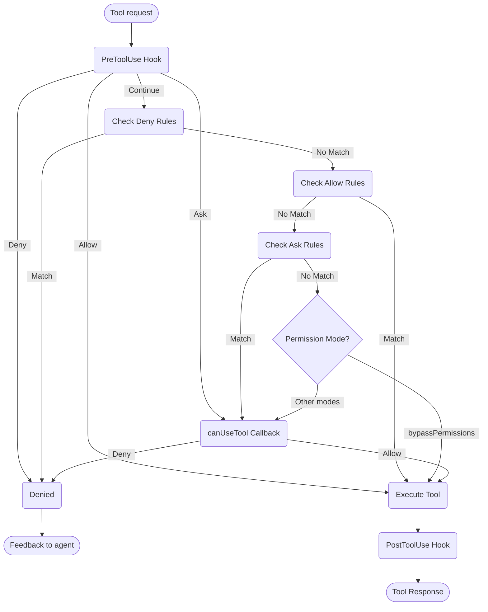

# Menangani Izin

Kontrol penggunaan alat dan izin dalam Claude Agent SDK

---

# Izin SDK

Claude Agent SDK menyediakan kontrol izin yang kuat yang memungkinkan Anda mengelola bagaimana Claude menggunakan alat dalam aplikasi Anda.

Panduan ini mencakup cara mengimplementasikan sistem izin menggunakan callback `canUseTool`, hooks, dan aturan izin settings.json. Untuk dokumentasi API lengkap, lihat [referensi SDK TypeScript](/docs/id/agent-sdk/typescript).

## Ikhtisar

Claude Agent SDK menyediakan empat cara yang saling melengkapi untuk mengontrol penggunaan alat:

1. **[Mode Izin](#permission-modes)** - Pengaturan perilaku izin global yang mempengaruhi semua alat
2. **[Callback canUseTool](/docs/id/agent-sdk/typescript#canusetool)** - Penanganan izin runtime untuk kasus yang tidak tercakup oleh aturan lain
3. **[Hooks](/docs/id/agent-sdk/hooks)** - Kontrol terperinci atas setiap eksekusi alat dengan logika kustom
4. **[Aturan izin (settings.json)](https://code.claude.com/docs/en/settings#permission-settings)** - Aturan allow/deny deklaratif dengan parsing perintah bash terintegrasi

Kasus penggunaan untuk setiap pendekatan:
- Mode izin - Tetapkan perilaku izin keseluruhan (perencanaan, auto-accepting edits, bypassing checks)
- `canUseTool` - Persetujuan dinamis untuk kasus yang tidak tercakup, meminta izin pengguna
- Hooks - Kontrol programatik atas semua eksekusi alat
- Aturan izin - Kebijakan statis dengan parsing perintah bash yang cerdas

## Diagram Alur Izin



**Urutan Pemrosesan:** PreToolUse Hook → Deny Rules → Allow Rules → Ask Rules → Permission Mode Check → canUseTool Callback → PostToolUse Hook

## Mode Izin

Mode izin memberikan kontrol global atas bagaimana Claude menggunakan alat. Anda dapat mengatur mode izin saat memanggil `query()` atau mengubahnya secara dinamis selama sesi streaming.

### Mode yang Tersedia

SDK mendukung empat mode izin, masing-masing dengan perilaku yang berbeda:

| Mode | Deskripsi | Perilaku Alat |
| :--- | :---------- | :------------ |
| `default` | Perilaku izin standar | Pemeriksaan izin normal berlaku |
| `plan` | Mode perencanaan - tidak ada eksekusi | Claude hanya dapat menggunakan alat read-only; menyajikan rencana sebelum eksekusi **(Saat ini tidak didukung dalam SDK)** |
| `acceptEdits` | Auto-accept file edits | Edit file dan operasi filesystem secara otomatis disetujui |
| `bypassPermissions` | Bypass semua pemeriksaan izin | Semua alat berjalan tanpa prompt izin (gunakan dengan hati-hati) |

### Mengatur Mode Izin

Anda dapat mengatur mode izin dengan dua cara:

#### 1. Konfigurasi Awal

Atur mode saat membuat query:

<CodeGroup>

```typescript TypeScript
import { query } from "@anthropic-ai/claude-agent-sdk";

const result = await query({
  prompt: "Help me refactor this code",
  options: {
    permissionMode: 'default'  // Standard permission mode
  }
});
```

```python Python
from claude_agent_sdk import query

result = await query(
    prompt="Help me refactor this code",
    options={
        "permission_mode": "default"  # Standard permission mode
    }
)
```

</CodeGroup>

#### 2. Perubahan Mode Dinamis (Hanya Streaming)

Ubah mode selama sesi streaming:

<CodeGroup>

```typescript TypeScript
import { query } from "@anthropic-ai/claude-agent-sdk";

// Create an async generator for streaming input
async function* streamInput() {
  yield { 
    type: 'user',
    message: { 
      role: 'user', 
      content: "Let's start with default permissions" 
    }
  };
  
  // Later in the conversation...
  yield {
    type: 'user',
    message: {
      role: 'user',
      content: "Now let's speed up development"
    }
  };
}

const q = query({
  prompt: streamInput(),
  options: {
    permissionMode: 'default'  // Start in default mode
  }
});

// Change mode dynamically
await q.setPermissionMode('acceptEdits');

// Process messages
for await (const message of q) {
  console.log(message);
}
```

```python Python
from claude_agent_sdk import query

async def stream_input():
    """Async generator for streaming input"""
    yield {
        "type": "user",
        "message": {
            "role": "user",
            "content": "Let's start with default permissions"
        }
    }
    
    # Later in the conversation...
    yield {
        "type": "user",
        "message": {
            "role": "user",
            "content": "Now let's speed up development"
        }
    }

q = query(
    prompt=stream_input(),
    options={
        "permission_mode": "default"  # Start in default mode
    }
)

# Change mode dynamically
await q.set_permission_mode("acceptEdits")

# Process messages
async for message in q:
    print(message)
```

</CodeGroup>

### Perilaku Spesifik Mode

#### Mode Accept Edits (`acceptEdits`)

Dalam mode accept edits:
- Semua edit file secara otomatis disetujui
- Operasi filesystem (mkdir, touch, rm, dll.) auto-approved
- Alat lain masih memerlukan izin normal
- Mempercepat pengembangan ketika Anda mempercayai edit Claude
- Berguna untuk prototyping cepat dan iterasi

Operasi yang auto-approved:
- Edit file (Edit, Write tools)
- Perintah filesystem Bash (mkdir, touch, rm, mv, cp)
- Pembuatan dan penghapusan file

#### Mode Bypass Permissions (`bypassPermissions`)

Dalam mode bypass permissions:
- **SEMUA penggunaan alat secara otomatis disetujui**
- Tidak ada prompt izin yang muncul
- Hooks masih dieksekusi (masih dapat memblokir operasi)
- **Gunakan dengan sangat hati-hati** - Claude memiliki akses sistem penuh
- Direkomendasikan hanya untuk lingkungan terkontrol

### Prioritas Mode dalam Alur Izin

Mode izin dievaluasi pada titik tertentu dalam alur izin:

1. **Hooks dieksekusi terlebih dahulu** - Dapat allow, deny, ask, atau continue
2. **Aturan Deny** diperiksa - Blokir alat terlepas dari mode
3. **Aturan Allow** diperiksa - Izinkan alat jika cocok
4. **Aturan Ask** diperiksa - Minta izin jika cocok
5. **Mode izin** dievaluasi:
   - **Mode `bypassPermissions`** - Jika aktif, izinkan semua alat yang tersisa
   - **Mode lain** - Tunda ke callback `canUseTool`
6. **Callback `canUseTool`** - Menangani kasus yang tersisa

Ini berarti:
- Hooks dapat selalu mengontrol penggunaan alat, bahkan dalam mode `bypassPermissions`
- Aturan deny eksplisit menggantikan semua mode izin
- Aturan ask dievaluasi sebelum mode izin
- Mode `bypassPermissions` menggantikan callback `canUseTool` untuk alat yang tidak cocok

### Praktik Terbaik

1. **Gunakan mode default** untuk eksekusi terkontrol dengan pemeriksaan izin normal
2. **Gunakan mode acceptEdits** saat bekerja pada file atau direktori terisolasi
3. **Hindari bypassPermissions** dalam produksi atau pada sistem dengan data sensitif
4. **Gabungkan mode dengan hooks** untuk kontrol terperinci
5. **Ubah mode secara dinamis** berdasarkan kemajuan tugas dan kepercayaan diri

Contoh perkembangan mode:
```typescript
// Start in default mode for controlled execution
permissionMode: 'default'

// Switch to acceptEdits for rapid iteration
await q.setPermissionMode('acceptEdits')
```

## canUseTool

Callback `canUseTool` dilewatkan sebagai opsi saat memanggil fungsi `query`. Ini menerima nama alat dan parameter input, dan harus mengembalikan keputusan - allow atau deny.

canUseTool fires kapan pun Claude Code akan menampilkan prompt izin kepada pengguna, misalnya hooks dan aturan izin tidak mencakupnya dan tidak dalam mode acceptEdits.

Berikut adalah contoh lengkap yang menunjukkan cara mengimplementasikan persetujuan alat interaktif:

<CodeGroup>

```typescript TypeScript
import { query } from "@anthropic-ai/claude-agent-sdk";

async function promptForToolApproval(toolName: string, input: any) {
  console.log("\n🔧 Tool Request:");
  console.log(`   Tool: ${toolName}`);
  
  // Display tool parameters
  if (input && Object.keys(input).length > 0) {
    console.log("   Parameters:");
    for (const [key, value] of Object.entries(input)) {
      let displayValue = value;
      if (typeof value === 'string' && value.length > 100) {
        displayValue = value.substring(0, 100) + "...";
      } else if (typeof value === 'object') {
        displayValue = JSON.stringify(value, null, 2);
      }
      console.log(`     ${key}: ${displayValue}`);
    }
  }
  
  // Get user approval (replace with your UI logic)
  const approved = await getUserApproval();
  
  if (approved) {
    console.log("   ✅ Approved\n");
    return {
      behavior: "allow",
      updatedInput: input
    };
  } else {
    console.log("   ❌ Denied\n");
    return {
      behavior: "deny",
      message: "User denied permission for this tool"
    };
  }
}

// Use the permission callback
const result = await query({
  prompt: "Help me analyze this codebase",
  options: {
    canUseTool: async (toolName, input) => {
      return promptForToolApproval(toolName, input);
    }
  }
});
```

```python Python
from claude_agent_sdk import query

async def prompt_for_tool_approval(tool_name: str, input_params: dict):
    print(f"\n🔧 Tool Request:")
    print(f"   Tool: {tool_name}")

    # Display parameters
    if input_params:
        print("   Parameters:")
        for key, value in input_params.items():
            display_value = value
            if isinstance(value, str) and len(value) > 100:
                display_value = value[:100] + "..."
            elif isinstance(value, (dict, list)):
                display_value = json.dumps(value, indent=2)
            print(f"     {key}: {display_value}")

    # Get user approval
    answer = input("\n   Approve this tool use? (y/n): ")

    if answer.lower() in ['y', 'yes']:
        print("   ✅ Approved\n")
        return {
            "behavior": "allow",
            "updatedInput": input_params
        }
    else:
        print("   ❌ Denied\n")
        return {
            "behavior": "deny",
            "message": "User denied permission for this tool"
        }

# Use the permission callback
result = await query(
    prompt="Help me analyze this codebase",
    options={
        "can_use_tool": prompt_for_tool_approval
    }
)
```

</CodeGroup>

## Menangani Alat AskUserQuestion

Alat `AskUserQuestion` memungkinkan Claude untuk mengajukan pertanyaan klarifikasi kepada pengguna selama percakapan. Ketika alat ini dipanggil, callback `canUseTool` Anda menerima pertanyaan dan harus mengembalikan jawaban pengguna.

### Struktur Input

Ketika `canUseTool` dipanggil dengan `toolName: "AskUserQuestion"`, input berisi:

```typescript
{
  questions: [
    {
      question: "Which database should we use?",
      header: "Database",
      options: [
        { label: "PostgreSQL", description: "Relational, ACID compliant" },
        { label: "MongoDB", description: "Document-based, flexible schema" }
      ],
      multiSelect: false
    },
    {
      question: "Which features should we enable?",
      header: "Features",
      options: [
        { label: "Authentication", description: "User login and sessions" },
        { label: "Logging", description: "Request and error logging" },
        { label: "Caching", description: "Redis-based response caching" }
      ],
      multiSelect: true
    }
  ]
}
```

### Mengembalikan Jawaban

Kembalikan jawaban dalam `updatedInput.answers` sebagai record yang memetakan teks pertanyaan ke label opsi yang dipilih:

```typescript
return {
  behavior: "allow",
  updatedInput: {
    questions: input.questions,  // Pass through original questions
    answers: {
      "Which database should we use?": "PostgreSQL",
      "Which features should we enable?": "Authentication, Caching"
    }
  }
}
```

<Note>
Jawaban multi-select adalah string yang dipisahkan koma (misalnya, `"Authentication, Caching"`).
</Note>

## Sumber Daya Terkait

- [Panduan Hooks](/docs/id/agent-sdk/hooks) - Pelajari cara mengimplementasikan hooks untuk kontrol terperinci atas eksekusi alat
- [Pengaturan: Aturan Izin](https://code.claude.com/docs/en/settings#permission-settings) - Konfigurasi aturan allow/deny deklaratif dengan parsing perintah bash