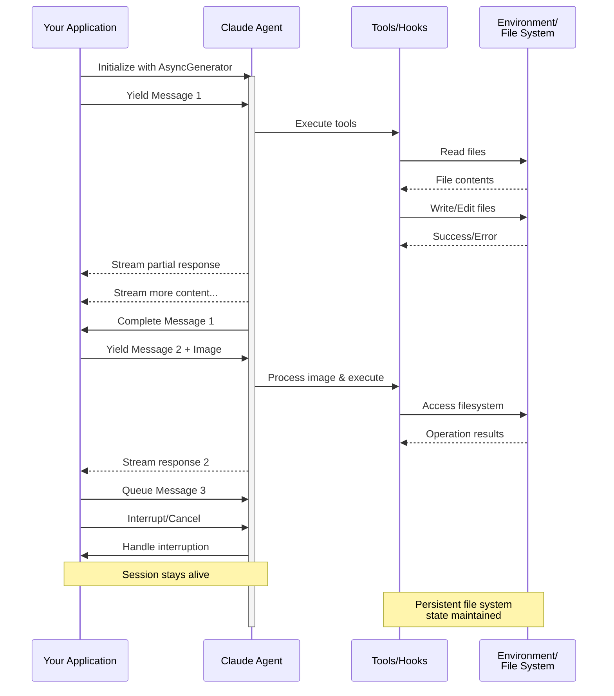

# Input Streaming

Memahami dua mode input untuk Claude Agent SDK dan kapan menggunakan masing-masing

---

## Gambaran Umum

Claude Agent SDK mendukung dua mode input yang berbeda untuk berinteraksi dengan agen:

- **Mode Input Streaming** (Default & Direkomendasikan) - Sesi interaktif yang persisten
- **Input Pesan Tunggal** - Kueri sekali jalan yang menggunakan status sesi dan melanjutkan

Panduan ini menjelaskan perbedaan, manfaat, dan kasus penggunaan untuk setiap mode untuk membantu Anda memilih pendekatan yang tepat untuk aplikasi Anda.

## Mode Input Streaming (Direkomendasikan)

Mode input streaming adalah cara **pilihan** untuk menggunakan Claude Agent SDK. Ini memberikan akses penuh ke kemampuan agen dan memungkinkan pengalaman interaktif yang kaya.

Ini memungkinkan agen beroperasi sebagai proses yang berumur panjang yang menerima input pengguna, menangani gangguan, menampilkan permintaan izin, dan menangani manajemen sesi.

### Cara Kerjanya



### Manfaat

<CardGroup cols={2}>
  <Card title="Unggahan Gambar" icon="image">
    Lampirkan gambar langsung ke pesan untuk analisis visual dan pemahaman
  </Card>
  <Card title="Pesan Antrian" icon="stack">
    Kirim beberapa pesan yang diproses secara berurutan, dengan kemampuan untuk mengganggu
  </Card>
  <Card title="Integrasi Alat" icon="wrench">
    Akses penuh ke semua alat dan server MCP kustom selama sesi
  </Card>
  <Card title="Dukungan Hooks" icon="link">
    Gunakan lifecycle hooks untuk menyesuaikan perilaku di berbagai titik
  </Card>
  <Card title="Umpan Balik Real-time" icon="lightning">
    Lihat respons saat dihasilkan, bukan hanya hasil akhir
  </Card>
  <Card title="Persistensi Konteks" icon="database">
    Pertahankan konteks percakapan di beberapa giliran secara alami
  </Card>
</CardGroup>

### Contoh Implementasi

<CodeGroup>

```typescript TypeScript
import { query } from "@anthropic-ai/claude-agent-sdk";
import { readFileSync } from "fs";

async function* generateMessages() {
  // First message
  yield {
    type: "user" as const,
    message: {
      role: "user" as const,
      content: "Analyze this codebase for security issues"
    }
  };
  
  // Wait for conditions or user input
  await new Promise(resolve => setTimeout(resolve, 2000));
  
  // Follow-up with image
  yield {
    type: "user" as const,
    message: {
      role: "user" as const,
      content: [
        {
          type: "text",
          text: "Review this architecture diagram"
        },
        {
          type: "image",
          source: {
            type: "base64",
            media_type: "image/png",
            data: readFileSync("diagram.png", "base64")
          }
        }
      ]
    }
  };
}

// Process streaming responses
for await (const message of query({
  prompt: generateMessages(),
  options: {
    maxTurns: 10,
    allowedTools: ["Read", "Grep"]
  }
})) {
  if (message.type === "result") {
    console.log(message.result);
  }
}
```

```python Python
from claude_agent_sdk import ClaudeSDKClient, ClaudeAgentOptions, AssistantMessage, TextBlock
import asyncio
import base64

async def streaming_analysis():
    async def message_generator():
        # First message
        yield {
            "type": "user",
            "message": {
                "role": "user",
                "content": "Analyze this codebase for security issues"
            }
        }

        # Wait for conditions
        await asyncio.sleep(2)

        # Follow-up with image
        with open("diagram.png", "rb") as f:
            image_data = base64.b64encode(f.read()).decode()

        yield {
            "type": "user",
            "message": {
                "role": "user",
                "content": [
                    {
                        "type": "text",
                        "text": "Review this architecture diagram"
                    },
                    {
                        "type": "image",
                        "source": {
                            "type": "base64",
                            "media_type": "image/png",
                            "data": image_data
                        }
                    }
                ]
            }
        }

    # Use ClaudeSDKClient for streaming input
    options = ClaudeAgentOptions(
        max_turns=10,
        allowed_tools=["Read", "Grep"]
    )

    async with ClaudeSDKClient(options) as client:
        # Send streaming input
        await client.query(message_generator())

        # Process responses
        async for message in client.receive_response():
            if isinstance(message, AssistantMessage):
                for block in message.content:
                    if isinstance(block, TextBlock):
                        print(block.text)

asyncio.run(streaming_analysis())
```

</CodeGroup>

## Input Pesan Tunggal

Input pesan tunggal lebih sederhana tetapi lebih terbatas.

### Kapan Menggunakan Input Pesan Tunggal

Gunakan input pesan tunggal ketika:

- Anda membutuhkan respons sekali jalan
- Anda tidak memerlukan lampiran gambar, hooks, dll.
- Anda perlu beroperasi di lingkungan stateless, seperti fungsi lambda

### Keterbatasan

<Warning>
Mode input pesan tunggal **tidak** mendukung:
- Lampiran gambar langsung dalam pesan
- Antrian pesan dinamis
- Gangguan real-time
- Integrasi hook
- Percakapan multi-giliran alami
</Warning>

### Contoh Implementasi

<CodeGroup>

```typescript TypeScript
import { query } from "@anthropic-ai/claude-agent-sdk";

// Simple one-shot query
for await (const message of query({
  prompt: "Explain the authentication flow",
  options: {
    maxTurns: 1,
    allowedTools: ["Read", "Grep"]
  }
})) {
  if (message.type === "result") {
    console.log(message.result);
  }
}

// Continue conversation with session management
for await (const message of query({
  prompt: "Now explain the authorization process",
  options: {
    continue: true,
    maxTurns: 1
  }
})) {
  if (message.type === "result") {
    console.log(message.result);
  }
}
```

```python Python
from claude_agent_sdk import query, ClaudeAgentOptions, ResultMessage
import asyncio

async def single_message_example():
    # Simple one-shot query using query() function
    async for message in query(
        prompt="Explain the authentication flow",
        options=ClaudeAgentOptions(
            max_turns=1,
            allowed_tools=["Read", "Grep"]
        )
    ):
        if isinstance(message, ResultMessage):
            print(message.result)

    # Continue conversation with session management
    async for message in query(
        prompt="Now explain the authorization process",
        options=ClaudeAgentOptions(
            continue_conversation=True,
            max_turns=1
        )
    ):
        if isinstance(message, ResultMessage):
            print(message.result)

asyncio.run(single_message_example())
```

</CodeGroup>