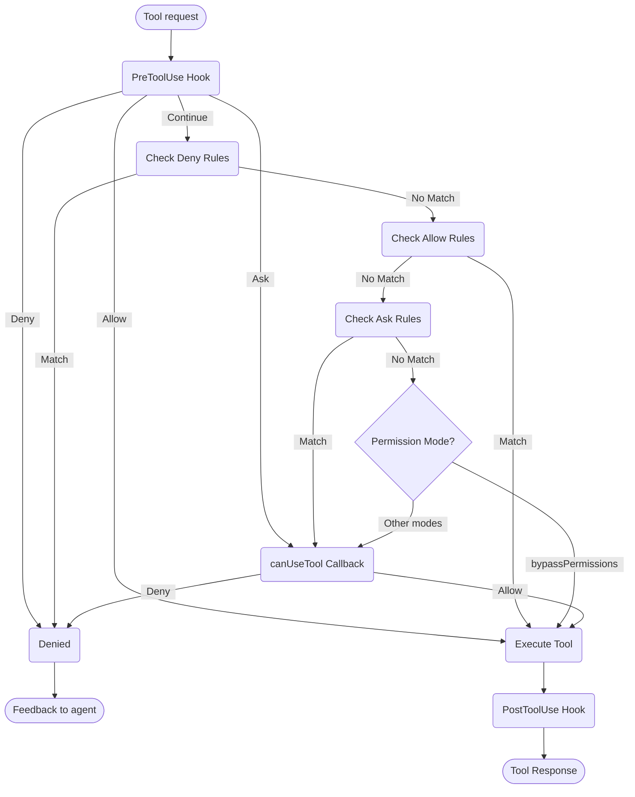

# Gestione dei Permessi

Controlla l'utilizzo dei tool e i permessi in Claude Agent SDK

---

# Permessi SDK

Claude Agent SDK fornisce potenti controlli di permesso che ti permettono di gestire come Claude utilizza i tool nella tua applicazione.

Questa guida copre come implementare sistemi di permesso utilizzando il callback `canUseTool`, gli hook e le regole di permesso in settings.json. Per la documentazione completa dell'API, vedi il [riferimento TypeScript SDK](/docs/it/agent-sdk/typescript).

## Panoramica

Claude Agent SDK fornisce quattro modi complementari per controllare l'utilizzo dei tool:

1. **[Modalità di Permesso](#permission-modes)** - Impostazioni di comportamento dei permessi globali che influenzano tutti i tool
2. **[callback canUseTool](/docs/it/agent-sdk/typescript#canusetool)** - Gestore di permessi a runtime per i casi non coperti da altre regole
3. **[Hook](/docs/it/agent-sdk/hooks)** - Controllo granulare su ogni esecuzione di tool con logica personalizzata
4. **[Regole di permesso (settings.json)](https://code.claude.com/docs/en/settings#permission-settings)** - Regole dichiarative di consentimento/negazione con analisi integrata dei comandi bash

Casi d'uso per ogni approccio:
- Modalità di permesso - Impostare il comportamento generale dei permessi (pianificazione, accettazione automatica delle modifiche, bypass dei controlli)
- `canUseTool` - Approvazione dinamica per i casi non coperti, chiede all'utente il permesso
- Hook - Controllo programmatico su tutte le esecuzioni di tool
- Regole di permesso - Politiche statiche con analisi intelligente dei comandi bash

## Diagramma del Flusso di Permesso



**Ordine di Elaborazione:** PreToolUse Hook → Deny Rules → Allow Rules → Ask Rules → Permission Mode Check → canUseTool Callback → PostToolUse Hook

## Modalità di Permesso

Le modalità di permesso forniscono un controllo globale su come Claude utilizza i tool. Puoi impostare la modalità di permesso quando chiami `query()` o cambiarla dinamicamente durante le sessioni di streaming.

### Modalità Disponibili

L'SDK supporta quattro modalità di permesso, ognuna con comportamenti diversi:

| Modalità | Descrizione | Comportamento Tool |
| :--- | :---------- | :------------ |
| `default` | Comportamento di permesso standard | Si applicano i controlli di permesso normali |
| `plan` | Modalità di pianificazione - nessuna esecuzione | Claude può utilizzare solo tool di sola lettura; presenta un piano prima dell'esecuzione **(Non attualmente supportato in SDK)** |
| `acceptEdits` | Accettazione automatica delle modifiche ai file | Le modifiche ai file e le operazioni del file system vengono approvate automaticamente |
| `bypassPermissions` | Bypass di tutti i controlli di permesso | Tutti i tool vengono eseguiti senza prompt di permesso (usare con cautela) |

### Impostazione della Modalità di Permesso

Puoi impostare la modalità di permesso in due modi:

#### 1. Configurazione Iniziale

Imposta la modalità quando crei una query:

<CodeGroup>

```typescript TypeScript
import { query } from "@anthropic-ai/claude-agent-sdk";

const result = await query({
  prompt: "Help me refactor this code",
  options: {
    permissionMode: 'default'  // Standard permission mode
  }
});
```

```python Python
from claude_agent_sdk import query

result = await query(
    prompt="Help me refactor this code",
    options={
        "permission_mode": "default"  # Standard permission mode
    }
)
```

</CodeGroup>

#### 2. Cambiamenti Dinamici della Modalità (Solo Streaming)

Cambia la modalità durante una sessione di streaming:

<CodeGroup>

```typescript TypeScript
import { query } from "@anthropic-ai/claude-agent-sdk";

// Create an async generator for streaming input
async function* streamInput() {
  yield { 
    type: 'user',
    message: { 
      role: 'user', 
      content: "Let's start with default permissions" 
    }
  };
  
  // Later in the conversation...
  yield {
    type: 'user',
    message: {
      role: 'user',
      content: "Now let's speed up development"
    }
  };
}

const q = query({
  prompt: streamInput(),
  options: {
    permissionMode: 'default'  // Start in default mode
  }
});

// Change mode dynamically
await q.setPermissionMode('acceptEdits');

// Process messages
for await (const message of q) {
  console.log(message);
}
```

```python Python
from claude_agent_sdk import query

async def stream_input():
    """Async generator for streaming input"""
    yield {
        "type": "user",
        "message": {
            "role": "user",
            "content": "Let's start with default permissions"
        }
    }
    
    # Later in the conversation...
    yield {
        "type": "user",
        "message": {
            "role": "user",
            "content": "Now let's speed up development"
        }
    }

q = query(
    prompt=stream_input(),
    options={
        "permission_mode": "default"  # Start in default mode
    }
)

# Change mode dynamically
await q.set_permission_mode("acceptEdits")

# Process messages
async for message in q:
    print(message)
```

</CodeGroup>

### Comportamenti Specifici della Modalità

#### Modalità Accettazione Modifiche (`acceptEdits`)

In modalità accettazione modifiche:
- Tutte le modifiche ai file vengono approvate automaticamente
- Le operazioni del file system (mkdir, touch, rm, ecc.) vengono auto-approvate
- Gli altri tool richiedono ancora i permessi normali
- Accelera lo sviluppo quando ti fidi delle modifiche di Claude
- Utile per il prototipaggio rapido e le iterazioni

Operazioni auto-approvate:
- Modifiche ai file (tool Edit, Write)
- Comandi bash del file system (mkdir, touch, rm, mv, cp)
- Creazione e eliminazione di file

#### Modalità Bypass dei Permessi (`bypassPermissions`)

In modalità bypass dei permessi:
- **TUTTI gli utilizzi di tool vengono approvati automaticamente**
- Non compaiono prompt di permesso
- Gli hook vengono comunque eseguiti (possono ancora bloccare le operazioni)
- **Usare con estrema cautela** - Claude ha accesso completo al sistema
- Consigliato solo per ambienti controllati

### Priorità della Modalità nel Flusso di Permesso

Le modalità di permesso vengono valutate in un punto specifico del flusso di permesso:

1. **Gli hook vengono eseguiti per primi** - Possono consentire, negare, chiedere o continuare
2. **Le regole di negazione** vengono controllate - Bloccano i tool indipendentemente dalla modalità
3. **Le regole di consentimento** vengono controllate - Permettono i tool se corrispondono
4. **Le regole di richiesta** vengono controllate - Chiedono il permesso se corrispondono
5. **La modalità di permesso** viene valutata:
   - **Modalità `bypassPermissions`** - Se attiva, consente tutti i tool rimanenti
   - **Altre modalità** - Rimanda al callback `canUseTool`
6. **Callback `canUseTool`** - Gestisce i casi rimanenti

Questo significa:
- Gli hook possono sempre controllare l'utilizzo dei tool, anche in modalità `bypassPermissions`
- Le regole di negazione esplicite sovrascrivono tutte le modalità di permesso
- Le regole di richiesta vengono valutate prima delle modalità di permesso
- La modalità `bypassPermissions` sovrascrive il callback `canUseTool` per i tool non corrispondenti

### Best Practice

1. **Usa la modalità default** per l'esecuzione controllata con controlli di permesso normali
2. **Usa la modalità acceptEdits** quando lavori su file o directory isolati
3. **Evita bypassPermissions** in produzione o su sistemi con dati sensibili
4. **Combina le modalità con gli hook** per un controllo granulare
5. **Cambia le modalità dinamicamente** in base al progresso dell'attività e alla fiducia

Esempio di progressione della modalità:
```typescript
// Start in default mode for controlled execution
permissionMode: 'default'

// Switch to acceptEdits for rapid iteration
await q.setPermissionMode('acceptEdits')
```

## canUseTool

Il callback `canUseTool` viene passato come opzione quando si chiama la funzione `query`. Riceve il nome del tool e i parametri di input e deve restituire una decisione - consentire o negare.

canUseTool si attiva ogni volta che Claude Code mostrerebbe un prompt di permesso a un utente, ad es. gli hook e le regole di permesso non lo coprono e non è in modalità acceptEdits.

Ecco un esempio completo che mostra come implementare l'approvazione interattiva dei tool:

<CodeGroup>

```typescript TypeScript
import { query } from "@anthropic-ai/claude-agent-sdk";

async function promptForToolApproval(toolName: string, input: any) {
  console.log("\n🔧 Tool Request:");
  console.log(`   Tool: ${toolName}`);
  
  // Display tool parameters
  if (input && Object.keys(input).length > 0) {
    console.log("   Parameters:");
    for (const [key, value] of Object.entries(input)) {
      let displayValue = value;
      if (typeof value === 'string' && value.length > 100) {
        displayValue = value.substring(0, 100) + "...";
      } else if (typeof value === 'object') {
        displayValue = JSON.stringify(value, null, 2);
      }
      console.log(`     ${key}: ${displayValue}`);
    }
  }
  
  // Get user approval (replace with your UI logic)
  const approved = await getUserApproval();
  
  if (approved) {
    console.log("   ✅ Approved\n");
    return {
      behavior: "allow",
      updatedInput: input
    };
  } else {
    console.log("   ❌ Denied\n");
    return {
      behavior: "deny",
      message: "User denied permission for this tool"
    };
  }
}

// Use the permission callback
const result = await query({
  prompt: "Help me analyze this codebase",
  options: {
    canUseTool: async (toolName, input) => {
      return promptForToolApproval(toolName, input);
    }
  }
});
```

```python Python
from claude_agent_sdk import query

async def prompt_for_tool_approval(tool_name: str, input_params: dict):
    print(f"\n🔧 Tool Request:")
    print(f"   Tool: {tool_name}")

    # Display parameters
    if input_params:
        print("   Parameters:")
        for key, value in input_params.items():
            display_value = value
            if isinstance(value, str) and len(value) > 100:
                display_value = value[:100] + "..."
            elif isinstance(value, (dict, list)):
                display_value = json.dumps(value, indent=2)
            print(f"     {key}: {display_value}")

    # Get user approval
    answer = input("\n   Approve this tool use? (y/n): ")

    if answer.lower() in ['y', 'yes']:
        print("   ✅ Approved\n")
        return {
            "behavior": "allow",
            "updatedInput": input_params
        }
    else:
        print("   ❌ Denied\n")
        return {
            "behavior": "deny",
            "message": "User denied permission for this tool"
        }

# Use the permission callback
result = await query(
    prompt="Help me analyze this codebase",
    options={
        "can_use_tool": prompt_for_tool_approval
    }
)
```

</CodeGroup>

## Gestione dello Strumento AskUserQuestion

Lo strumento `AskUserQuestion` consente a Claude di porre domande di chiarimento all'utente durante una conversazione. Quando questo tool viene chiamato, il tuo callback `canUseTool` riceve le domande e deve restituire le risposte dell'utente.

### Struttura di Input

Quando `canUseTool` viene chiamato con `toolName: "AskUserQuestion"`, l'input contiene:

```typescript
{
  questions: [
    {
      question: "Which database should we use?",
      header: "Database",
      options: [
        { label: "PostgreSQL", description: "Relational, ACID compliant" },
        { label: "MongoDB", description: "Document-based, flexible schema" }
      ],
      multiSelect: false
    },
    {
      question: "Which features should we enable?",
      header: "Features",
      options: [
        { label: "Authentication", description: "User login and sessions" },
        { label: "Logging", description: "Request and error logging" },
        { label: "Caching", description: "Redis-based response caching" }
      ],
      multiSelect: true
    }
  ]
}
```

### Restituzione delle Risposte

Restituisci le risposte in `updatedInput.answers` come un record che mappa il testo della domanda alle etichette dell'opzione selezionata:

```typescript
return {
  behavior: "allow",
  updatedInput: {
    questions: input.questions,  // Pass through original questions
    answers: {
      "Which database should we use?": "PostgreSQL",
      "Which features should we enable?": "Authentication, Caching"
    }
  }
}
```

<Note>
Le risposte multi-select sono stringhe separate da virgole (ad es., `"Authentication, Caching"`).
</Note>

## Risorse Correlate

- [Guida agli Hook](/docs/it/agent-sdk/hooks) - Scopri come implementare gli hook per un controllo granulare sull'esecuzione dei tool
- [Impostazioni: Regole di Permesso](https://code.claude.com/docs/en/settings#permission-settings) - Configura regole dichiarative di consentimento/negazione con analisi dei comandi bash