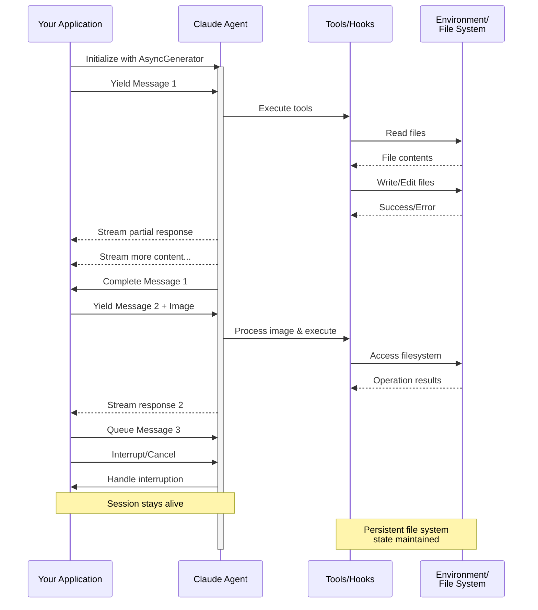

# ストリーミング入力

Claude Agent SDKの2つの入力モードを理解し、各モードをいつ使用するかを学ぶ

---

## 概要

Claude Agent SDKは、エージェントと対話するための2つの異なる入力モードをサポートしています：

- **ストリーミング入力モード**（デフォルト＆推奨）- 永続的でインタラクティブなセッション
- **シングルメッセージ入力** - セッション状態を使用して再開する1回限りのクエリ

このガイドでは、各モードの違い、利点、ユースケースについて説明し、アプリケーションに適したアプローチを選択するのに役立てます。

## ストリーミング入力モード（推奨）

ストリーミング入力モードは、Claude Agent SDKを使用する**推奨される**方法です。エージェントの機能に完全にアクセスでき、豊かでインタラクティブな体験を実現します。

これにより、エージェントは長期的なプロセスとして動作し、ユーザー入力を受け取り、割り込みを処理し、権限リクエストを表示し、セッション管理を処理できます。

### 仕組み



### 利点

<CardGroup cols={2}>
  <Card title="画像アップロード" icon="image">
    メッセージに画像を直接添付して、ビジュアル分析と理解を実現
  </Card>
  <Card title="キューに入れたメッセージ" icon="stack">
    複数のメッセージを順序立てて処理し、割り込む機能を備えて送信
  </Card>
  <Card title="ツール統合" icon="wrench">
    セッション中のすべてのツールとカスタムMCPサーバーへの完全なアクセス
  </Card>
  <Card title="フック対応" icon="link">
    ライフサイクルフックを使用して、様々なポイントで動作をカスタマイズ
  </Card>
  <Card title="リアルタイムフィードバック" icon="lightning">
    最終結果だけでなく、生成されるレスポンスをリアルタイムで確認
  </Card>
  <Card title="コンテキスト永続性" icon="database">
    複数のターンにわたって自然に会話コンテキストを維持
  </Card>
</CardGroup>

### 実装例

<CodeGroup>

```typescript TypeScript
import { query } from "@anthropic-ai/claude-agent-sdk";
import { readFileSync } from "fs";

async function* generateMessages() {
  // First message
  yield {
    type: "user" as const,
    message: {
      role: "user" as const,
      content: "Analyze this codebase for security issues"
    }
  };
  
  // Wait for conditions or user input
  await new Promise(resolve => setTimeout(resolve, 2000));
  
  // Follow-up with image
  yield {
    type: "user" as const,
    message: {
      role: "user" as const,
      content: [
        {
          type: "text",
          text: "Review this architecture diagram"
        },
        {
          type: "image",
          source: {
            type: "base64",
            media_type: "image/png",
            data: readFileSync("diagram.png", "base64")
          }
        }
      ]
    }
  };
}

// Process streaming responses
for await (const message of query({
  prompt: generateMessages(),
  options: {
    maxTurns: 10,
    allowedTools: ["Read", "Grep"]
  }
})) {
  if (message.type === "result") {
    console.log(message.result);
  }
}
```

```python Python
from claude_agent_sdk import ClaudeSDKClient, ClaudeAgentOptions, AssistantMessage, TextBlock
import asyncio
import base64

async def streaming_analysis():
    async def message_generator():
        # First message
        yield {
            "type": "user",
            "message": {
                "role": "user",
                "content": "Analyze this codebase for security issues"
            }
        }

        # Wait for conditions
        await asyncio.sleep(2)

        # Follow-up with image
        with open("diagram.png", "rb") as f:
            image_data = base64.b64encode(f.read()).decode()

        yield {
            "type": "user",
            "message": {
                "role": "user",
                "content": [
                    {
                        "type": "text",
                        "text": "Review this architecture diagram"
                    },
                    {
                        "type": "image",
                        "source": {
                            "type": "base64",
                            "media_type": "image/png",
                            "data": image_data
                        }
                    }
                ]
            }
        }

    # Use ClaudeSDKClient for streaming input
    options = ClaudeAgentOptions(
        max_turns=10,
        allowed_tools=["Read", "Grep"]
    )

    async with ClaudeSDKClient(options) as client:
        # Send streaming input
        await client.query(message_generator())

        # Process responses
        async for message in client.receive_response():
            if isinstance(message, AssistantMessage):
                for block in message.content:
                    if isinstance(block, TextBlock):
                        print(block.text)

asyncio.run(streaming_analysis())
```

</CodeGroup>

## シングルメッセージ入力

シングルメッセージ入力はより単純ですが、より制限されています。

### シングルメッセージ入力を使用する場合

シングルメッセージ入力を使用する場合：

- 1回限りのレスポンスが必要な場合
- 画像添付、フックなどが不要な場合
- ラムダ関数などのステートレス環境で動作する必要がある場合

### 制限事項

<Warning>
シングルメッセージ入力モードは以下をサポート**していません**：
- メッセージ内の直接的な画像添付
- 動的なメッセージキューイング
- リアルタイム割り込み
- フック統合
- 自然なマルチターン会話
</Warning>

### 実装例

<CodeGroup>

```typescript TypeScript
import { query } from "@anthropic-ai/claude-agent-sdk";

// Simple one-shot query
for await (const message of query({
  prompt: "Explain the authentication flow",
  options: {
    maxTurns: 1,
    allowedTools: ["Read", "Grep"]
  }
})) {
  if (message.type === "result") {
    console.log(message.result);
  }
}

// Continue conversation with session management
for await (const message of query({
  prompt: "Now explain the authorization process",
  options: {
    continue: true,
    maxTurns: 1
  }
})) {
  if (message.type === "result") {
    console.log(message.result);
  }
}
```

```python Python
from claude_agent_sdk import query, ClaudeAgentOptions, ResultMessage
import asyncio

async def single_message_example():
    # Simple one-shot query using query() function
    async for message in query(
        prompt="Explain the authentication flow",
        options=ClaudeAgentOptions(
            max_turns=1,
            allowed_tools=["Read", "Grep"]
        )
    ):
        if isinstance(message, ResultMessage):
            print(message.result)

    # Continue conversation with session management
    async for message in query(
        prompt="Now explain the authorization process",
        options=ClaudeAgentOptions(
            continue_conversation=True,
            max_turns=1
        )
    ):
        if isinstance(message, ResultMessage):
            print(message.result)

asyncio.run(single_message_example())
```

</CodeGroup>