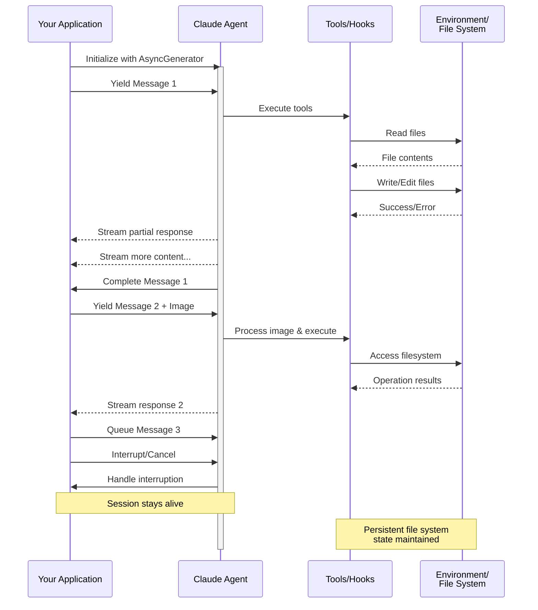

# Entrada em Streaming

Compreendendo os dois modos de entrada para Claude Agent SDK e quando usar cada um

---

## Visão Geral

O Claude Agent SDK suporta dois modos de entrada distintos para interagir com agentes:

- **Modo de Entrada em Streaming** (Padrão e Recomendado) - Uma sessão persistente e interativa
- **Entrada de Mensagem Única** - Consultas únicas que usam estado de sessão e retomada

Este guia explica as diferenças, benefícios e casos de uso para cada modo para ajudá-lo a escolher a abordagem certa para sua aplicação.

## Modo de Entrada em Streaming (Recomendado)

O modo de entrada em streaming é a forma **preferida** de usar o Claude Agent SDK. Ele fornece acesso completo aos recursos do agente e permite experiências ricas e interativas.

Ele permite que o agente funcione como um processo de longa duração que recebe entrada do usuário, lida com interrupções, exibe solicitações de permissão e gerencia a sessão.

### Como Funciona



### Benefícios

<CardGroup cols={2}>
  <Card title="Upload de Imagens" icon="image">
    Anexe imagens diretamente às mensagens para análise e compreensão visual
  </Card>
  <Card title="Mensagens Enfileiradas" icon="stack">
    Envie múltiplas mensagens que processam sequencialmente, com capacidade de interrupção
  </Card>
  <Card title="Integração de Ferramentas" icon="wrench">
    Acesso completo a todas as ferramentas e servidores MCP personalizados durante a sessão
  </Card>
  <Card title="Suporte a Hooks" icon="link">
    Use hooks de ciclo de vida para personalizar o comportamento em vários pontos
  </Card>
  <Card title="Feedback em Tempo Real" icon="lightning">
    Veja as respostas conforme são geradas, não apenas os resultados finais
  </Card>
  <Card title="Persistência de Contexto" icon="database">
    Mantenha o contexto da conversa em múltiplos turnos naturalmente
  </Card>
</CardGroup>

### Exemplo de Implementação

<CodeGroup>

```typescript TypeScript
import { query } from "@anthropic-ai/claude-agent-sdk";
import { readFileSync } from "fs";

async function* generateMessages() {
  // First message
  yield {
    type: "user" as const,
    message: {
      role: "user" as const,
      content: "Analyze this codebase for security issues"
    }
  };
  
  // Wait for conditions or user input
  await new Promise(resolve => setTimeout(resolve, 2000));
  
  // Follow-up with image
  yield {
    type: "user" as const,
    message: {
      role: "user" as const,
      content: [
        {
          type: "text",
          text: "Review this architecture diagram"
        },
        {
          type: "image",
          source: {
            type: "base64",
            media_type: "image/png",
            data: readFileSync("diagram.png", "base64")
          }
        }
      ]
    }
  };
}

// Process streaming responses
for await (const message of query({
  prompt: generateMessages(),
  options: {
    maxTurns: 10,
    allowedTools: ["Read", "Grep"]
  }
})) {
  if (message.type === "result") {
    console.log(message.result);
  }
}
```

```python Python
from claude_agent_sdk import ClaudeSDKClient, ClaudeAgentOptions, AssistantMessage, TextBlock
import asyncio
import base64

async def streaming_analysis():
    async def message_generator():
        # First message
        yield {
            "type": "user",
            "message": {
                "role": "user",
                "content": "Analyze this codebase for security issues"
            }
        }

        # Wait for conditions
        await asyncio.sleep(2)

        # Follow-up with image
        with open("diagram.png", "rb") as f:
            image_data = base64.b64encode(f.read()).decode()

        yield {
            "type": "user",
            "message": {
                "role": "user",
                "content": [
                    {
                        "type": "text",
                        "text": "Review this architecture diagram"
                    },
                    {
                        "type": "image",
                        "source": {
                            "type": "base64",
                            "media_type": "image/png",
                            "data": image_data
                        }
                    }
                ]
            }
        }

    # Use ClaudeSDKClient for streaming input
    options = ClaudeAgentOptions(
        max_turns=10,
        allowed_tools=["Read", "Grep"]
    )

    async with ClaudeSDKClient(options) as client:
        # Send streaming input
        await client.query(message_generator())

        # Process responses
        async for message in client.receive_response():
            if isinstance(message, AssistantMessage):
                for block in message.content:
                    if isinstance(block, TextBlock):
                        print(block.text)

asyncio.run(streaming_analysis())
```

</CodeGroup>

## Entrada de Mensagem Única

A entrada de mensagem única é mais simples, mas mais limitada.

### Quando Usar Entrada de Mensagem Única

Use entrada de mensagem única quando:

- Você precisa de uma resposta única
- Você não precisa de anexos de imagem, hooks, etc.
- Você precisa operar em um ambiente sem estado, como uma função lambda

### Limitações

<Warning>
O modo de entrada de mensagem única **não** suporta:
- Anexos de imagem diretos em mensagens
- Enfileiramento dinâmico de mensagens
- Interrupção em tempo real
- Integração de hooks
- Conversas naturais com múltiplos turnos
</Warning>

### Exemplo de Implementação

<CodeGroup>

```typescript TypeScript
import { query } from "@anthropic-ai/claude-agent-sdk";

// Simple one-shot query
for await (const message of query({
  prompt: "Explain the authentication flow",
  options: {
    maxTurns: 1,
    allowedTools: ["Read", "Grep"]
  }
})) {
  if (message.type === "result") {
    console.log(message.result);
  }
}

// Continue conversation with session management
for await (const message of query({
  prompt: "Now explain the authorization process",
  options: {
    continue: true,
    maxTurns: 1
  }
})) {
  if (message.type === "result") {
    console.log(message.result);
  }
}
```

```python Python
from claude_agent_sdk import query, ClaudeAgentOptions, ResultMessage
import asyncio

async def single_message_example():
    # Simple one-shot query using query() function
    async for message in query(
        prompt="Explain the authentication flow",
        options=ClaudeAgentOptions(
            max_turns=1,
            allowed_tools=["Read", "Grep"]
        )
    ):
        if isinstance(message, ResultMessage):
            print(message.result)

    # Continue conversation with session management
    async for message in query(
        prompt="Now explain the authorization process",
        options=ClaudeAgentOptions(
            continue_conversation=True,
            max_turns=1
        )
    ):
        if isinstance(message, ResultMessage):
            print(message.result)

asyncio.run(single_message_example())
```

</CodeGroup>