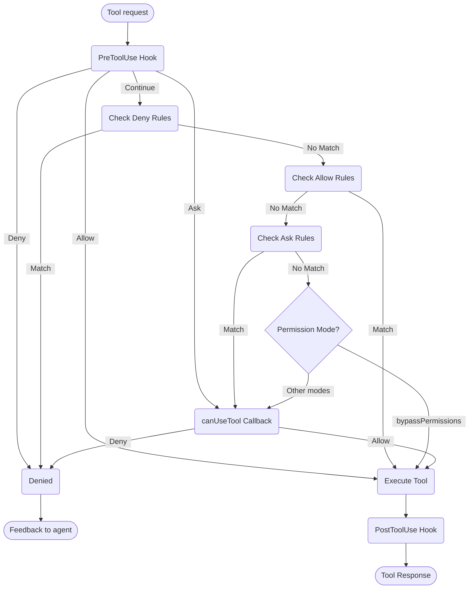

# 处理权限

在 Claude Agent SDK 中控制工具使用和权限

---

# SDK 权限

Claude Agent SDK 提供强大的权限控制，允许您管理 Claude 在应用程序中如何使用工具。

本指南介绍如何使用 `canUseTool` 回调、钩子和 settings.json 权限规则来实现权限系统。有关完整的 API 文档，请参阅 [TypeScript SDK 参考](/docs/zh-CN/agent-sdk/typescript)。

## 概述

Claude Agent SDK 提供四种互补的方式来控制工具使用：

1. **[权限模式](#permission-modes)** - 影响所有工具的全局权限行为设置
2. **[canUseTool 回调](/docs/zh-CN/agent-sdk/typescript#canusetool)** - 用于其他规则未涵盖的情况的运行时权限处理程序
3. **[钩子](/docs/zh-CN/agent-sdk/hooks)** - 通过自定义逻辑对每个工具执行进行细粒度控制
4. **[权限规则 (settings.json)](https://code.claude.com/docs/en/settings#permission-settings)** - 具有集成 bash 命令解析的声明式允许/拒绝规则

每种方法的用例：
- 权限模式 - 设置整体权限行为（规划、自动接受编辑、绕过检查）
- `canUseTool` - 未涵盖情况的动态批准，提示用户获得权限
- 钩子 - 对所有工具执行的编程控制
- 权限规则 - 具有智能 bash 命令解析的静态策略

## 权限流程图



**处理顺序：** PreToolUse Hook → 拒绝规则 → 允许规则 → 询问规则 → 权限模式检查 → canUseTool 回调 → PostToolUse Hook

## 权限模式

权限模式提供对 Claude 如何使用工具的全局控制。您可以在调用 `query()` 时设置权限模式，或在流式会话期间动态更改它。

### 可用模式

SDK 支持四种权限模式，每种模式具有不同的行为：

| 模式 | 描述 | 工具行为 |
| :--- | :---------- | :------------ |
| `default` | 标准权限行为 | 应用正常权限检查 |
| `plan` | 规划模式 - 无执行 | Claude 只能使用只读工具；在执行前呈现计划 **(SDK 中目前不支持)** |
| `acceptEdits` | 自动接受文件编辑 | 文件编辑和文件系统操作自动批准 |
| `bypassPermissions` | 绕过所有权限检查 | 所有工具无需权限提示即可运行（谨慎使用） |

### 设置权限模式

您可以通过两种方式设置权限模式：

#### 1. 初始配置

在创建查询时设置模式：

<CodeGroup>

```typescript TypeScript
import { query } from "@anthropic-ai/claude-agent-sdk";

const result = await query({
  prompt: "Help me refactor this code",
  options: {
    permissionMode: 'default'  // 标准权限模式
  }
});
```

```python Python
from claude_agent_sdk import query

result = await query(
    prompt="Help me refactor this code",
    options={
        "permission_mode": "default"  # 标准权限模式
    }
)
```

</CodeGroup>

#### 2. 动态模式更改（仅限流式）

在流式会话期间更改模式：

<CodeGroup>

```typescript TypeScript
import { query } from "@anthropic-ai/claude-agent-sdk";

// 为流式输入创建异步生成器
async function* streamInput() {
  yield { 
    type: 'user',
    message: { 
      role: 'user', 
      content: "Let's start with default permissions" 
    }
  };
  
  // 稍后在对话中...
  yield {
    type: 'user',
    message: {
      role: 'user',
      content: "Now let's speed up development"
    }
  };
}

const q = query({
  prompt: streamInput(),
  options: {
    permissionMode: 'default'  // 以默认模式启动
  }
});

// 动态更改模式
await q.setPermissionMode('acceptEdits');

// 处理消息
for await (const message of q) {
  console.log(message);
}
```

```python Python
from claude_agent_sdk import query

async def stream_input():
    """用于流式输入的异步生成器"""
    yield {
        "type": "user",
        "message": {
            "role": "user",
            "content": "Let's start with default permissions"
        }
    }
    
    # 稍后在对话中...
    yield {
        "type": "user",
        "message": {
            "role": "user",
            "content": "Now let's speed up development"
        }
    }

q = query(
    prompt=stream_input(),
    options={
        "permission_mode": "default"  # 以默认模式启动
    }
)

# 动态更改模式
await q.set_permission_mode("acceptEdits")

# 处理消息
async for message in q:
    print(message)
```

</CodeGroup>

### 模式特定行为

#### 接受编辑模式 (`acceptEdits`)

在接受编辑模式中：
- 所有文件编辑自动批准
- 文件系统操作（mkdir、touch、rm 等）自动批准
- 其他工具仍需要正常权限
- 当您信任 Claude 的编辑时加快开发速度
- 适用于快速原型设计和迭代

自动批准的操作：
- 文件编辑（编辑、写入工具）
- Bash 文件系统命令（mkdir、touch、rm、mv、cp）
- 文件创建和删除

#### 绕过权限模式 (`bypassPermissions`)

在绕过权限模式中：
- **所有工具使用自动批准**
- 不出现权限提示
- 钩子仍然执行（仍然可以阻止操作）
- **谨慎使用** - Claude 具有完整的系统访问权限
- 仅建议在受控环境中使用

### 权限流程中的模式优先级

权限模式在权限流程中的特定点进行评估：

1. **钩子首先执行** - 可以允许、拒绝、询问或继续
2. **检查拒绝规则** - 无论模式如何都阻止工具
3. **检查允许规则** - 如果匹配则允许工具
4. **检查询问规则** - 如果匹配则提示获得权限
5. **评估权限模式**：
   - **`bypassPermissions` 模式** - 如果活跃，允许所有剩余工具
   - **其他模式** - 延迟到 `canUseTool` 回调
6. **`canUseTool` 回调** - 处理剩余情况

这意味着：
- 钩子可以始终控制工具使用，即使在 `bypassPermissions` 模式中
- 显式拒绝规则覆盖所有权限模式
- 询问规则在权限模式之前评估
- `bypassPermissions` 模式覆盖未匹配工具的 `canUseTool` 回调

### 最佳实践

1. **使用默认模式**进行受控执行，进行正常权限检查
2. **使用 acceptEdits 模式**在处理隔离文件或目录时
3. **避免 bypassPermissions** 在生产环境或具有敏感数据的系统上
4. **将模式与钩子结合**以进行细粒度控制
5. **根据任务进度和信心动态切换模式**

模式进度示例：
```typescript
// 以默认模式启动以进行受控执行
permissionMode: 'default'

// 切换到 acceptEdits 以进行快速迭代
await q.setPermissionMode('acceptEdits')
```

## canUseTool

`canUseTool` 回调在调用 `query` 函数时作为选项传递。它接收工具名称和输入参数，必须返回一个决定 - 允许或拒绝。

canUseTool 在 Claude Code 向用户显示权限提示时触发，例如钩子和权限规则未涵盖它且不在 acceptEdits 模式中。

以下是一个完整示例，展示如何实现交互式工具批准：

<CodeGroup>

```typescript TypeScript
import { query } from "@anthropic-ai/claude-agent-sdk";

async function promptForToolApproval(toolName: string, input: any) {
  console.log("\n🔧 Tool Request:");
  console.log(`   Tool: ${toolName}`);
  
  // 显示工具参数
  if (input && Object.keys(input).length > 0) {
    console.log("   Parameters:");
    for (const [key, value] of Object.entries(input)) {
      let displayValue = value;
      if (typeof value === 'string' && value.length > 100) {
        displayValue = value.substring(0, 100) + "...";
      } else if (typeof value === 'object') {
        displayValue = JSON.stringify(value, null, 2);
      }
      console.log(`     ${key}: ${displayValue}`);
    }
  }
  
  // 获取用户批准（用您的 UI 逻辑替换）
  const approved = await getUserApproval();
  
  if (approved) {
    console.log("   ✅ Approved\n");
    return {
      behavior: "allow",
      updatedInput: input
    };
  } else {
    console.log("   ❌ Denied\n");
    return {
      behavior: "deny",
      message: "User denied permission for this tool"
    };
  }
}

// 使用权限回调
const result = await query({
  prompt: "Help me analyze this codebase",
  options: {
    canUseTool: async (toolName, input) => {
      return promptForToolApproval(toolName, input);
    }
  }
});
```

```python Python
from claude_agent_sdk import query

async def prompt_for_tool_approval(tool_name: str, input_params: dict):
    print(f"\n🔧 Tool Request:")
    print(f"   Tool: {tool_name}")

    # 显示参数
    if input_params:
        print("   Parameters:")
        for key, value in input_params.items():
            display_value = value
            if isinstance(value, str) and len(value) > 100:
                display_value = value[:100] + "..."
            elif isinstance(value, (dict, list)):
                display_value = json.dumps(value, indent=2)
            print(f"     {key}: {display_value}")

    # 获取用户批准
    answer = input("\n   Approve this tool use? (y/n): ")

    if answer.lower() in ['y', 'yes']:
        print("   ✅ Approved\n")
        return {
            "behavior": "allow",
            "updatedInput": input_params
        }
    else:
        print("   ❌ Denied\n")
        return {
            "behavior": "deny",
            "message": "User denied permission for this tool"
        }

# 使用权限回调
result = await query(
    prompt="Help me analyze this codebase",
    options={
        "can_use_tool": prompt_for_tool_approval
    }
)
```

</CodeGroup>

## 处理 AskUserQuestion 工具

`AskUserQuestion` 工具允许 Claude 在对话期间向用户提出澄清问题。当调用此工具时，您的 `canUseTool` 回调接收问题并必须返回用户的答案。

### 输入结构

当使用 `toolName: "AskUserQuestion"` 调用 `canUseTool` 时，输入包含：

```typescript
{
  questions: [
    {
      question: "Which database should we use?",
      header: "Database",
      options: [
        { label: "PostgreSQL", description: "Relational, ACID compliant" },
        { label: "MongoDB", description: "Document-based, flexible schema" }
      ],
      multiSelect: false
    },
    {
      question: "Which features should we enable?",
      header: "Features",
      options: [
        { label: "Authentication", description: "User login and sessions" },
        { label: "Logging", description: "Request and error logging" },
        { label: "Caching", description: "Redis-based response caching" }
      ],
      multiSelect: true
    }
  ]
}
```

### 返回答案

在 `updatedInput.answers` 中返回答案，作为将问题文本映射到所选选项标签的记录：

```typescript
return {
  behavior: "allow",
  updatedInput: {
    questions: input.questions,  // 传递原始问题
    answers: {
      "Which database should we use?": "PostgreSQL",
      "Which features should we enable?": "Authentication, Caching"
    }
  }
}
```

<Note>
多选答案是逗号分隔的字符串（例如，`"Authentication, Caching"`）。
</Note>

## 相关资源

- [钩子指南](/docs/zh-CN/agent-sdk/hooks) - 了解如何实现钩子以对工具执行进行细粒度控制
- [设置：权限规则](https://code.claude.com/docs/en/settings#permission-settings) - 使用 bash 命令解析配置声明式允许/拒绝规则