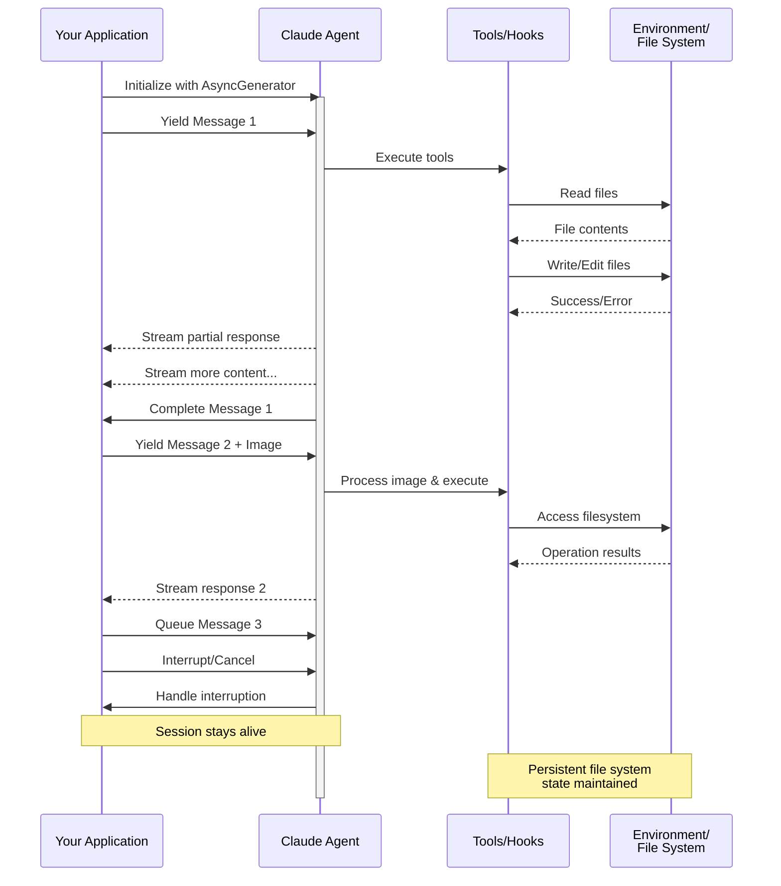

# 串流輸入

了解 Claude Agent SDK 的兩種輸入模式及何時使用各種模式

---

## 概述

Claude Agent SDK 支援兩種不同的輸入模式來與代理互動：

- **串流輸入模式**（預設且推薦）- 持久的互動式工作階段
- **單一訊息輸入** - 使用工作階段狀態和恢復的一次性查詢

本指南說明每種模式的差異、優點和使用案例，幫助您為應用程式選擇正確的方法。

## 串流輸入模式（推薦）

串流輸入模式是使用 Claude Agent SDK 的**首選**方式。它提供對代理功能的完整存取，並支援豐富的互動式體驗。

它允許代理作為長期執行的程序運作，接收使用者輸入、處理中斷、顯示權限請求，以及處理工作階段管理。

### 運作方式



### 優點

<CardGroup cols={2}>
  <Card title="影像上傳" icon="image">
    直接將影像附加到訊息中以進行視覺分析和理解
  </Card>
  <Card title="佇列訊息" icon="stack">
    傳送多個訊息以順序處理，並能夠中斷
  </Card>
  <Card title="工具整合" icon="wrench">
    在工作階段期間完整存取所有工具和自訂 MCP 伺服器
  </Card>
  <Card title="Hooks 支援" icon="link">
    使用生命週期 hooks 在各個點自訂行為
  </Card>
  <Card title="即時回饋" icon="lightning">
    查看產生的回應，而不僅僅是最終結果
  </Card>
  <Card title="內容持久性" icon="database">
    自然地在多個回合中維持對話內容
  </Card>
</CardGroup>

### 實作範例

<CodeGroup>

```typescript TypeScript
import { query } from "@anthropic-ai/claude-agent-sdk";
import { readFileSync } from "fs";

async function* generateMessages() {
  // First message
  yield {
    type: "user" as const,
    message: {
      role: "user" as const,
      content: "Analyze this codebase for security issues"
    }
  };
  
  // Wait for conditions or user input
  await new Promise(resolve => setTimeout(resolve, 2000));
  
  // Follow-up with image
  yield {
    type: "user" as const,
    message: {
      role: "user" as const,
      content: [
        {
          type: "text",
          text: "Review this architecture diagram"
        },
        {
          type: "image",
          source: {
            type: "base64",
            media_type: "image/png",
            data: readFileSync("diagram.png", "base64")
          }
        }
      ]
    }
  };
}

// Process streaming responses
for await (const message of query({
  prompt: generateMessages(),
  options: {
    maxTurns: 10,
    allowedTools: ["Read", "Grep"]
  }
})) {
  if (message.type === "result") {
    console.log(message.result);
  }
}
```

```python Python
from claude_agent_sdk import ClaudeSDKClient, ClaudeAgentOptions, AssistantMessage, TextBlock
import asyncio
import base64

async def streaming_analysis():
    async def message_generator():
        # First message
        yield {
            "type": "user",
            "message": {
                "role": "user",
                "content": "Analyze this codebase for security issues"
            }
        }

        # Wait for conditions
        await asyncio.sleep(2)

        # Follow-up with image
        with open("diagram.png", "rb") as f:
            image_data = base64.b64encode(f.read()).decode()

        yield {
            "type": "user",
            "message": {
                "role": "user",
                "content": [
                    {
                        "type": "text",
                        "text": "Review this architecture diagram"
                    },
                    {
                        "type": "image",
                        "source": {
                            "type": "base64",
                            "media_type": "image/png",
                            "data": image_data
                        }
                    }
                ]
            }
        }

    # Use ClaudeSDKClient for streaming input
    options = ClaudeAgentOptions(
        max_turns=10,
        allowed_tools=["Read", "Grep"]
    )

    async with ClaudeSDKClient(options) as client:
        # Send streaming input
        await client.query(message_generator())

        # Process responses
        async for message in client.receive_response():
            if isinstance(message, AssistantMessage):
                for block in message.content:
                    if isinstance(block, TextBlock):
                        print(block.text)

asyncio.run(streaming_analysis())
```

</CodeGroup>

## 單一訊息輸入

單一訊息輸入更簡單但功能更受限。

### 何時使用單一訊息輸入

在以下情況下使用單一訊息輸入：

- 您需要一次性回應
- 您不需要影像附件、hooks 等
- 您需要在無狀態環境中運作，例如 lambda 函式

### 限制

<Warning>
單一訊息輸入模式**不**支援：
- 訊息中的直接影像附件
- 動態訊息佇列
- 即時中斷
- Hook 整合
- 自然的多回合對話
</Warning>

### 實作範例

<CodeGroup>

```typescript TypeScript
import { query } from "@anthropic-ai/claude-agent-sdk";

// Simple one-shot query
for await (const message of query({
  prompt: "Explain the authentication flow",
  options: {
    maxTurns: 1,
    allowedTools: ["Read", "Grep"]
  }
})) {
  if (message.type === "result") {
    console.log(message.result);
  }
}

// Continue conversation with session management
for await (const message of query({
  prompt: "Now explain the authorization process",
  options: {
    continue: true,
    maxTurns: 1
  }
})) {
  if (message.type === "result") {
    console.log(message.result);
  }
}
```

```python Python
from claude_agent_sdk import query, ClaudeAgentOptions, ResultMessage
import asyncio

async def single_message_example():
    # Simple one-shot query using query() function
    async for message in query(
        prompt="Explain the authentication flow",
        options=ClaudeAgentOptions(
            max_turns=1,
            allowed_tools=["Read", "Grep"]
        )
    ):
        if isinstance(message, ResultMessage):
            print(message.result)

    # Continue conversation with session management
    async for message in query(
        prompt="Now explain the authorization process",
        options=ClaudeAgentOptions(
            continue_conversation=True,
            max_turns=1
        )
    ):
        if isinstance(message, ResultMessage):
            print(message.result)

asyncio.run(single_message_example())
```

</CodeGroup>