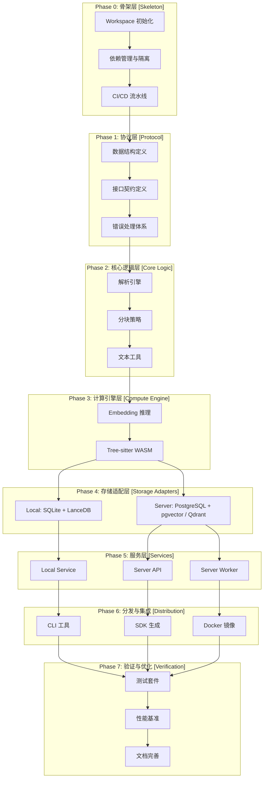
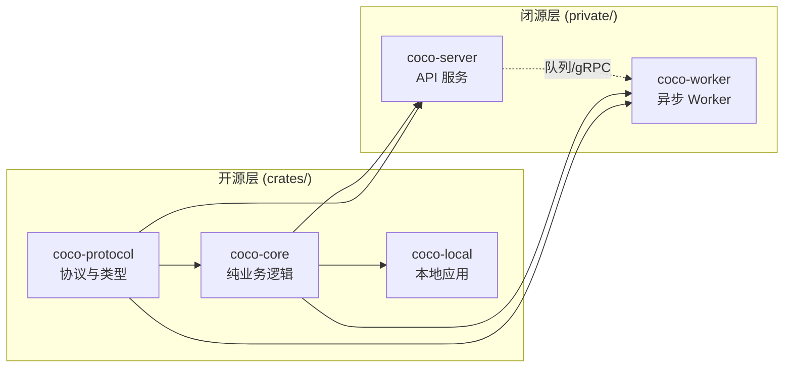
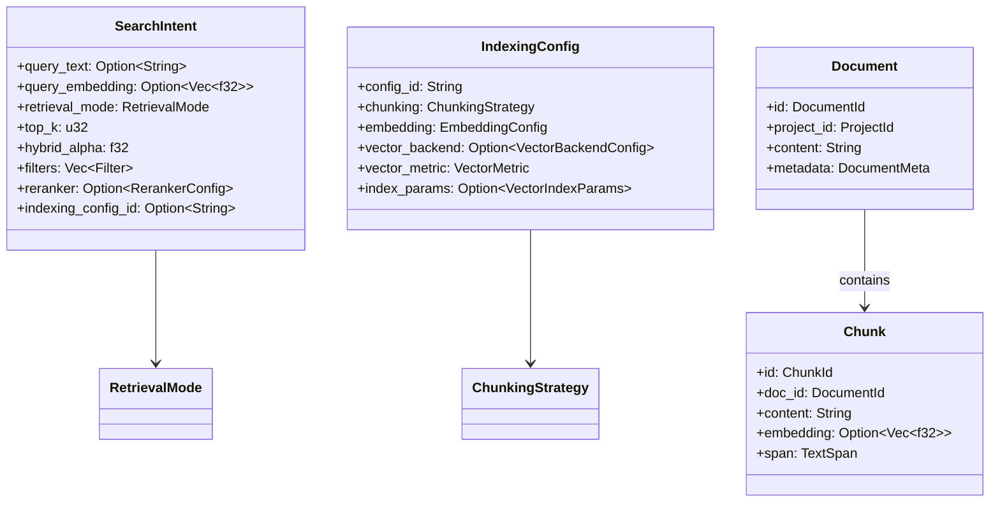
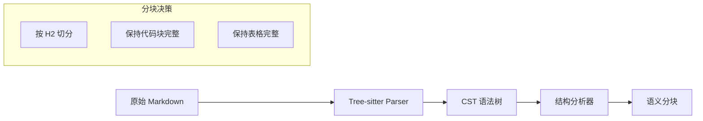
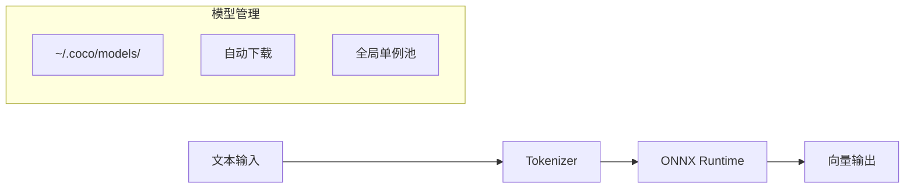
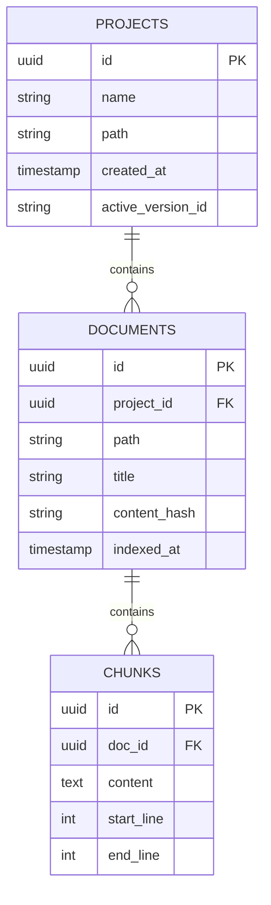
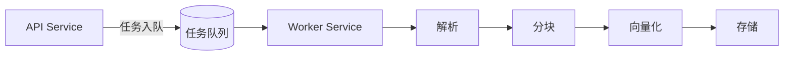
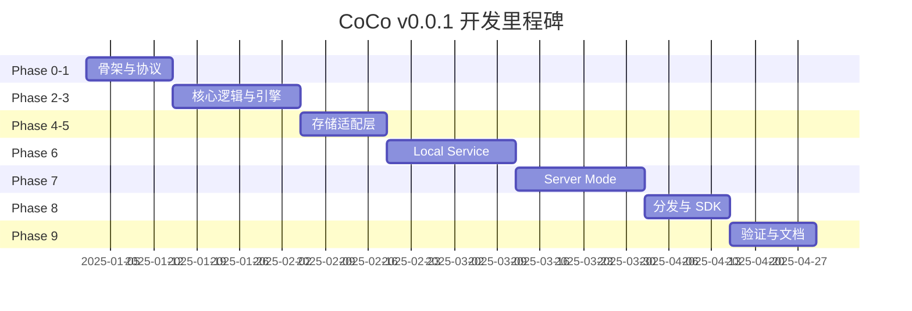

# CoCo v0.0.1 开发任务书 (Development Plan)

> **基准文档:** `TASK.md` (v0.0.1 Physical Separation)
> **核心原则:** Skeleton to Flesh (由骨架到血肉), Physical Separation (物理隔离), No-DI (静态分发)

---

## 📐 项目架构总览

---

## 📅 Phase 0: 基础设施与架构骨架 (Skeleton & Infra)

**目标:** 建立稳固的 Monorepo 结构，通过 CI/CD 强制执行架构约束（物理隔离与依赖规则）。

**依赖:** 无（项目起点）

**产出:** 可编译的空 Workspace，通过 CI 构建验证

---

### 0.1 Workspace 初始化

**目标:** 创建符合 Physical Separation 原则的 Cargo Workspace

| 任务                            | 说明                                   | 验收标准                |
| :------------------------------ | :------------------------------------- | :---------------------- |
| **0.1.1** 创建 Workspace 根目录 | 创建 `Cargo.toml` 定义 workspace       | `cargo check` 通过      |
| **0.1.2** 定义成员结构          | `crates/*` (开源) + `private/*` (闭源) | 目录结构符合规范        |
| **0.1.3** 锁定 Rust 版本        | 创建 `rust-toolchain.toml`             | 版本固定为 stable-1.85+ |
| **0.1.4** 配置共享依赖          | `[workspace.dependencies]` 统一版本    | 无版本冲突警告          |
| **0.1.5** Submodule 可选化      | `private/` 可拆分为独立仓库或 Submodule | `.gitmodules` 可用且文档一致 |

- [x] **0.1.1** 创建 `Cargo.toml` (Workspace Root)
  - [x] 配置 `[workspace]` 块
  - [x] 定义 `members = ["crates/*", "private/*"]`
  - [x] 定义 `exclude = ["private/*"]` (可选，按需调整；本次不启用)
- [x] **0.1.2** 定义 Workspace 成员结构
  - [x] 创建 `crates/` 目录 (开源代码)
  - [x] 创建 `private/` 目录 (闭源代码，可独立 Git 管理)
- [x] **0.1.3** 创建 `rust-toolchain.toml`
  - [x] 锁定 `channel = "stable"`
  - [x] 锁定最低版本 (workspace `rust-version = "1.85"`)
- [x] **0.1.4** 配置共享依赖版本
  - [x] 在 `[workspace.dependencies]` 定义通用依赖版本
- [x] **0.1.5** `private/` 未来可拆分为独立仓库或 Submodule（可选）
  - [x] 明确拆分时机与约束（不阻塞 v0.0.1；本次不拆分）
  - [x] 若拆分为 Submodule，补齐 `.gitmodules` 与初始化说明（本次不适用）

---

### 0.2 核心 Crates 创建 (骨架)

**目标:** 创建所有 Crate 的空骨架，确保依赖方向正确

**依赖:** 0.1 Workspace 初始化

| Crate           | 类型 | 核心职责            | 禁止依赖                |
| :-------------- | :--- | :------------------ | :---------------------- |
| `coco-protocol` | Lib  | 协议、DTO、错误类型 | 任何 I/O 库             |
| `coco-core`     | Lib  | 解析、分块、算法    | 数据库驱动、HTTP 客户端 |
| `coco-local`    | Bin  | 本地 TUI 应用       | `postgres`, `pgvector`, `qdrant-client` |
| `coco-server`   | Bin  | 服务端 API          | `lancedb`, 嵌入式数据库 |
| `coco-worker`   | Bin  | 异步任务处理        | `lancedb`, 嵌入式数据库 |

- [x] **0.2.1** 创建 `crates/coco-protocol`
  - [x] `cargo new --lib crates/coco-protocol`
  - [x] 添加基础依赖: `serde`, `thiserror`
  - [x] 创建 `lib.rs` 占位结构
- [x] **0.2.2** 创建 `crates/coco-core`
  - [x] `cargo new --lib crates/coco-core`
  - [x] 依赖 `coco-protocol`
  - [x] **严格约束:** 仅允许纯计算依赖
- [x] **0.2.3** 创建 `crates/coco-local`
  - [x] `cargo new --bin crates/coco-local`
  - [x] 依赖 `coco-core`, `coco-protocol`
  - [x] 添加占位 `main.rs`
- [x] **0.2.4** 创建 `private/coco-server`
  - [x] `cargo new --bin private/coco-server`
  - [x] 依赖 `coco-core`, `coco-protocol`
  - [x] **架构检查:** 确保不引入嵌入式数据库
- [x] **0.2.5** 创建 `private/coco-worker`
  - [x] `cargo new --bin private/coco-worker`
  - [x] 依赖 `coco-core`, `coco-protocol`

---

### 0.3 依赖管理与架构隔离 (Physical Separation)

**目标:** 配置各 Crate 的依赖，严格执行物理隔离

**依赖:** 0.2 核心 Crates 创建

| 模式            | 允许的存储依赖                                             | 禁止的存储依赖                     |
| :-------------- | :--------------------------------------------------------- | :--------------------------------- |
| **Local Mode**  | `sea-orm` (sqlite), `lancedb`                              | `postgres`, `pgvector`, 网络型 VDB |
| **Server Mode** | `sea-orm` (postgres), `pgvector`, `qdrant-client`, `tonic` | `lancedb`, 嵌入式 SQLite           |
| **Core Logic**  | 无 I/O 依赖                                                | 所有数据库和网络库                 |

- [x] **0.3.1** 配置 `crates/coco-local` 依赖
  - [x] 添加 `sea-orm` (sqlite feature)
  - [x] 添加 `lancedb`
  - [x] 添加 `ort` (ONNX Runtime)
  - [x] 添加 `notify` (文件监听)
  - [x] 添加 `ratatui` (TUI)
  - [x] **验证:** 确保无 `postgres` 依赖
- [x] **0.3.2** 配置 `private/coco-server` 依赖
  - [x] 添加 `sea-orm` (postgres feature)
  - [x] 添加 `pgvector`
  - [x] 添加专门向量数据库客户端 (`qdrant-client`)
  - [x] 添加 `axum` (HTTP 框架)
  - [x] 添加 `tonic` (gRPC, 可选)
  - [x] 添加 `opentelemetry` (可观测性)
  - [x] **验证:** 确保无 `lancedb` 依赖
- [x] **0.3.3** 配置 `crates/coco-core` 依赖
  - [x] 添加 `tree-sitter`
  - [x] 添加 `tree-sitter-markdown`
  - [x] 添加 `serde`, `thiserror`
  - [x] **严格验证:** `cargo tree -p coco-core` 无任何数据库/网络库
- [x] **0.3.4** 统一元数据连接策略
  - [x] Local/Server 使用 `DatabaseConnection` 适配 `sqlite://` 与 `postgres://`
  - [x] 避免泛型注入或运行时 DI

---

### 0.4 CI/CD 与代码质量

**目标:** 通过自动化流水线强制执行架构约束

**依赖:** 0.2, 0.3

- [x] **0.4.1** 配置 GitHub Actions 基础流水线
  - [x] 创建 `.github/workflows/ci.yml`
  - [x] 配置 `cargo check --workspace`
  - [x] 配置 `cargo test --workspace`
  - [x] 配置 `cargo clippy --workspace -- -D warnings`
- [x] **0.4.2** 配置 Clippy 规则
  - [x] 创建 `clippy.toml` 或在 `Cargo.toml` 配置
  - [x] 拒绝 `unsafe` (除非显式允许)
  - [x] 强制 `missing_docs` (公开 API)
- [x] **0.4.3** 编写架构守护脚本 (可选)
  - [x] 创建 `scripts/check-deps.sh`
  - [x] 扫描各 Crate 的 `Cargo.toml`
  - [x] 检测禁止的依赖引入
  - [x] 在 CI 中执行

---

## 🧠 Phase 1: 核心协议与纯逻辑 (The Brain)

**目标:** 定义系统的"大脑"与数据契约。此阶段完全不涉及 I/O，专注于类型定义与算法实现。

**依赖:** Phase 0 (骨架就绪)

**产出:** `coco-protocol` 与 `coco-core` 的核心类型和算法

---

### 1.1 协议定义 (coco-protocol)

**目标:** 建立跨层共享的数据契约

**依赖:** 0.2.1 coco-protocol 创建

- [x] **1.1.1** 定义核心领域模型
  - [x] `Document`: 文档实体 (id, project_id, content, metadata)
  - [x] `Chunk`: 分块实体 (id, doc_id, content, embedding, span)
  - [x] `DocumentMeta`: 元数据 (title, path, source_ref, created_at, updated_at)
- [x] **1.1.2** 定义检索意图结构
  - [x] `SearchIntent`: 检索请求 (query_text/query_embedding, mode, top_k, filters, hybrid_alpha, reranker)
  - [x] `RetrievalMode`: 枚举 (Vector, FTS, Hybrid)
  - [x] `Filter`: 过滤条件 (field, op, value)
  - [x] 对外协议仅开放 `Eq/Contains` 操作符，其它仅内部保留
- [x] **1.1.3** 定义索引配置结构
  - [x] `IndexingConfig`: 索引策略 (config_id, chunking, embedding, vector_backend, vector_metric, index_params)
  - [x] `ChunkingStrategy`: 分块策略 (name, chunk_size, overlap)
  - [x] `EmbeddingConfig`: 嵌入配置 (model_name, dimensions)
  - [x] `VectorMetric`: 枚举 (Cosine, Dot, L2)
  - [x] `VectorIndexParams`: 索引参数 (如 HNSW/IVF-PQ), 允许按后端扩展
  - [x] `vector_metric` 必填，`index_params` 可选且有默认
- [x] **1.1.4** 定义检索配置结构
  - [x] `RetrievalConfig`: 检索策略 (mode, top_k, hybrid_alpha, reranker, vector_backend)
  - [x] `RerankerConfig`: 重排序配置 (model_name, top_n)
  - [x] 检索配置不得覆盖 `vector_metric`/`index_params`
- [x] **1.1.5** 定义向量后端配置
  - [x] `VectorBackendKind`: 枚举 (PgVector, Qdrant)
  - [x] `VectorBackendConfig`: 后端选择与连接参数
  - [x] Qdrant 配置: url/api_key/collection_prefix
  - [x] `VectorRecord`: 向量记录 (chunk_id, embedding, metadata)
  - [x] `IndexingConfig`/`RetrievalConfig` 引入向量后端选择
  - [x] `COCO_VECTOR_BACKEND`: pgvector/qdrant
  - [x] Local 使用 LanceDB，`vector_backend` 字段仅 Server 侧允许
- [x] **1.1.6** 定义响应包裹与质量元信息
  - [x] `ResponseMeta`: request-level 状态 (fresh/stale)
  - [x] `SearchHitMeta`: score/quality/verified
  - [x] `score` 语义统一: 高分更好, 需要时归一化到 [0,1]
  - [x] `ResponseMeta.status` 定义清晰 (fresh/stale 判定规则)
  - [x] 显式查询非 active `config_id` 标记为 `stale` (public API 不暴露 `version_id`)
  - [x] 无缓存/无回填时必须仍为 `fresh` (不以缺少质量信息为 `stale`)
  - [x] `status` 仅反映版本/配置新鲜度，不表达缓存/延迟
  - [x] `status` 以元数据 store 的 active 版本/配置为准
  - [x] Local 默认 `fresh` 且拒绝显式非 active 配置查询
  - [x] `quality/verified` 为可选字段，Local 返回 `null`，Server 由 Pipeline 填充
  - [x] `SearchHit`: `{ meta, chunk }`
  - [x] `ResponseEnvelope<T>`: `{ meta, data }` 统一结构
  - [x] 移除 `SearchResult`，统一使用 `SearchHit`
- [x] **1.1.7** 定义索引选择与 `config_id` 约束
  - [x] `SearchIntent.indexing_config_id: Option<String>`
  - [x] `VectorMetadata`/`VectorRecord` 增加 `config_id`
  - [x] 同项目允许多套索引共存，检索必须显式选择或采用默认 `config_id`
  - [x] `IndexingConfig.config_id` 作为存储层写入与过滤键
  - [x] `config_id` 与 embedding 维度/metric 强绑定，不兼容时必须落到独立物理索引
  - [x] 未显式指定时使用 `active_config_id`
  - [x] `config_id` 命名规范: `^[a-z0-9][a-z0-9_-]{0,62}$` (长度 1..63)
  - [x] `config_id` 仅允许 trim 用于校验，trim 后与原值不一致即 4xx
  - [x] 长度上限 63 与 PG 标识符限制对齐 (跨后端统一约束)
  - [x] `MAX_CONFIG_ID_LEN` 调整为 63，保持与协议一致
  - [x] `VectorMetadata.config_id` 迁移后视为必填，缺失即拒绝写入
  - [x] 保留 `config_id=default` 作为系统默认
  - [x] `config_id=default` 保留且不可删除/覆盖

---

### 1.2 接口契约定义 (Traits)

**目标:** 定义业务语义端口，供 Local/Server 分别实现

**依赖:** 1.1 协议定义

> [!IMPORTANT] > **No-DI 原则:** 这些 Trait 用于定义语义契约，但实际使用时通过 Concrete Types 静态绑定，不使用 `Box<dyn ...>` 运行时注入。

- [x] **1.2.1** 定义 `StorageBackend` Trait
  - [x] `fn upsert_chunks(&self, chunks: Vec<Chunk>) -> impl Future<Output = Result<()>> + Send`
  - [x] `fn search_similar(&self, intent: SearchIntent) -> impl Future<Output = Result<Vec<SearchHit>>> + Send`
  - [x] `fn delete_by_doc(&self, doc_id: DocumentId) -> impl Future<Output = Result<()>> + Send`
  - [x] `fn get_chunk(&self, chunk_id: ChunkId) -> impl Future<Output = Result<Option<Chunk>>> + Send`
- [x] **1.2.2** 定义 `EmbeddingModel` Trait
  - [x] `fn embed(&self, texts: &[&str]) -> Result<Vec<Vec<f32>>>`
  - [x] `fn dimensions(&self) -> usize`
  - [x] `fn model_name(&self) -> &str`
- [x] **1.2.3** 定义 `DocumentParser` Trait
  - [x] `fn parse(&self, content: &str, file_type: FileType) -> Result<ParsedDocument>`
  - [x] `fn supported_types(&self) -> Vec<FileType>`
- [x] **1.2.4** 定义 `Chunker` Trait
  - [x] `fn chunk(&self, doc: &ParsedDocument, config: &ChunkingStrategy) -> Result<Vec<TextSpan>>`
- [x] **1.2.5** 定义 `VectorStore` Trait
  - [x] `fn upsert_vectors(&self, records: Vec<VectorRecord>) -> impl Future<Output = Result<()>> + Send`
  - [x] `fn search_vectors(&self, intent: SearchIntent) -> impl Future<Output = Result<Vec<SearchHit>>> + Send`
  - [x] `fn delete_vectors_by_doc(&self, doc_id: DocumentId) -> impl Future<Output = Result<()>> + Send`
  - [x] `fn get_vector(&self, chunk_id: ChunkId) -> impl Future<Output = Result<Option<VectorRecord>>> + Send`

---

### 1.3 错误处理体系

**目标:** 建立统一的错误类型与处理规范

**依赖:** 1.1, 1.2

- [x] **1.3.1** 定义 `CocoError` 枚举
  - [x] `System`: 系统级错误 (IO, Config)
  - [x] `User`: 用户输入错误 (Validation, NotFound)
  - [x] `Network`: 网络错误 (Timeout, Connection)
  - [x] `Storage`: 存储错误 (Query, Write)
  - [x] `Compute`: 计算错误 (Embedding, Parsing)
  - [x] `CocoErrorKind` 枚举值对外固定 (禁止新增破坏性值)
  - [x] `ErrorResponse.message` 仅允许用户可读、稳定英文 (禁止内部错误串/本地化)
- [x] **1.3.2** 实现错误转换
  - [x] `From<std::io::Error>`
  - [x] 提供 `CocoError::storage/compute/...` 供外部错误显式映射
  - [x] 保持 `coco-protocol` 纯净，避免引入存储库依赖
- [x] **1.3.3** 定义 HTTP 错误映射
  - [x] 创建 `ErrorResponse` 结构
  - [x] 定义 HTTP 状态码映射规则
  - [x] `ErrorResponse` 仅包含 `kind/message`，不暴露内部细节
  - [x] 错误 `kind` 与 HTTP 状态码映射表固定化
- [x] **1.3.4** 错误响应不包裹
  - [x] `ErrorResponse` 保持单层结构
  - [x] 仅检索成功响应使用 `ResponseEnvelope` (其他端点保持原结构)
- [x] **1.3.5** 定义输入校验工具
  - [x] `SearchIntent`/`IndexingConfig`/`RetrievalConfig` 纯函数校验
  - [x] 统一错误码与错误消息格式
  - [x] `VectorMetric` 必填且合法
  - [x] `VectorIndexParams` 结构校验 (值域/范围)
  - [x] `VectorIndexParams` 与 `vector_backend` 匹配，不允许跨后端字段
  - [x] `retrieval_config.vector_backend` 必须与解析后的后端一致 (遵循 5.1.4)
  - [x] `config_id` 命名规范校验与规范化 (首字符为字母/数字，长度 <= 63，trim 仅用于校验)
  - [x] Filter 白名单校验，禁止 `org_id/project_id/version_id/config_id`
  - [x] Filter 字段白名单 (public API): `doc_id`/`chunk_id`；Local 额外允许 `content`
  - [x] Filter 操作符白名单 (public API): 仅 `Eq`/`Contains`，其余一律 4xx
  - [x] 未支持的字段或操作符一律返回 4xx

---

## 💪 Phase 2: 核心算法实现 (Core Logic)

**目标:** 实现纯逻辑层的解析与分块算法，完全不涉及 I/O。

**依赖:** Phase 1 (协议定义完成)

**产出:** 可独立测试的解析与分块功能

---

### 2.1 Markdown 解析与分块

**目标:** 基于 Tree-sitter 实现智能 Markdown 解析

**依赖:** 1.2 接口定义

- [x] **2.1.1** 集成 Tree-sitter Markdown
  - [x] 添加 `tree-sitter-markdown` 依赖
  - [x] 实现 `MarkdownParser` 结构
  - [x] 实现 CST 遍历逻辑
- [x] **2.1.2** 实现 `MarkdownSplitter`
  - [x] 按 H1/H2 标题层级切分
  - [x] 保持 Code Block 完整性
  - [x] 保持 Table 完整性
  - [x] 保持 List 完整性
  - [x] 处理嵌套结构
- [x] **2.1.3** 实现 `FixedTokenSplitter` (兜底策略)
  - [x] 基于 Token 数量切分
  - [x] 支持 overlap 配置
  - [x] 处理边界条件

---

### 2.2 代码解析能力

**目标:** 支持多语言代码的语义解析

**依赖:** 2.1

- [x] **2.2.1** 实现 `CodeParser` 结构
  - [x] 支持 Rust, Python, TypeScript, Go
  - [x] 提取函数/类/模块边界
  - [x] 保留注释与文档字符串
- [x] **2.2.2** 实现语义分块策略
  - [x] 按函数/类切分代码
  - [x] 保持上下文完整 (imports, type defs)
  - [x] 处理大型函数的二次切分

---

### 2.3 文本处理工具

**目标:** 提供通用的文本处理工具函数

**依赖:** 无特定依赖

- [x] **2.3.1** 实现文本清洗 (Sanitization)
  - [x] 移除控制字符
  - [x] 规范化空白符
  - [x] 处理 Unicode 规范化
- [x] **2.3.2** 实现内容 Hash 计算
  - [x] 基于 SHA-256 生成 Content ID
  - [x] 支持增量 Hash (流式处理)
- [x] **2.3.3** 实现文本截断与窗口
  - [x] Token 级别截断
  - [x] 滑动窗口提取
  - [x] 边界感知截断 (不切断单词)

---

## 🔧 Phase 3: 计算引擎实现 (The Muscle)

**目标:** 实现高性能的计算单元（解析、已编译模型推理）。

**依赖:** Phase 2 (核心算法完成)

**产出:** 可运行的 Embedding 和 Grammar 加载能力

---

### 3.1 ONNX Embedding 推理引擎 (Local Mode)

**目标:** 集成 ONNX Runtime 实现本地 Embedding

**依赖:** 1.2.2 EmbeddingModel Trait

- [x] **3.1.1** 集成 ONNX Runtime
  - [x] 添加 `ort` crate 依赖
  - [x] 配置 CPU/GPU 后端选择
  - [x] 实现 Session 初始化
- [x] **3.1.2** 实现 `OrtEmbedder` 结构
  - [x] 实现 `EmbeddingModel` Trait
  - [x] 支持批量推理 (batch inference)
  - [x] 实现输入预处理 (tokenization)
- [x] **3.1.3** 实现模型文件管理
  - [x] 检测 `~/.coco/models/` 目录
  - [x] 实现自动下载机制 (HuggingFace Mirror)
  - [x] 实现模型版本校验
  - [x] 支持 `--model-url` 自定义镜像
- [x] **3.1.4** 实现全局模型池
  - [x] 使用 `once_cell` 或 `lazy_static` 实现单例
  - [x] 多项目共享同一模型实例
  - [x] 实现内存占用监控

---

### 3.2 Tree-sitter WASM 运行时

**目标:** 动态加载 WASM Grammar，避免二进制膨胀

**依赖:** 2.1 Markdown 解析

- [x] **3.2.1** 集成 Wasmtime
  - [x] 添加 `wasmtime` 依赖
  - [x] 实现 WASM 模块加载
  - [x] 配置内存限制与沙箱
- [x] **3.2.2** 实现 `GrammarLoader`
  - [x] 从 `~/.coco/grammars/` 加载 `.wasm` 文件
  - [x] 按文件类型按需加载
  - [x] 缺失时自动下载
- [x] **3.2.3** 实现通用 AST 适配器
  - [x] 统一不同语言的节点遍历
  - [x] 提供查询规则接口
  - [x] 支持自定义查询语句

---

### 3.3 HTTP Embedding 客户端 (Server Mode)

**目标:** 对接 OpenAI 等外部 Embedding API

**依赖:** 1.2.2 EmbeddingModel Trait

- [x] **3.3.1** 实现 `HttpEmbedder` 结构
  - [x] 对接 OpenAI `text-embedding-3-small` API
  - [x] 实现批量请求 (batch)
  - [x] 实现重试与限流处理
- [x] **3.3.2** 实现 API Key 管理
  - [x] 从环境变量读取
  - [x] 支持多 Provider 配置

---

## 🏠 Phase 4: 本地模式存储层 (Local Mode Storage)

**目标:** 实现 Local Mode 的嵌入式存储层

**依赖:** Phase 3 (计算引擎就绪)，Phase 1 (接口定义)

**产出:** 完整的本地存储能力

---

### 4.1 LanceDB 向量存储

**目标:** 实现嵌入式向量数据库适配

**依赖:** 1.2.1 StorageBackend Trait, 1.2.5 VectorStore Trait

- [x] **4.1.1** 实现 `LanceBackend` 结构
  - [x] 实现 `StorageBackend` Trait (返回 `SearchHit`)
  - [x] 配置存储路径 (`~/.coco/data/`)
  - [x] 实现表自动创建
- [x] **4.1.2** 实现向量索引配置
  - [x] 配置 IVF-PQ 索引参数
  - [x] 实现索引重建逻辑
  - [x] 支持 metric 类型选择 (cosine, L2)
  - [x] `VectorMetric`/`VectorIndexParams` 映射到 LanceDB 配置
  - [x] `index_params` 为空时使用后端默认
- [x] **4.1.3** 实现混合检索
  - [x] 向量相似度检索
  - [x] FTS 关键词检索 (如支持)
  - [x] Hybrid 结果合并
  - [x] score 方向统一 (高分更好)
  - [x] FTS 与向量查询共享同一 `config_id`
- [x] **4.1.4** 适配 `VectorStore` Trait
  - [x] 复用现有 LanceDB 索引与查询
  - [x] 返回 `SearchHit` 并填充 `SearchHitMeta`
  - [x] 兼容本地 `StorageBackend` 组合方式
- [x] **4.1.5** 实现 `LanceExecutor`
  - [x] 将 `SearchIntent` 映射到 LanceDB 查询
  - [x] 保持与 Pg/Qdrant 检索语义一致
- [x] **4.1.6** 支持多索引 `config_id`
  - [x] LanceDB schema 增加 `config_id`
  - [x] 查询强制按 `config_id` 过滤，默认使用 active `config_id`
  - [x] `SearchIntent.indexing_config_id` 映射到 LanceDB filter
  - [x] `config_id` 对应独立表或独立索引，避免维度不一致
  - [x] `config_id` 必须已注册，禁止隐式创建
  - [x] `config_id` 命名规范校验遵循 1.3.5 (trim 变化即拒绝)

---

### 4.2 SQLite 元数据层

**目标:** 使用 SQLite 管理本地元数据

**依赖:** 4.1

- [x] **4.2.1** 定义 SeaORM Schema
  - [x] `projects` 表 (id, name, path, created_at, active_version_id)
  - [x] `documents` 表 (id, project_id, path, title, content_hash, indexed_at)
  - [x] `chunks` 表 (id, doc_id, content, start_line, end_line)
- [x] **4.2.2** 实现 `LocalMetaStore`
  - [x] 初始化 SQLite 连接
  - [x] 实现 CRUD 操作
  - [x] 实现事务支持
- [x] **4.2.3** 实现迁移管理
  - [x] 使用 SeaORM Migration
  - [x] 自动执行版本升级
- [x] **4.2.4** 元数据扩展 `config_id`
  - [x] `documents/chunks` 增加 `config_id`
  - [x] 迁移与回填策略明确
  - [x] `projects` 增加 `active_config_id`
  - [x] 旧数据回填默认 `config_id`
  - [x] 新建项目默认 `active_config_id=default`
- [x] **4.2.5** 索引配置注册表
  - [x] `indexing_configs` 表 (config_id, chunking, embedding, vector_backend, vector_metric, index_params, created_at)
  - [x] `chunking`/`embedding` 使用 JSON 存储
  - [x] `index_params` 使用 JSON 存储，便于扩展
  - [x] `config_id` 唯一约束与默认配置回填
  - [x] `config_id` 写入前必须为 canonical (regex + trim 变化即拒绝)
  - [x] Local `vector_backend` 必须为空 (不允许设置)
  - [x] 系统预置 `config_id=default`
  - [x] 默认配置创建需幂等
  - [x] `default` 配置不可删除/覆盖
  - [x] `active_config_id` 必须指向合法配置
  - [x] `config_id` 一旦被引用不可变更 (变更需新建配置)
  - [x] 切换 `active_config_id` 走事务保证一致性
  - [x] 默认配置包含 `vector_metric`/`index_params` 默认值

---

### 4.3 影子索引与原子切换 (Local)

**目标:** 本地重建时避免半成品对外可见，构建完成后一次性切换

**依赖:** 4.1, 4.2

- [x] **4.3.1** 引入本地版本表
  - [x] `project_versions` 表 (id, project_id, status, created_at, item_count)
  - [x] `status` 取值固定: `BUILDING/ACTIVE/ARCHIVED`
- [x] **4.3.2** 版本化写入与查询过滤
  - [x] `documents/chunks` 增加 `version_id`
  - [x] 向量记录写入 `version_id`
  - [x] 查询默认仅返回 `active_version_id`
- [x] **4.3.3** 原子切换流程
  - [x] 导入/重建生成新 `version_id` 并写入 `BUILDING`
  - [x] 构建完成后事务内切换 `active_version_id`
  - [x] 旧版本标记为 `ARCHIVED`
- [x] **4.3.4** 本地版本保留与 GC
  - [x] 保留最近 N 个版本或最近 T 小时
  - [x] `/v1/sys/prune` 触发清理 `ARCHIVED` 数据

---

## ☁️ Phase 5: 服务端模式存储层 (Server Mode Storage)

**目标:** 实现 Server Mode 的网络型存储层

**依赖:** Phase 3，Phase 1

**产出:** 完整的服务端存储能力

---

### 5.1 向量后端抽象与选择

**目标:** 支持 pgvector 与专门向量数据库二选一，并便于后续扩展

**策略:** Qdrant 作为专门向量 DB 首选实现；pgvector 保留为默认/兼容选项

**依赖:** 1.1.5 VectorBackendConfig, 1.2.5 VectorStore Trait

- [x] **5.1.1** 定义 `ServerVectorBackend` 枚举 (PgVector, Qdrant)
  - [x] 禁止 `Box<dyn ...>`，用 `enum` + `match` 做静态分发
  - [x] 统一暴露 `VectorStore` API
- [x] **5.1.2** 实现后端初始化与选择
  - [x] 根据 `VectorBackendKind` 选择后端
  - [x] 管理连接池/客户端生命周期
  - [x] 输出后端类型与版本日志
  - [x] 通过 `COCO_VECTOR_BACKEND` 选择后端
  - [x] 未配置时默认 `pgvector`
  - [x] `qdrant` 时强制校验 URL/collection 前缀
- [x] **5.1.3** 实现跨后端 Hybrid Search 汇聚
  - [x] 向量检索来自选定后端
  - [x] FTS 仍由 Postgres 提供
  - [x] RRF 合并并统一排序
  - [x] 统一 score 方向与归一化策略
  - [x] score 归一化到 [0,1] 并在所有后端保持一致
  - [x] 仅合并同一 `version_id/config_id` 的结果集
- [x] **5.1.4** 统一后端选择语义
  - [x] Server 仅允许单一向量后端
  - [x] 请求中的 `vector_backend` 必须匹配 `COCO_VECTOR_BACKEND` (不一致则拒绝)
  - [x] Local 向量后端固定为 Lance (不支持切换)
  - [x] Local 中 `vector_backend` 非空直接 4xx (请求/配置均拒绝)
  - [x] Server 只读取 env，request/indexing_config 仅用于校验

---

### 5.2 PostgreSQL + pgvector 存储

**目标:** 实现服务端向量存储

**依赖:** 1.2.1 StorageBackend Trait, 1.2.5 VectorStore Trait

- [x] **5.2.1** 实现 `PgBackend` 结构
  - [x] 实现 `StorageBackend` Trait (返回 `SearchHit`)
  - [x] 配置 PostgreSQL 连接池
  - [x] 实现 pgvector 扩展检测
- [x] **5.2.2** 实现 Hybrid Search
  - [x] 向量相似度 (pgvector)
  - [x] 全文检索 (tsvector)
  - [x] RRF (Reciprocal Rank Fusion) 合并
  - [x] score 方向统一 (高分更好)
  - [x] FTS 与向量查询共享同一 `version_id/config_id`
  - [x] `VectorMetric` 映射到 pgvector 距离函数
- [x] **5.2.3** 实现多租户隔离
  - [x] 引入 `org_id`, `project_id` 复合主键
  - [x] 强制 RLS (Row Level Security)
- [x] **5.2.4** 实现影子索引与原子切换
  - [x] `project_versions` 表
  - [x] `active_version_id` 指针
  - [x] 事务内原子切换
- [x] **5.2.5** 适配 `VectorStore` Trait
  - [x] 复用现有 pgvector 查询逻辑
  - [x] 返回 `SearchHit` 并填充 `SearchHitMeta`
  - [x] 显式映射错误到 `CocoError::Storage`
  - [x] `SearchHitMeta.quality/verified` 来自 PG 元数据字段
- [x] **5.2.6** 实现 `PgExecutor`
  - [x] 将 `SearchIntent` 映射到 SQL/pgvector 查询
  - [x] 保持与 Lance/Qdrant 检索语义一致
- [x] **5.2.7** 加入 `config_id` 维度
  - [x] Schema 增加 `config_id` 字段 (chunks/vectors)
  - [x] 写入与查询强制携带 `config_id` (默认 active `config_id`)
  - [x] 复合索引包含 `org_id/project_id/version_id/config_id`
  - [x] 唯一约束包含 `org_id/project_id/version_id/config_id/chunk_id`
  - [x] 维度/metric 不一致时拆表或拒绝写入
  - [x] `VectorIndexParams` 映射到 pgvector 索引选项
  - [x] `index_params` 为空时使用后端默认
  - [x] `config_id` 到表/索引名的安全映射
  - [x] 未注册 `config_id` 返回错误
  - [x] 查询时确保向量记录与元数据的 `config_id` 一致

---

### 5.3 专门向量数据库存储 (Qdrant)

**目标:** 引入独立向量数据库作为可选后端

**依赖:** 1.2.5 VectorStore Trait, 5.1

- [x] **5.3.1** Qdrant 方案确认
  - [x] 确认 Qdrant gRPC/HTTP 客户端与鉴权方式
  - [x] 选定主协议 (gRPC/HTTP) 并统一使用
  - [x] 明确向量维度与 metric 兼容性
  - [x] 明确为网络型服务 (禁止嵌入式)
  - [x] 明确 v0.0.1 仅支持 `pgvector`/`qdrant`，不纳入 Milvus/Weaviate
- [x] **5.3.2** 实现 `QdrantStore` 结构
  - [x] 实现 `VectorStore` Trait
  - [x] 映射 upsert/search/delete API
  - [x] 返回 `SearchHit` 并填充 `SearchHitMeta`
  - [x] 组织/项目/版本隔离策略一致
  - [x] payload 中显式写入 `org_id/project_id/version_id/config_id`
  - [x] `chunk_id` -> point id 映射规则明确且可逆 (包含 `config_id`)
  - [x] point id 使用稳定哈希避免长度限制与注入风险
  - [x] payload 仅存索引键，chunk 内容与质量信息从 PG 回填
  - [x] 未注册 `config_id` 直接拒绝写入/查询
- [x] **5.3.3** 实现索引/collection 生命周期
  - [x] 自动创建 collection
  - [x] 维度/metric 校验与升级策略
  - [x] 影子 collection 与原子切换
  - [x] collection 命名使用 `collection_prefix + org_id + project_id + version + config_id`
  - [x] `VectorIndexParams` 映射到 HNSW/量化参数
  - [x] embedding 维度/metric 变化触发新 collection
  - [x] 使用 collection alias 指向 active collection，避免 rename 竞态
  - [x] `index_params` 为空时使用后端默认
  - [x] `config_id` 命名必须可安全映射到 collection 名
  - [x] collection 名称长度限制与冲突处理策略
- [x] **5.3.4** 适配过滤与排序
  - [x] 映射 filters 到 Qdrant 语法
  - [x] 强制追加 `org_id/project_id/version_id/config_id` 过滤
  - [x] 与 5.1.3 的 Hybrid 汇聚对齐
- [x] **5.3.5** 实现 `QdrantExecutor`
  - [x] 将 `SearchIntent` 映射到 Qdrant 查询
  - [x] 保持与 Pg/Lance 检索语义一致
  - [x] score 方向与归一化对齐
  - [x] `VectorMetric` 映射 (cosine/dot/L2) 一致
  - [x] Qdrant 结果按 `chunk_id` 批量回填 PG 元数据

---

### 5.4 PostgreSQL 元数据层 (Server)

**目标:** 服务端元数据管理

**依赖:** 5.1

- [x] **5.4.1** 定义 SeaORM Schema (Postgres)
  - [x] `organizations` 表
  - [x] `projects` 表 (含 org_id)
  - [x] `documents` 表 (含 source_ref, 无 path)
  - [x] `chunks` 表 (含 version_id)
  - [x] `project_versions` 表
- [x] **5.4.2** 实现版本化写入
  - [x] 为每次构建生成 version_id
  - [x] 写入时带 version_id 标记
- [x] **5.4.3** 实现 GC 清理
  - [x] 保留最近 N 个版本
  - [x] 低优先级清理 ARCHIVED 数据
- [x] **5.4.4** 扩展元数据以承载质量信息
  - [x] `documents/chunks` 增加 `quality_score`/`verified`
  - [x] 迁移与回填策略明确
- [x] **5.4.5** 扩展元数据以承载 `config_id`
  - [x] `documents/chunks` 增加 `config_id`
  - [x] 默认值与回填策略明确
  - [x] `projects`/`project_versions` 增加 `active_config_id`
  - [x] 旧数据回填默认 `config_id`
  - [x] 新建项目默认 `active_config_id=default`
- [x] **5.4.6** 索引配置注册表
  - [x] `indexing_configs` 表 (org_id, config_id, chunking, embedding, vector_backend, vector_metric, index_params, created_at)
  - [x] `chunking`/`embedding` 使用 JSON 存储
  - [x] `index_params` 使用 JSON 存储，便于扩展
  - [x] `org_id + config_id` 唯一约束
  - [x] `config_id` 写入前必须为 canonical (regex + trim 变化即拒绝)
  - [x] 系统预置 `config_id=default`
  - [x] 默认配置创建需幂等
  - [x] `default` 配置不可删除/覆盖
  - [x] `active_config_id` 必须指向合法配置
  - [x] `config_id` 一旦被引用不可变更 (变更需新建配置)
  - [x] 切换 `active_config_id` 走事务保证一致性
  - [x] 默认配置包含 `vector_metric`/`index_params` 默认值

---

## 🚀 Phase 6: 本地服务与守护进程 (Local Service)

**目标:** 打造极致体验的本地开发者工具

**依赖:** Phase 4 (本地存储就绪)，Phase 3 (计算引擎就绪)

**产出:** 可运行的 `coco-local` 二进制

---

### 6.1 HTTP 服务核心

**目标:** 实现 Local Mode 的 HTTP API 服务

**依赖:** 4.1, 4.2

- [x] **6.1.1** 搭建 Axum HTTP 服务
  - [x] 配置路由结构
  - [x] 实现中间件 (Logging, CORS)
  - [x] 配置端口绑定 (默认 3456)
  - [x] `trace_id` 生成规则与 Server 对齐 (UUIDv7 或等价)
  - [x] 日志字段名固定为 `trace_id`
  - [x] `trace_id` 仅由中间件生成，handler 不重复生成
  - [x] 不引入 `request_id`，统一使用 `trace_id`
  - [x] `trace_id` 不写入响应头 (仅日志可见)
  - [x] 访问日志必须包含 `method/path/status/latency/trace_id`
  - [x] 访问日志统一 JSON 字段名: `method/path/status/latency_ms/trace_id`
  - [x] `latency_ms` 统计全链路耗时 (从请求进入到响应完成)
  - [x] 访问日志包含 `ts` 字段 (UTC ISO-8601, 毫秒精度)
  - [x] 访问日志 JSON schema 固定 (字段集合 + 类型)
  - [x] 访问日志 schema 版本号 (如 `schema_version`)
  - [x] `schema_version` 初始值固定为 `1`
- [x] **6.1.2** 实现系统端点
  - [x] `GET /v1/sys/health`: 健康检查
  - [x] `POST /v1/sys/register`: 项目注册 (支持 path)
  - [x] `POST /v1/sys/prune`: GC 清理
  - [x] 注册时默认 `active_config_id=default`
  - [x] `default` 配置缺失时拒绝注册
  - [x] 注册响应包含 `active_config_id`
- [x] **6.1.3** 实现文档端点
  - [x] `POST /v1/docs/import`: 触发导入
  - [x] `POST /v1/docs/query`: 语义检索
  - [x] `GET /v1/docs/:id`: 获取文档详情
- [x] **6.1.4** 统一本地响应包裹
  - [x] `ResponseEnvelope` 包裹检索响应
  - [x] 仅 `/v1/docs/query` 使用 `ResponseEnvelope`
  - [x] 本地字段 (path/line) 仅在 `Chunk` 元数据内出现
  - [x] `SearchHitMeta.quality/verified` 固定为 `null`
  - [x] `ResponseMeta.status` 固定为 `fresh`
  - [x] 不因缺少质量字段而标记 `stale`
- [x] **6.1.5** 支持索引选择参数
  - [x] `POST /v1/docs/query` 支持 `indexing_config_id`/`retrieval_config`
  - [x] `POST /v1/docs/import` 支持指定 `indexing_config_id`
  - [x] 缺省时使用 `active_config_id`
  - [x] 未知 `config_id` 返回明确 4xx
  - [x] 未设置 `active_config_id` 返回明确 4xx
  - [x] `config_id` 必须已注册，禁止隐式创建
  - [x] `config_id` 命名非法返回 4xx
  - [x] 允许写入非 active `config_id` (用于构建新索引)
  - [x] 查询显式非 active `config_id` 返回 4xx
  - [x] `indexing_config_id` 仅允许 trim 用于校验，trim 变化即 4xx
  - [x] Local 不使用 `stale` 表达非 active 查询
  - [x] 请求体拒绝内联 `indexing_config` (必须先注册)
- [x] **6.1.6** 校验检索意图合法性
  - [x] 复用 1.3.5 校验工具，避免重复规则
  - [x] `Vector` 模式必须提供 `query_embedding`
  - [x] `FTS` 模式必须提供 `query_text`
  - [x] `Hybrid` 模式必须同时提供 `query_text` + `query_embedding`
  - [x] `top_k > 0` 且 `hybrid_alpha` 在 [0,1]
  - [x] `query_embedding.len` 必须与 `EmbeddingConfig.dimensions` 一致
  - [x] 过滤字段白名单遵循 1.3.5 (禁止 `org_id/project_id/version_id/config_id`)
  - [x] Local 不允许 `retrieval_config.vector_backend` (出现即 4xx)
  - [x] Local 仅允许 `doc_id/chunk_id/content` 过滤
  - [x] Local 仅允许 `Eq/Contains` 操作符
  - [x] Local 错误响应仅返回稳定英文 message (内部错误仅记录日志)
- [x] **6.1.7** 索引配置管理端点
  - [x] `GET /v1/sys/configs`: 列出配置
  - [x] `POST /v1/sys/configs`: 新增/更新配置
  - [x] `POST /v1/sys/configs/activate`: 切换 active `config_id`
  - [x] 已被引用的 `config_id` 禁止修改，需新建配置
  - [x] `config_id=default` 不允许修改/覆盖
  - [x] `vector_metric`/`index_params` 合法性校验
  - [x] 未指定 `index_params` 使用后端默认
  - [x] `config_id` 命名规范校验遵循 1.3.5 (regex + trim 变化即拒绝)
  - [x] Local `vector_backend` 必须为空 (出现即 4xx)
  - [x] 不提供删除接口，仅允许切换 active
  - [x] 返回 canonical `config_id`
  - [x] 列表返回 `active_config_id` 或 `is_active`
- [x] **6.1.8** 本地 Live Retrieval 校验与回填
  - [x] 查询后校验文件 mtime 与元数据一致性，变化则从 FS 读取最新内容
  - [x] 基于 snippet/hash 在窗口内执行 fuzzy anchor 修正行号/span
  - [x] 校验失败时降级为不返回行号或路径，不影响搜索结果
  - [x] 仅 Local 生效，Server 不启用
  - [x] 支持开关与窗口大小配置
- [x] **6.1.9** Slow Path 兜底 (Local 可选)
  - [x] 结果不足或锚点失败时启用 Live Grep 兜底
  - [x] 使用 `rg`/`grep` 在工作区搜索 query_text/snippet
  - [x] 兜底结果不写入存储，仅用于响应
  - [x] 受限于 max_results/timeout，避免阻塞
- [x] **6.1.10** 分层检索编排 (Tiered Retrieval)
  - [x] DB 检索先行 (FTS/Vector/Hybrid)，FS 仅用于校验与回填
  - [x] 禁止 FS 全盘扫描与 DB 检索并行竞争
  - [x] 仅在结果不足或校验失败时触发 Slow Path

---

### 6.2 启动与生命周期管理

**目标:** 实现可靠的服务启动与管理

**依赖:** 6.1

- [x] **6.2.1** 实现端口幂等检测
  - [x] Ping `/v1/sys/health` 检测已运行实例
  - [x] 仅当响应包含 CoCo 签名才视为已运行
  - [x] 检测 `EADDRINUSE` 错误
  - [x] 输出友好提示信息
- [x] **6.2.2** 实现 Smart Lock
  - [x] 创建 `~/.coco/service.lock`
  - [x] 写入 PID 与启动时间
  - [x] 检测进程存活 (`is_pid_running`)
  - [x] Windows 使用 `tasklist` 兜底 PID 检测
  - [x] 清理僵尸锁文件
- [x] **6.2.3** 实现模型预配置
  - [x] 首次启动检测模型文件
  - [x] TUI 进度条下载
  - [x] 支持 `COCO_MODEL_URL` / `--model-url` 自定义源
  - [x] `coco setup --model-path` 手动配置
- [x] **6.2.4** 默认只绑定本机地址
  - [x] 默认 `127.0.0.1`
  - [x] 仅显式 `COCO_HOST` 才允许对外暴露
- [x] **6.2.5** 配置项别名兼容 (Local)
  - [x] 支持 `COCO_DB_URL` 作为 `COCO_META_DB` 别名 (sqlite://)
  - [x] 支持 `COCO_LANCEDB_PATH` 作为 `COCO_VECTOR_DIR` 别名
  - [x] `COCO_MODE=local` 仅用于兼容提示 (不作为逻辑分支)
  - [x] 新旧变量冲突时明确优先级并提示

---

### 6.3 文件系统监听

**目标:** 实现实时文件变更监听

**依赖:** 6.1, 6.2

- [x] **6.3.1** 集成 `notify` crate
  - [x] 监听工作区目录
  - [x] 过滤 `.git`, `node_modules` 等
  - [x] 处理递归监听
- [x] **6.3.2** 实现 Debounce 机制
  - [x] 合并短时内多次保存事件
  - [x] 配置 debounce 时间 (如 300ms)
- [x] **6.3.3** 实现事件到 Ingest Pipeline 的流
  - [x] 文件变更 -> 解析 -> 分块 -> 向量化 -> 存储
  - [x] 错误处理与重试
  - [x] 批量处理优化
  - [x] 写入时携带 `config_id` (默认 active `config_id`)
  - [x] embedding 维度校验失败时拒绝写入
  - [x] 未注册 `config_id` 直接拒绝写入
- [x] **6.3.4** 实现兜底同步机制
  - [x] 定时 Re-scan (如每 5 分钟)
  - [x] 处理分支切换导致的变更

---

### 6.4 TUI Dashboard

**目标:** 提供实时状态可视化

**依赖:** 6.1, 6.2, 6.3

- [x] **6.4.1** 集成 `ratatui`
  - [x] 创建 TUI 应用框架
  - [x] 设计布局结构
- [x] **6.4.2** 实现状态面板
  - [x] QPS 实时显示
  - [x] 内存占用
  - [x] 待处理队列长度
  - [x] 最近索引文件列表
- [x] **6.4.3** 支持 Headless 模式
  - [x] `coco start --headless` (暂用 `COCO_HEADLESS`)
  - [x] `CI=true` 环境变量检测
  - [x] 结构化日志输出

---

### 6.5 CLI 命令集

**目标:** 提供完整的 CLI 工具

**依赖:** 6.1 - 6.4

- [x] **6.5.1** 实现 `coco start`
  - [x] 启动 HTTP 服务
  - [x] 支持 `--port`, `--host` 参数
  - [x] 支持 `--headless` 模式
- [x] **6.5.2** 实现 `coco import <path>`
  - [x] 手动触发导入
  - [x] 支持 `--recursive` 递归导入
  - [x] 显示进度与结果
- [x] **6.5.3** 实现 `coco status`
  - [x] 查询服务健康状态
  - [x] 显示已注册项目
  - [x] 显示存储统计
- [x] **6.5.4** 实现 `coco grammar`
  - [x] `coco grammar list`: 列出已安装 Grammar
  - [x] `coco grammar install <lang>`: 安装 Grammar
  - [x] `coco grammar update`: 更新所有 Grammar
- [x] **6.5.5** 实现 `coco config`
  - [x] `coco config list`: 列出索引配置
  - [x] `coco config set`: 写入/更新索引配置
  - [x] `coco config use`: 切换 active `config_id`
  - [x] 已被引用的 `config_id` 修改被拒绝
  - [x] `config_id=default` 不允许修改/覆盖
  - [x] `config_id` 命名规范校验遵循 1.3.5 (regex + trim 变化即拒绝)
  - [x] Local `vector_backend` 不可设置
  - [x] `coco config list` 标记 active 配置
- [x] **6.5.6** 实现 `coco prune`
  - [x] 触发 `/v1/sys/prune` 执行清理
  - [x] 支持 `--host`/`--port` 参数

---

### 6.6 实验框架 (Experiments)

**目标:** 批量对比索引/检索策略，输出可复现的评估指标

**依赖:** 6.1, 6.5, 1.1.3, 1.1.4, 1.3.5

- [x] **6.6.1** 定义 `experiment.yml` 规范
  - [x] `indexing_strategies`/`query_strategies`/`evaluation_set` 字段
  - [x] 支持 `config_id` 与 `retrieval_config` 组合
  - [x] 明确评估指标: Recall@K/MRR/HitRate/Latency
- [x] **6.6.2** 实现 `coco experiment run <experiment.yml>`
  - [x] 通过 `/v1/sys/configs` 显式注册 `indexing_strategies`
  - [x] 批量构建索引并跟踪 version/config
  - [x] 批量查询并统计指标
  - [x] 输出 `results.json` (含 config_id、version_id、指标、时间戳)
- [x] **6.6.3** 实现 `coco experiment compare <results.json>`
  - [x] 聚合多次结果并输出对比表
  - [x] 支持按 config_id/retrieval_mode 过滤
- [x] **6.6.4** 实验可复现性
  - [x] 记录数据集版本/commit hash
  - [x] 固定随机种子与并发参数

---

## 🌐 Phase 7: 服务端 API 与 Worker (Server Mode)

**目标:** 构建企业级、多租户、高吞吐的知识库服务

**依赖:** Phase 5 (服务端存储就绪)，Phase 3 (计算引擎就绪)

**产出:** 可部署的 `coco-server` 与 `coco-worker`

---

### 7.1 API Service 核心

**目标:** 实现 Server Mode 的 HTTP API

**依赖:** 5.1, 5.4 (向量后端任选其一: 5.2/5.3)

- [x] **7.1.1** 搭建 Axum HTTP 服务
  - [x] 配置路由结构
  - [x] 实现中间件 (Tracing, CORS, Auth)
  - [x] 配置连接池
  - [x] 请求级 `trace_id` 生成并写入日志
  - [x] 错误响应不返回 `trace_id` (仅日志可见)
  - [x] 访问日志必须包含 `trace_id`
  - [x] `trace_id` 采用 UUIDv7 或等价可排序 ID
  - [x] 日志字段名固定为 `trace_id`
  - [x] `trace_id` 仅由中间件生成，handler 不重复生成
  - [x] 不引入 `request_id`，统一使用 `trace_id`
  - [x] `trace_id` 不写入响应头 (仅日志可见)
  - [x] 访问日志必须包含 `method/path/status/latency/trace_id`
  - [x] 访问日志统一 JSON 字段名: `method/path/status/latency_ms/trace_id`
  - [x] `latency_ms` 统计全链路耗时 (从请求进入到响应完成)
  - [x] 访问日志包含 `ts` 字段 (UTC ISO-8601, 毫秒精度)
  - [x] 访问日志 JSON schema 固定 (字段集合 + 类型)
  - [x] 访问日志 schema 版本号 (如 `schema_version`)
  - [x] `schema_version` 初始值固定为 `1`
- [x] **7.1.2** 实现认证中间件
  - [x] Bearer Token 验证
  - [x] Master Key / API Key 区分
  - [x] Rate Limiting (Token Bucket)
- [x] **7.1.3** 实现系统端点
  - [x] `GET /v1/sys/health`: 健康检查 (含版本号)
  - [x] 健康检查包含 Worker 状态与版本签名
  - [x] 健康检查包含向量后端类型与连接状态
  - [x] 返回向量后端版本信息与 ping 状态
  - [x] `POST /v1/sys/register`: 项目注册 (source_ref, 无 path)
  - [x] 服务端拒绝 `path` 字段
  - [x] `source_ref` 不得包含路径分隔符或盘符前缀
  - [x] `POST /v1/sys/prune`: GC 清理
  - [x] 注册时默认 `active_config_id=default`
  - [x] `default` 配置缺失时拒绝注册
  - [x] 注册响应包含 `active_config_id`
- [x] **7.1.4** 实现文档端点
  - [x] `POST /v1/docs/query`: 语义检索 (Passthrough Streaming)
  - [x] 过境不入境 pipe 封装：仅探测响应头/首块错误，正常即直通，不缓冲全量 body
  - [x] `POST /v1/ingest/batch`: 批量导入
  - [x] 提供 `POST /v1/docs/import` 兼容路由 (映射到 `/v1/ingest/batch`)
- [x] **7.1.5** 实现重建端点
  - [x] `POST /v1/docs/index`: 触发刷新/重建
- [x] **7.1.6** 实现 Memo 端点
  - [x] `POST /v1/memo/query`: 用户笔记检索
  - [x] `session_token` 必填且非空
  - [x] Memo 查询不接受 `indexing_config_id` (出现即 4xx)
  - [x] Memo 查询不接受 `retrieval_config.vector_backend` (出现即 4xx)
  - [x] Memo 查询 `ResponseMeta.status` 恒为 `fresh`
- [x] **7.1.7** 强制请求头与鉴权约束
  - [x] `Authorization: Bearer <api_key>`
  - [x] `x-coco-org-id` / `x-coco-project-id`
  - [x] Memo 查询不要求 `x-coco-org-id`/`x-coco-project-id`
- [x] **7.1.8** 启用 TLS 与证书配置
  - [x] `COCO_TLS_CERT`/`COCO_TLS_KEY` 支持
  - [x] Server Mode 默认 TLS (或明确由反向代理终止)
- [x] **7.1.9** 统一响应包裹结构
  - [x] `meta` + `data` 响应
  - [x] 兼容 `quality/verified` 字段
  - [x] `QueryResponse` 使用 `SearchHit`
  - [x] 仅 `/v1/docs/query` 与 `/v1/memo/query` 使用 `ResponseEnvelope`
  - [x] Streaming 仍输出完整 JSON 对象 (分块写入 `data.results`)
  - [x] `ResponseEnvelope<{ results: Vec<SearchHit> }>` 作为查询响应
  - [x] 允许一次性破坏旧 `QueryResponse`
  - [x] 错误响应保持 `ErrorResponse` 单层结构
  - [x] Server 响应不包含本地字段 (path/line)
  - [x] `ResponseMeta.status` 默认为 `fresh`
  - [x] 显式查询非 active `config_id` 时标记 `stale` (public API 不暴露 `version_id`)
  - [x] `ResponseMeta.status` 使用元数据 store 的 active 值判定
  - [x] `ResponseMeta.status` 不表达缓存/延迟，仅表达版本/配置新鲜度
- [x] **7.1.10** Public API 仅使用 JSON
  - [x] `application/json` 统一协议
  - [x] 禁止二进制协议对外暴露
- [x] **7.1.11** 默认只绑定本机地址
  - [x] 默认 `127.0.0.1`
  - [x] 仅显式 `COCO_HOST` 才允许对外暴露
- [x] **7.1.12** 完成响应契约迁移
  - [x] 移除旧 `QueryResponse` 结构
  - [x] OpenAPI/SDK 同步新 envelope
  - [x] 记录破坏性变更与迁移说明
  - [x] 升级 API 版本号与兼容策略
  - [x] 日志 `schema_version` 变更视为破坏性变更
- [x] **7.1.13** 支持索引选择参数
  - [x] `/v1/docs/query` 支持 `indexing_config_id`/`retrieval_config` 映射到 `SearchIntent`
  - [x] `/v1/ingest/batch` 支持 `indexing_config_id` 并写入 `config_id`
  - [x] `/v1/docs/index` 支持指定 `indexing_config_id` 重建
  - [x] 缺省时使用 `active_config_id`
  - [x] 未知 `config_id` 返回明确 4xx
  - [x] 未设置 `active_config_id` 返回明确 4xx
  - [x] `config_id` 必须已注册，禁止隐式创建
  - [x] `config_id` 命名非法返回 4xx
  - [x] 允许写入非 active `config_id` (用于构建新索引)
  - [x] 查询显式非 active `config_id` 返回 `stale`
  - [x] `indexing_config_id` 仅允许 trim 用于校验，trim 变化即 4xx
  - [x] 未显式指定 `config_id` 时不返回 `stale`
  - [x] 请求体拒绝内联 `indexing_config` (必须先注册)
- [x] **7.1.14** 校验检索意图合法性
  - [x] 复用 1.3.5 校验工具，避免重复规则
  - [x] `Vector` 模式必须提供 `query_embedding`
  - [x] `FTS` 模式必须提供 `query_text`
  - [x] `Hybrid` 模式必须同时提供 `query_text` + `query_embedding`
  - [x] `top_k > 0` 且 `hybrid_alpha` 在 [0,1]
  - [x] `query_embedding.len` 必须与 `EmbeddingConfig.dimensions` 一致
  - [x] 过滤字段白名单遵循 1.3.5 (禁止 `org_id/project_id/version_id/config_id`)
  - [x] `vector_backend` 与 `COCO_VECTOR_BACKEND` 不一致时拒绝请求
  - [x] `retrieval_config.vector_backend` 与解析后的后端不一致时拒绝 (Server = COCO_VECTOR_BACKEND)
  - [x] Server 仅允许 `doc_id/chunk_id` 过滤
  - [x] Server 仅允许 `Eq/Contains` 操作符
  - [x] Server 错误响应仅返回稳定英文 message (内部错误仅记录日志)
  - [x] 规则同时适用于 `/v1/docs/query` 与 `/v1/memo/query`
- [x] **7.1.15** 索引配置管理端点
  - [x] `GET /v1/sys/configs`: 列出配置 (Admin)
  - [x] `POST /v1/sys/configs`: 新增/更新配置 (Admin)
  - [x] `POST /v1/sys/configs/activate`: 切换 active `config_id` (Admin)
  - [x] 已被引用的 `config_id` 禁止修改，需新建配置
  - [x] `config_id=default` 不允许修改/覆盖
  - [x] `vector_backend` 允许为空，持久化时填充 `COCO_VECTOR_BACKEND`
  - [x] `vector_backend` 非空时必须与 `COCO_VECTOR_BACKEND` 一致
  - [x] `vector_metric`/`index_params` 合法性校验
  - [x] 未指定 `index_params` 使用后端默认
  - [x] `config_id` 命名规范校验遵循 1.3.5 (regex + trim 变化即拒绝)
  - [x] 不提供删除接口，仅允许切换 active
  - [x] 返回 canonical `config_id`
  - [x] 列表返回 `active_config_id` 或 `is_active`
- [x] **7.1.16** 健康检查完整链路
  - [x] 向量后端 ping 状态返回 (pgvector/Qdrant 连通性)
  - [x] Worker gRPC/队列连通性检查
  - [x] 返回各组件版本与状态摘要
- [x] **7.1.17** Passthrough Streaming 实现
  - [x] 智能 Pipe Wrapper 仅探测响应头/首块
  - [x] 正常响应直通，不缓冲全量 body
  - [x] 错误响应拦截并重写为标准 `ErrorResponse`
  - [x] 避免 `await response.json()` 全量解析
- [x] **7.1.18** 配置项别名兼容 (Server)
  - [x] 支持 `COCO_DB_URL` 作为 `COCO_META_DB` 别名 (postgres://)
  - [x] `COCO_MODE=server` 仅用于兼容提示 (不作为逻辑分支)
  - [x] 新旧变量冲突时明确优先级并提示

---

### 7.2 异步 Worker

**目标:** 实现高吞吐的后台任务处理

**依赖:** 7.1

- [x] **7.2.1** 实现任务队列
  - [x] 基于 Postgres 表的简易队列
  - [x] 或 Redis 队列 (可选)
  - [x] 定义 `IngestJob` 数据结构
- [x] **7.2.2** 实现 Job Processor
  - [x] 消费任务 -> Parse -> Chunk -> Embed -> Store
  - [x] 批量写入优化 (batch upsert)
  - [x] 错误处理与重试
  - [x] 传递 `indexing_config_id` 到向量/元数据写入
  - [x] embedding 维度校验失败时拒绝写入
  - [x] 未注册 `config_id` 直接失败并标记任务错误
  - [x] 向量写入与元数据写入的 `config_id` 必须一致
- [x] **7.2.3** 实现版本握手
  - [x] API Service 与 Worker 版本校验
  - [x] 版本不匹配报错拒绝服务
- [x] **7.2.4** 实现任务状态查询
  - [x] `GET /v1/jobs/:id`: 查询状态
  - [x] `GET /v1/jobs/:id/events`: SSE 进度推送
- [x] **7.2.5** 实现 API <-> Worker 高效 IPC (可选)
  - [x] gRPC/Protobuf 或 Arrow IPC
  - [x] 避免 JSON 大负载解析
  - [x] `COCO_WORKER_ADDR` 配置与连通性检测
- [x] **7.2.6** 支持质量元信息写入
  - [x] Ingest Payload 携带 `quality_score`/`verified`
  - [x] 写入到 Chunk/Document 元数据
  - [x] 查询结果透出 `SearchHitMeta`
  - [x] Local 不生成 `quality/verified`
- [x] **7.2.7** Query / Ingest 双引擎拓扑
  - [x] 查询与导入使用独立资源池/配置
  - [x] `BATCH_SIZE`/timeout 等参数可配置 (Query vs Ingest)
  - [x] 监控与扩容指标按 QPS/队列积压区分
- [x] **7.2.8** 大体积数据引用传递 (Pass-by-Reference)
  - [x] API Service 先写入临时存储/对象存储
  - [x] 仅传递 `blob_ref`/`url` 与任务参数
  - [x] Worker 侧拉取数据并写入最终存储
  - [x] 避免 API Service 全量缓冲与解析
- [x] **7.2.9** 执行计划 (IndexingPlan / QueryPlan)
  - [x] API Service 生成计划并下发给 Worker
  - [x] Worker 侧校验计划版本与字段
  - [x] 计划支持扩展策略字段而不改 Rust 逻辑
- [x] **7.2.10** 可选扩展: WASM 规则注入
  - [x] 任务支持附带 `wasm_module_ref`
  - [x] Worker 使用 `wasmtime` 执行规则
  - [x] 规则执行失败可降级为跳过或任务失败

---

### 7.3 多租户与配额

**目标:** 实现企业级多租户隔离

**依赖:** 7.1, 7.2

- [x] **7.3.1** 实现组织管理
  - [x] `org_id` 隔离
  - [x] 组织级别配额
- [x] **7.3.2** 实现配额限制
  - [x] 最大文件数限制
  - [x] 存储体积限制
  - [x] Embedding 调用限制
- [x] **7.3.3** 实现限流
  - [x] Token Bucket 限流
  - [x] 按 org/project 分别限流
- [x] **7.3.4** 引入 `user_id` 维度隔离
  - [x] schema 增补 `user_id`
  - [x] 限流/配额支持 `user_id`

---

## 📦 Phase 8: 客户端 SDK 与分发 (Distribution)

**目标:** 让全世界的应用都能轻松接入 CoCo

**依赖:** Phase 6, Phase 7 (服务完成)

**产出:** 发布就绪的二进制、Docker 镜像与 SDK

---

### 8.1 OpenAPI 与 SDK 生成

**目标:** 自动生成类型安全的 SDK

**依赖:** 6.1, 7.1

- [x] **8.1.1** 集成 OpenAPI 导出
  - [x] 使用 `utoipa` 或 `aide`
  - [x] 自动生成 `openapi.json`
  - [x] CI 自动更新文档
- [x] **8.1.2** 生成 TypeScript SDK
  - [x] 配置生成脚本
  - [x] 生成 Fetch Client
  - [x] 发布到 npm (可选)
- [x] **8.1.3** 生成 Python SDK
  - [x] 配置生成脚本
  - [x] 生成标准库客户端
  - [x] 发布到 PyPI (可选)
- [x] **8.1.4** 补齐 OpenAPI 协议细节
  - [x] Security Scheme (Bearer)
  - [x] 必需 Header: `x-coco-org-id` / `x-coco-project-id`
  - [x] `SearchHit`/`ResponseEnvelope<T>` 响应结构
  - [x] `ErrorResponse` 不包裹
- [x] **8.1.5** SDK 与版本同步
  - [x] 生成 `SearchHit`/`ResponseEnvelope` 新类型
  - [x] 移除旧 `QueryResponse` 类型
  - [x] 破坏性版本号调整 (Server/SDK)
  - [x] 更新 SDK 示例与迁移提示
  - [x] `/v1/memo/query` 使用 `ResponseEnvelope` 的类型绑定
  - [x] 覆盖 `indexing_config_id`/`retrieval_config` 新字段
  - [x] OpenAPI 标注 `retrieval_mode` 的条件字段要求
  - [x] OpenAPI 标注 filters 允许字段/操作符 (public API)
  - [x] OpenAPI 仅暴露 `FilterOp` 的 `Eq/Contains`
  - [x] SDK 覆盖索引配置管理端点
  - [x] SDK 类型包含 `VectorMetric`/`VectorIndexParams`
  - [x] SDK 仅暴露 `FilterOp` 的 `Eq/Contains` (其余隐藏或标记 internal)
  - [x] `schema_version` 变更触发 SDK 破坏性版本号升级
  - [x] SDK `ErrorResponse` 类型固定为 `kind/message`

---

### 8.2 Local Binary 构建与发布

**目标:** 提供跨平台预编译二进制

**依赖:** 6.x

- [x] **8.2.1** 配置 GitHub Actions Release
  - [x] macOS (x86_64, aarch64)
  - [x] Linux (x86_64, aarch64)
  - [x] Windows (x86_64)
- [x] **8.2.2** 配置 Homebrew/Scoop
  - [x] 创建 Homebrew Formula
  - [x] 创建 Scoop Manifest
- [x] **8.2.3** 实现自动更新检测
  - [x] `coco update`: 检测新版本
  - [x] `coco update --install`: 自动更新

---

### 8.3 Docker 镜像构建

**目标:** 提供生产就绪的 Docker 镜像

**依赖:** 7.x

- [x] **8.3.1** 编写 `Dockerfile.server`
  - [x] 多阶段构建
  - [x] 极小体积 (scratch/distroless)
  - [x] 安全最佳实践
- [x] **8.3.2** 编写 `Dockerfile.worker`
  - [x] 包含 ONNX Runtime (如需本地推理)
  - [x] 或仅 HTTP Client
- [x] **8.3.3** 编写 `docker-compose.yml`
  - [x] 包含 PostgreSQL + pgvector (默认)
  - [x] 可选引入 Qdrant 服务
  - [x] 示例启用 `COCO_VECTOR_BACKEND=qdrant`
  - [x] 示例包含 `COCO_VECTOR_DB_COLLECTION_PREFIX`
  - [x] 包含 API + Worker
  - [x] 网络与卷配置
- [x] **8.3.4** 发布到 Registry
  - [x] GitHub Container Registry
  - [x] Docker Hub (可选)
- [x] **8.3.5** 提供 Helm 部署示例
  - [x] 基础 Chart 覆盖 API/Worker/DB
  - [x] values 支持 pgvector/Qdrant 可选
  - [x] values 透传 `COCO_*` 环境变量
- [x] **8.3.6** Docker 镜像命名对齐
  - [x] 发布 `coco-api` 镜像别名指向 `coco-server`
  - [x] 文档与 Compose 示例支持 `coco-api`/`coco-worker` 双命名

---

## ✅ Phase 9: 验证与验收 (Verification)

**目标:** 证明它真的能用，而且很好用

**依赖:** Phase 6, 7, 8 (功能完成)

**产出:** 测试报告、性能基准、完整文档

---

### 9.1 单元测试

**目标:** 覆盖核心逻辑

**依赖:** Phase 2

- [x] **9.1.1** Core Logic 测试
  - [x] Markdown 解析测试
  - [x] 分块策略测试
  - [x] 边界条件测试
- [x] **9.1.2** Protocol 测试
  - [x] 序列化/反序列化测试
  - [x] 错误类型测试
  - [x] `SearchIntent.indexing_config_id` 序列化与默认值
  - [x] `VectorRecord.config_id` 序列化
  - [x] `SearchIntent` 校验规则测试
  - [x] `VectorMetric`/`VectorIndexParams` 序列化与校验
  - [x] `IndexingConfig` 默认值与必填字段测试
  - [x] `config_id` 命名规范校验
  - [x] `config_id` trim 变化即失败
  - [x] `config_id` 长度 64 拒绝、长度 63 通过
  - [x] `config_id` 以 `-`/`_` 开头拒绝
  - [x] `config_id=default` 保留与不可变规则
  - [x] `ErrorResponse` 序列化仅包含 `kind/message`
- [x] **9.1.3** 达成覆盖率目标
  - [x] `coco-core` >= 80%
  - [x] `coco-protocol` >= 90%
- [x] **9.1.4** 响应协议测试
  - [x] `SearchHit`/`ResponseEnvelope` 序列化稳定性
  - [x] `quality/verified` 为 `null` 的 Local 场景
  - [x] `score` 方向与归一化规则一致性
  - [x] `ResponseMeta.status` 默认值与取值范围

---

### 9.2 集成测试

**目标:** 验证端到端流程

**依赖:** Phase 6, 7

- [x] **9.2.1** Local Mode 集成测试
  - [x] 文件变更 -> 检索出结果
  - [x] 项目注册 -> 导入 -> 查询
  - [x] 服务启停测试
  - [x] 更新断言为 `SearchHit/ResponseEnvelope`
  - [x] `config_id` 配置创建与切换
  - [x] 未注册 `config_id` 返回 4xx
  - [x] 查询非 active `config_id` 返回 4xx
  - [x] Local 请求中 `vector_backend` 字段返回 4xx
  - [x] `filters` 支持 `content` + `Contains`
  - [x] `config_id` 命名非法返回 4xx
  - [x] 注册后 `active_config_id=default`
  - [x] 注册响应包含 `active_config_id`
- [x] **9.2.2** Server Mode 集成测试
  - [x] API 导入 -> 检索出结果
  - [x] 多租户隔离验证
  - [x] Worker 任务处理验证
  - [x] 更新断言为 `SearchHit/ResponseEnvelope`
  - [x] `config_id` 配置创建与切换
  - [x] 未注册 `config_id` 返回 4xx
  - [x] 查询非 active `config_id` 返回 `stale`
  - [x] 注册后 `active_config_id=default`
  - [x] 注册响应包含 `active_config_id`
- [x] **9.2.3** 配置 CI 集成测试
  - [x] 使用 Docker Compose 启动测试环境
  - [x] 自动运行集成测试套件
- [x] **9.2.4** API 契约测试
  - [x] `/v1/docs/query` 返回 `ResponseEnvelope`
  - [x] `/v1/memo/query` 返回 `ResponseEnvelope`
  - [x] Streaming JSON 结构完整
  - [x] `ResponseMeta.status` 字段存在
  - [x] 无缓存时 `ResponseMeta.status = fresh`
  - [x] 仅显式非 active `config_id` 标记 `stale`
  - [x] 查询显式非 active `config_id` 时 `ResponseMeta.status = stale`
  - [x] 查询 active `config_id` 时 `ResponseMeta.status = fresh`
  - [x] `ErrorResponse` 不包裹
  - [x] `ErrorResponse` 包含 `kind/message`
  - [x] `ErrorResponse.message` 非空且不包含内部错误串
  - [x] 响应体不包含 `trace_id`
  - [x] 响应体不包含 `request_id`
  - [x] 响应头不包含 `trace_id`/`request_id`
  - [x] 访问日志符合 JSON schema (字段 + 类型)
  - [x] Server 不返回 path/line
  - [x] `indexing_config_id`/`retrieval_config` 生效
  - [x] 内联 `indexing_config` 请求返回 4xx
  - [x] Memo 查询携带 `indexing_config_id` 返回 4xx
  - [x] Memo 查询携带 `retrieval_config.vector_backend` 返回 4xx
  - [x] Memo 查询 `session_token` 为空返回 4xx
  - [x] 检索意图非法输入返回 4xx 且错误类型一致
  - [x] `vector_backend` 与 `COCO_VECTOR_BACKEND` 不一致时拒绝
  - [x] 未知 `config_id` 返回 4xx
  - [x] `retrieval_config.vector_backend` 与解析后的后端不一致时拒绝
  - [x] 未设置 `active_config_id` 返回 4xx
  - [x] `config_id` 命名非法返回 4xx
  - [x] Server: 显式查询非 active `config_id` 返回 `stale`
  - [x] filters 含 `org_id` 返回 4xx
  - [x] filters 含 `project_id` 返回 4xx
  - [x] `config_id` 含内部空格或大写返回 4xx
  - [x] `config_id` 前后空白 (trim 变化) 返回 4xx
  - [x] `default` 配置缺失时注册返回 4xx
  - [x] filters 含 `version_id` 返回 4xx
  - [x] filters 含 `config_id` 返回 4xx
  - [x] Server filters 使用 `content` 返回 4xx
  - [x] filters 使用 `In/Gt/Gte/Lt/Lte/Neq` 返回 4xx
- [x] **9.2.5** Qdrant 集成测试
  - [x] Server Mode 走 Qdrant 检索路径
  - [x] 查询结果 `SearchHitMeta` 完整
  - [x] 跨 org/project 数据隔离
  - [x] `config_id` 结果隔离
  - [x] `VectorMetric` 映射有效
- [x] **9.2.7** 访问日志 Schema 验证
  - [x] 验证 JSON 字段名一致性 (`method/path/status/latency_ms/trace_id/ts`)
  - [x] 验证 `schema_version` 存在且值为 `1`
  - [x] 验证 `ts` 符合 ISO-8601 毫秒精度
  - [x] 验证 `trace_id` 为 UUIDv7 格式
  - [x] 验证日志不包含 `request_id` 字段
- [x] **9.2.6** 索引选择集成测试
  - [x] 多 `config_id` 并行写入与查询
  - [x] 不同 `config_id` 结果隔离
  - [x] 已被引用的 `config_id` 修改被拒绝
  - [x] `config_id=default` 修改被拒绝
  - [x] 未注册 `config_id` 返回 4xx
  - [x] 写入非 active `config_id` 后切换 active 查询为 `fresh`
  - [x] `config_id` 规范化不自动改写，仅拒绝非法 (trim 变化即错)
  - [x] Server: 显式查询非 active `config_id` 返回 `stale`

---

### 9.3 E2E 测试

**目标:** 模拟真实用户旅程

**依赖:** 9.1, 9.2

- [x] **9.3.1** 编写 E2E 测试脚本
  - [x] Python/Shell 脚本
  - [x] 模拟完整用户旅程
- [x] **9.3.2** Local Mode E2E
  - [x] 安装 -> 启动 -> 导入 -> 查询 -> 停止
  - [x] 模型下载流程
  - [x] 更新断言为 `SearchHit/ResponseEnvelope`
- [x] **9.3.3** Server Mode E2E
  - [x] Docker 部署 -> 认证 -> 导入 -> 查询
  - [x] 更新断言为 `SearchHit/ResponseEnvelope`
- [x] **9.3.4** Qdrant E2E
  - [x] Docker 部署 -> 认证 -> 导入 -> 查询 (Qdrant)
  - [x] `COCO_VECTOR_BACKEND=qdrant` 路径覆盖

---

### 9.4 性能基准

**目标:** 验证性能指标达标

**依赖:** 9.1, 9.2

| 指标                  | Local Mode 目标 | Server Mode 目标 |
| :-------------------- | :-------------- | :--------------- |
| Import 性能 (10 万行) | < 1 min         | < 2 min          |
| Query P99 延迟        | < 50ms          | < 200ms          |
| 闲置内存占用          | < 100MB         | < 500MB          |
| 并发 QPS              | > 100           | > 1000           |

- [x] **9.4.1** 编写基准测试
  - [x] 使用 `criterion` crate
  - [x] 测试解析、分块、嵌入性能
- [x] **9.4.2** 测试 Import 性能
  - [x] 准备 10 万行测试代码库
  - [x] 测量完整索引时间
- [x] **9.4.3** 测试 Query 延迟
  - [x] 测量 P50, P95, P99
  - [x] 测试并发场景
- [x] **9.4.4** 测试内存占用
  - [x] 闲置状态内存
  - [x] 峰值内存
- [x] **9.4.5** Qdrant 性能基线
  - [x] Query P99 (Qdrant) < 200ms
  - [x] 并发场景 QPS 目标达标

---

### 9.5 文档完善

**目标:** 提供完整的用户与开发者文档

**依赖:** 所有 Phase 完成

- [x] **9.5.1** 编写用户文档
  - [x] Quick Start Guide
  - [x] Installation Guide
  - [x] Configuration Reference
- [x] **9.5.2** 编写 API 文档
  - [x] 自动生成 OpenAPI 文档
  - [x] 提供示例请求与响应
  - [x] 索引配置管理端点文档
  - [x] 注册响应包含 `active_config_id`
  - [x] 注册响应包含 `project_id` (Local/Server) 并说明字段含义
  - [x] 配置列表包含 `active_config_id` 或 `is_active`
  - [x] 导入/查询不接受内联 `indexing_config`，改用 `/v1/sys/configs` + `indexing_config_id`
  - [x] Memo 查询 `session_token` 要求与头部约束说明
  - [x] filters 能力矩阵 (Local vs Server)
  - [x] FilterOp 仅 `Eq/Contains` 的限制说明
  - [x] 错误 `kind` -> HTTP 状态码映射表
  - [x] `CocoErrorKind` 枚举值与含义说明
  - [x] `trace_id` 仅用于日志，不在响应中返回
  - [x] `trace_id` 采用 UUIDv7 (或等价可排序 ID)
  - [x] 不返回 `request_id` (统一 `trace_id` 语义)
  - [x] 不返回 `trace_id`/`request_id` 响应头
  - [x] 访问日志 JSON schema 说明 (字段 + 类型)
  - [x] 访问日志 schema 版本说明与兼容策略
  - [x] `schema_version=1` 的字段集合与类型清单
- [x] **9.5.2.1** 更新响应契约示例
  - [x] `SearchHit`/`ResponseEnvelope` 示例
  - [x] `/v1/memo/query` 的 `ResponseEnvelope` 示例
  - [x] 破坏性变更说明
  - [x] Local `quality/verified = null` 示例
  - [x] `ErrorResponse` 不包裹示例
  - [x] `ErrorResponse` 字段说明 (`kind/message`)
  - [x] `ErrorResponse.message` 用户可读示例 (不包含内部错误串)
  - [x] `ErrorResponse.message` 语言规范 (默认英文稳定)
  - [x] `ResponseMeta.status` 示例
  - [x] Memo 查询 `ResponseMeta.status` 恒为 `fresh` 说明
  - [x] `SearchHitMeta` 与 `ResponseMeta` 责任边界说明
  - [x] `indexing_config_id` 使用示例
  - [x] 同步 `TASK.md` 中 Response Envelope 描述
  - [x] 修正 `meta.score/quality/verified` 归属到 `SearchHitMeta`
  - [x] `ResponseMeta.status` 判定示例 (public API: stale 仅来自显式 `config_id`)
  - [x] `vector_metric`/`index_params` 配置示例
  - [x] 显式查询非 active `config_id` 的响应示例
  - [x] `config_id` 规范化与错误示例 (trim 变化即错)
  - [x] Local 查询非 active `config_id` 的错误示例
  - [x] `config_id` 长度超限与前导字符非法的错误示例
- [x] **9.5.3** 编写开发者文档
  - [x] Architecture Overview
  - [x] Contributing Guide
  - [x] Extension Guide
- [x] **9.5.4** 补齐配置项文档
  - [x] Server: `COCO_HOST/PORT/DB_URL/ADMIN_KEY/API_KEY/RATE_LIMIT_*/ORG_MAX_*/TLS_*`
  - [x] Local: `COCO_META_DB/COCO_VECTOR_DIR/COCO_MODEL_*/COCO_CHUNK_*`
  - [x] 兼容字段: `COCO_MODE` (local/server，仅提示)
  - [x] 兼容别名: `COCO_DB_URL` -> `COCO_META_DB`，`COCO_LANCEDB_PATH` -> `COCO_VECTOR_DIR`
  - [x] Queue: `COCO_QUEUE_MODE/COCO_REDIS_URL/COCO_REDIS_QUEUE`
  - [x] Worker: `COCO_WORKER_*`/`COCO_WORKER_ADDR`
  - [x] Vector Backend: `COCO_VECTOR_BACKEND`
  - [x] Qdrant: `COCO_VECTOR_DB_URL/COCO_VECTOR_DB_API_KEY/COCO_VECTOR_DB_COLLECTION_PREFIX`
  - [x] 请求字段: `indexing_config_id`/`retrieval_config`
  - [x] filters 保留字段 (`org_id/project_id/version_id/config_id`) 禁止传入
  - [x] filters 允许字段与操作符 (Local vs Server 差异)
  - [x] filters 支持字段与 Schema 对应关系说明
  - [x] 索引配置字段: `vector_metric`/`index_params`
  - [x] Local 不接受 `vector_backend` 字段
  - [x] 索引配置默认值与不可变策略
  - [x] 索引配置注册表字段说明
  - [x] `config_id` 命名规范 (regex + 长度 1..63 + trim 变化即错)
  - [x] `config_id` 长度上限 63 的理由 (与 PG 标识符对齐)
  - [x] 索引配置生命周期 (仅切换 active, 不删除)
  - [x] `config_id=default` 预置与保留说明
  - [x] 项目注册默认 `active_config_id=default`
  - [x] `default` 配置缺失时注册失败
- [x] **9.5.5** 实验框架文档
  - [x] `experiment.yml` schema 示例
  - [x] `coco experiment run/compare` 使用说明
  - [x] 指标解释 (Recall@K/MRR/HitRate/Latency)
  - [x] `results.json` 输出示例
  - [x] 与 `config_id`/`retrieval_config` 的关系说明
- [x] **9.5.6** TASK.md 与 tasks.md 同步检查
  - [x] Response Envelope 描述一致性验证
  - [x] 配置项完整性对照 (TASK.md 4.4 vs tasks.md 9.5.4)
  - [x] 配置项命名差异对齐：`COCO_DB_URL/COCO_LANCEDB_PATH/COCO_MODE` vs `COCO_META_DB/COCO_VECTOR_DIR`（决定新增别名或更新规范）
  - [x] `COCO_MODE` 兼容策略对齐 (单二进制 vs 多二进制)
  - [x] API 端点列表双向对照 (TASK.md 5.2 vs tasks.md 6.1/7.1)
  - [x] 请求头约束对齐：TASK.md 3.2/5.2 仅 `x-coco-project-id` vs 现行 Server `x-coco-org-id` + `x-coco-project-id`
  - [x] `/v1/docs/import` vs `/v1/ingest/batch` 端点命名对齐 (Server)
  - [x] `indexing_config` 内联请求 vs `indexing_config_id` 注册制：对齐 TASK.md 3.6/5.2 与当前实现
  - [x] 注册响应字段对齐：TASK.md 3.2/5.2 仅 `project_id` vs 现行响应包含 `active_config_id`
  - [x] Workspace 结构对齐：TASK.md 2.1 未要求 Submodule vs tasks.md 0.1.5 子模块计划（决定保留/删除）
  - [x] Workspace 结构补齐：TASK.md 2.1 目录树/描述补充 `private/coco-worker` (Server API + Worker 双 crate)
  - [x] Roadmap 的 `coco-engine` vs 现有 `coco-core/coco-protocol` 命名对齐
  - [x] Local Mode 架构对齐：TASK.md 2.3 Hub & Spoke 与现行 Rust Service 方案一致
  - [x] Local Mode 分发形态对齐：TASK.md 2.2 的 Standalone Bin 与 `coco-local` 二进制/CLI
  - [x] Docker 镜像命名对齐：发布 `coco-api` 别名并在文档/Compose 支持双命名
  - [x] 在 TASK.md 4.2 追加镜像别名说明（`coco-api` <-> `coco-server`）
  - [x] 部署文档对齐：补齐 Helm Chart 使用说明与示例位置
  - [x] 在 TASK.md 4.2 标注 Helm Chart 入口与示例位置
  - [x] 技术栈表格一致性验证 (TASK.md 4.x vs tasks.md Phase 3-5)
  - [x] 向量后端范围对齐：TASK.md 3.4/4.1 的 Milvus/Weaviate 与当前 `VectorBackendKind`/实现范围
  - [x] `source_ref` 约束描述对齐：禁止路径或盘符前缀
  - [x] 在 API 文档补充 `source_ref` 非法示例（路径/盘符）
  - [x] 增加自动化对齐检查清单：env/endpoint/header 变更必须同步 TASK.md 与 tasks.md

---

## 📊 里程碑与时间线

---

## 🔗 依赖关系总结

| Phase                   | 依赖             | 阻塞               |
| :---------------------- | :--------------- | :----------------- |
| Phase 0 (骨架)          | 无               | Phase 1-9          |
| Phase 1 (协议)          | Phase 0          | Phase 2-9          |
| Phase 2 (核心逻辑)      | Phase 1          | Phase 3-9          |
| Phase 3 (计算引擎)      | Phase 2          | Phase 4-9          |
| Phase 4 (Local 存储)    | Phase 3, Phase 1 | Phase 6            |
| Phase 5 (Server 存储)   | Phase 3, Phase 1 | Phase 7            |
| Phase 6 (Local Service) | Phase 4          | Phase 8.2, Phase 9 |
| Phase 7 (Server Mode)   | Phase 5          | Phase 8.3, Phase 9 |
| Phase 8 (分发)          | Phase 6, Phase 7 | Phase 9            |
| Phase 9 (验证)          | Phase 8          | 无                 |

---

## 📝 注意事项

> [!IMPORTANT] > **Physical Separation 原则**
>
> - `coco-local` 与 `coco-server` 必须在编译时完全隔离
> - 不使用 Feature Flags 混合代码
> - 不使用 `Box<dyn ...>` 运行时注入

> [!WARNING] > **PostgreSQL 扩展权限**
>
> - 部署 Server Mode 前必须确认 `CREATE EXTENSION` 权限 (仅 pgvector 场景)
> - 托管数据库 (RDS/Neon) 需确认 pgvector 支持 (仅 pgvector 场景)
> - 使用 Qdrant 需单独配置 URL/API Key/collection 前缀

> [!TIP] > **开发建议**
>
> - 优先完成 Local Mode，快速验证核心逻辑
> - Server Mode 可延后，但架构设计需提前考虑
> - 测试驱动开发，每个 Phase 完成后补充测试
